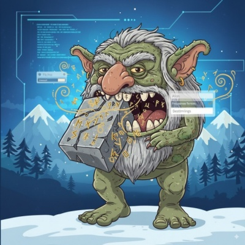

# 🪨 Runestone



A command-line tool and web application for analyzing Swedish textbook pages using OCR and Large Language Models. Transform phone photos of Swedish textbook pages into structured digital study guides with vocabulary, grammar explanations, and learning resources.

## 🎯 Features

- **🔄 Multi-Provider Support**: Choose between OpenAI (GPT-4o) or Google Gemini for LLM processing
- **📸 OCR Processing**: Extract text from Swedish textbook page images using vision-enabled LLMs
- **🎓 Grammar Analysis**: Identify and explain grammatical patterns and rules
- **🔑 Vocabulary Extraction**: Generate word banks with English translations and contextual examples
- **💾 Vocabulary Persistence**: Save vocabulary to SQLite database for long-term learning tracking
- **🔗 Resource Discovery**: Find relevant learning resources from trusted Swedish language sites
- **✨ Rich Output**: Beautiful console output with emojis and formatting
- **📝 Export Options**: Output results to console or markdown format
- **⚙️ Configurable**: Easy provider switching via environment variables or CLI options
- **🌐 Web API**: REST API for programmatic access to image processing functionality
- **🖥️ Web Interface**: Responsive web application for easy image upload and results viewing
- **🧠 Agent Memory**: Structured, user-managed memory items with API + UI support
- **🤖 Rune Recall**: Telegram bot for daily vocabulary recall and command processing

## 🚀 Quick Start

### Prerequisites

- Python 3.13+
- Node.js 18+ and npm (for web interface development)
- API key for your chosen LLM provider:
  - **OpenAI**: API key with GPT-4o access (recommended, default)
  - **Gemini**: Google Gemini API key with vision capabilities
- Telegram Bot Token (for Rune Recall feature): Obtain from @BotFather on Telegram
- UV package manager (recommended) or pip

### Installation

1. **Clone the repository:**
   ```bash
   git clone <repository-url>
   cd runestone
   ```

2. **Install dependencies:**
   ```bash
   # Using UV (recommended)
   make install

   # Or using pip
   pip install -e .
   ```

3. **Set up your API key:**

   **For OpenAI (default):**
   ```bash
   export OPENAI_API_KEY="your-openai-api-key"
   ```

   **For Openrouter:**
   ```bash
   export GEMINI_API_KEY="your-openrouter-api-key"
   export LLM_PROVIDER="openrouter"
   ```

   **Or copy and configure the environment file:**
   ```bash
   cp .env.example .env
   # Edit .env with your preferred settings
   ```

4. **Test the installation:**
   ```bash
   runestone --help
   ```

### Basic Usage

```bash
# Process a Swedish textbook page image (uses OpenAI by default)
runestone process /path/to/textbook_page.jpg

# Use Openrouter provider
runestone process --provider openrouter /path/to/textbook_page.jpg

# Use specific OpenAI model
runestone process --provider openai --model gpt-4o-mini /path/to/textbook_page.jpg

# With verbose output
runestone process /path/to/textbook_page.jpg --verbose

# Export to markdown
runestone process /path/to/textbook_page.jpg --output-format markdown

# Specify API key directly
runestone process --provider openai --api-key YOUR_API_KEY /path/to/textbook_page.jpg

# Load vocabulary from CSV file
runestone load-vocab /path/to/vocabulary.csv

# Load vocabulary with custom database name
runestone load-vocab /path/to/vocabulary.csv --db-name my_vocab.db

# Load vocabulary skipping existence check (allow duplicates)
runestone load-vocab /path/to/vocabulary.csv --skip-existence-check
```

### Web API Usage

Runestone also provides a REST API for programmatic access:

```bash
# Start the API server
make run-backend

# Or run directly
uvicorn runestone.api.main:app --reload
```

The API will be available at `http://localhost:8010` with the following endpoints:

- `POST /api/process`: Upload an image and get analysis results
- `POST /api/vocabulary`: Save vocabulary items to the database
- `GET /api/vocabulary`: Retrieve all saved vocabulary items
- `GET /api/memory`: List memory items (filters + pagination)
- `POST /api/memory`: Create or update a memory item (upsert)
- `PUT /api/memory/{item_id}/status`: Update item status
- `POST /api/memory/{item_id}/promote`: Promote mastered items to knowledge strengths
- `DELETE /api/memory/{item_id}`: Delete a memory item
- `DELETE /api/memory?category=...`: Clear a memory category
- `GET /api/health`: Health check endpoint

API documentation is available at `http://localhost:8010/docs`.

### Web Interface Usage

Runestone also provides a responsive web interface for easy image upload and results viewing:

```bash
# Start both the backend API and frontend web interface
make run-dev

# Or start them separately
make run-backend    # Backend API server
make run-frontend   # Frontend development server
```

The web interface will be available at `http://localhost:5173` with the following features:

- **📤 File Upload**: Drag and drop or click to select Swedish textbook page images
- **⚙️ Provider Selection**: Choose between OpenAI GPT-4o or Google Gemini
- **📊 Real-time Results**: View formatted analysis results with grammar explanations and vocabulary
- **🔄 Processing Status**: Visual feedback during image processing
- **🧠 Agent Memory Modal**: View, add, edit, and delete memory items by category
- **📱 Responsive Design**: Works on desktop and mobile devices

**Quick Start:**
1. Run `make run-dev` to start both servers
2. Open `http://localhost:5173` in your browser
3. Upload a Swedish textbook page image
4. View the structured analysis results

### Agent Memory Migration

Legacy user memory stored on the `users` table can be migrated to `memory_items`:

```bash
make migrate-memory ARGS="--dry-run --limit-users 5"
make migrate-memory ARGS="--user-id 123"
```

The migration is idempotent and uses the `memory_migrated` flag on `users` to avoid duplicate work.

### Rune Recall Feature

Runestone includes a Telegram bot for automated vocabulary recall and command processing:

```bash
# Start the Rune Recall Telegram Bot Worker
make run-recall

# Or run directly
uv run python recall_main.py
```

The bot will:
- Poll for incoming commands every 5 seconds
- Send vocabulary recall words at configured intervals (default: every 60 minutes)
- Process user interactions via Telegram

**Prerequisites:**
- Set `TELEGRAM_BOT_TOKEN` environment variable with your bot token from @BotFather
- Ensure vocabulary data is available in the database

**Configuration:**
- `RECALL_INTERVAL_MINUTES`: Interval between recall messages (default: 60)

## 📖 Example Output

When you process a Swedish textbook page, Runestone will provide:

```
🪨 Runestone - Swedish Textbook Analysis
╔════════════════════════════════════════════════════════════════╗

📖 Full Recognized Text
┌────────────────────────────────────────────────────────────────┐
│ Hej, jag heter Anna. Vad heter du?                             │
│ Jag kommer från Sverige. Varifrån kommer du?                  │
│ ...                                                            │
└────────────────────────────────────────────────────────────────┘

🎓 Grammar Focus
┌────────────────────────────────────────────────────────────────┐
│ Topic: Swedish introductions and questions                     │
│ Type: Inferred Pattern                                         │
│                                                               │
│ Explanation:                                                  │
│ This page covers basic introduction patterns in Swedish...    │
└────────────────────────────────────────────────────────────────┘

🔑 Word Bank
┌─────────────┬───────────────────────────────────────────────────┬───────────────────────────────────────────────────┐
│   Svenska   │                     English                      │                Example Phrase                 │
├─────────────┼───────────────────────────────────────────────────┼───────────────────────────────────────────────────┤
│ hej         │ hello                                            │ Hej, jag heter Anna.                         │
│ jag heter   │ my name is                                       │ Jag heter Anna.                               │
│ vad         │ what                                             │ Vad heter du?                                 │
│ kommer från │ come from                                        │ Jag kommer från Sverige.                      │
└─────────────┴───────────────────────────────────────────────────┴───────────────────────────────────────────────────┘

🔗 Extra Resources
┌────────────────────────────────────────────────────────────────┐
│ 1. Swedish Grammar Reference - Svenska.se                     │
│    🔗 https://svenska.se/tre/sprak/grammatik/                 │
│    📝 Official Swedish grammar reference and explanations     │
│                                                               │
│ 2. Swedish Introductions Guide - Clozemaster                 │
│    🔗 https://www.clozemaster.com/blog/swedish-introductions/ │
│    📝 Comprehensive guide to Swedish introductions           │
└────────────────────────────────────────────────────────────────┘

✨ Analysis complete!
```

## 🛠️ Development

### Development Setup

```bash
# Set up development environment
make setup

# Install development dependencies
make install-dev

# Install pre-commit hooks
pre-commit install
```

### Available Make Commands

```bash
# Setup & Installation
make help              # Show all available commands
make setup             # Set up development environment with pre-commit hooks
make install           # Install production dependencies only
make install-dev       # Install all dependencies (production + development)
make install-backend   # Install backend dependencies
make install-frontend  # Install frontend dependencies
make install-all       # Install all dependencies concurrently

# Code Quality
make lint              # Run all linting and formatting (with fixes)
make lint-check        # Run linting checks only (no fixes)
make backend-lint      # Run backend linting and formatting
make frontend-lint     # Run frontend linting

# Testing
make test              # Run all test suites
make test-coverage     # Run tests with coverage report
make backend-test      # Run backend tests only
make frontend-test     # Run frontend tests only

# Running Applications
make run IMAGE_PATH=/path/to/image.jpg GEMINI_API_KEY=your_key  # Run CLI application
make run-backend       # Start FastAPI backend server
make run-frontend      # Start frontend development server
make run-dev           # Start both backend and frontend concurrently
make run-recall        # Start the Rune Recall Telegram Bot Worker
make migrate-memory    # Migrate legacy user memory to memory_items (use ARGS=...)

# Development Workflows
make dev-test          # Quick development test (install-dev + lint-check + test)
make dev-full          # Full development check (install-dev + lint + test-coverage)

# CI/CD
make ci-lint           # CI linting pipeline
make ci-test           # CI testing pipeline

# Utilities
make clean             # Clean up temporary files and caches
make info              # Show environment information
```

## 🐳 Docker

### Quick Start with Docker

```bash
# Start all services (automatically handles permissions)
make docker-up

# Stop all services
make docker-down

# Rebuild containers
make docker-build
```

### Updating Code in Containers

To update the code running in Docker containers after making changes:

```bash
# Rebuild the images with updated code
docker compose build --no-cache

# Or if containers are already running, restart them
docker compose restart
```

This will rebuild the backend and frontend images with your latest code changes and restart the containers.

### Database Permissions (SQLite)

The Docker setup automatically handles SQLite database permissions to prevent "attempt to write a readonly database" errors:

- **Database in State Directory**: The SQLite database is stored in the `state/` directory (`sqlite:///./state/runestone.db`)
- **Automatic Permissions**: The `init-state.sh` script ensures the state directory has proper permissions (`777`) for container access
- **No Manual Configuration**: Works across all development machines without user ID mapping

**Technical Details:**
- Database file: `./state/runestone.db` (inherits directory permissions)
- State directory permissions: `drwxrwxrwx` (777) - allows container write access
- The `init-state.sh` script automatically sets permissions during `make docker-up`

This clean solution eliminates the need for complex user ID mapping while maintaining security and portability.

### Running Tests

```bash
# Run all tests
make test

# Run tests with coverage
make test-coverage

# Run specific test file
pytest tests/test_ocr.py -v

# Run tests with verbose output
pytest tests/ -v -s
```

### Code Quality

The project uses several tools for code quality:

- **Black**: Code formatting
- **isort**: Import sorting
- **flake8**: Linting
- **pre-commit**: Git hooks for quality checks
- **pytest**: Testing framework with coverage

## 🏗️ Architecture

```
src/runestone/
├── cli.py              # Command-line interface
├── config.py           # Centralized configuration management
├── db/                 # Database layer
│   ├── __init__.py
│   ├── database.py     # SQLAlchemy engine and session management
│   ├── models.py       # Database table models
│   ├── memory_item_repository.py # Memory item data access
│   └── vocabulary_repository.py  # Vocabulary data access
├── api/                # REST API layer
│   ├── __init__.py
│   ├── main.py         # FastAPI application setup
│   ├── endpoints.py    # OCR + analysis endpoints
│   ├── memory_endpoints.py # Memory item endpoints
│   └── schemas.py      # Pydantic models for API
├── core/
│   ├── processor.py    # Main workflow orchestration
│   ├── ocr.py         # OCR processing (provider-agnostic)
│   ├── analyzer.py    # Content analysis and resource discovery
│   ├── formatter.py   # Output formatting (console/markdown)
│   ├── exceptions.py  # Custom exception classes
│   └── clients/       # LLM provider implementations
│       ├── __init__.py
│       ├── base.py    # Abstract base client
│       ├── openai_client.py    # OpenAI implementation
│       ├── gemini_client.py    # Gemini implementation
│       └── factory.py # Client factory
└── __init__.py

tests/
├── test_cli.py        # CLI tests
├── test_api.py        # API tests
├── test_ocr.py        # OCR processing tests
├── test_analyzer.py   # Content analysis tests
├── test_vocabulary.py # Vocabulary database tests
└── test_integration.py # Integration tests
```

## 📋 Requirements

- **Python**: 3.13+
- **Database**: SQLite (built-in) or PostgreSQL/MySQL (optional)
- **API Key**: Choose one:
  - OpenAI API key with GPT-4o access (recommended)
  - Google Gemini API key with vision capabilities
- **Image Formats**: `.jpg`, `.png`, `.gif`, `.bmp`, `.webp`
- **Internet**: Required for LLM processing and resource discovery

## ⚙️ Configuration

### Environment Variables

**Provider Selection:**
- `LLM_PROVIDER`: Choose your LLM provider (`openai` or `openrouter`, default: `openai`)

**OpenAI Configuration:**
- `OPENAI_API_KEY`: Your OpenAI API key (required for OpenAI provider)
- `OPENAI_MODEL`: Model to use (default: `gpt-4o-mini`)

**Gemini Configuration:**
- `GEMINI_API_KEY`: Your Google Gemini API key (required for Gemini provider)

**Database Configuration:**
- `DATABASE_URL`: Database connection URL (default: `sqlite:///./state/runestone.db`)

**General Settings:**
- `VERBOSE`: Enable verbose logging (`true` or `false`, default: `false`)

**Telegram Configuration:**
- `TELEGRAM_BOT_TOKEN`: Your Telegram bot token from @BotFather (required for Rune Recall)
- `RECALL_INTERVAL_MINUTES`: Interval between recall messages in minutes (default: 60)
- `TELEGRAM_OFFSET_FILENAME`: Filename for storing Telegram update offset (default: offset.txt)

### Configuration File

Create a `.env` file from the example:
```bash
cp .env.example .env
```

Edit `.env` with your preferred settings:
```env
# Choose your provider
LLM_PROVIDER=openai

# OpenAI settings
OPENAI_API_KEY=your_openai_api_key_here
OPENAI_MODEL=gpt-4o-mini

# Gemini settings (if using Gemini)
GEMINI_API_KEY=your_gemini_api_key_here

# Database settings
DATABASE_URL=sqlite:///./state/runestone.db

# Telegram settings (for Rune Recall)
TELEGRAM_BOT_TOKEN=your_telegram_bot_token_here
RECALL_INTERVAL_MINUTES=60

# General settings
VERBOSE=false
```
### Frontend Configuration

For the web interface, create a frontend environment file:
```bash
cp frontend/.env.example frontend/.env
```

The frontend `.env` file contains:
```env
# Backend API Configuration
# The URL where the Runestone backend API is running
VITE_API_BASE_URL=http://localhost:8010
```

**Note**: The frontend runs from the `frontend/` directory, so it requires its own `.env` file to access environment variables properly. This ensures the web interface can communicate with the backend API.


### Supported Image Types

Runestone works best with:
- Clear photos of textbook pages
- Good lighting and minimal shadows
- Images larger than 100x100 pixels
- Standard image formats (JPG, PNG, etc.)

## 🚨 Error Handling

Runestone provides clear error messages for common issues:

- **Missing API Key**: Clear instructions on setting up authentication
- **File Not Found**: Verification that the image path exists
- **OCR Failure**: Graceful handling when text cannot be recognized
- **Network Issues**: Timeout and connection error handling

## 🤝 Contributing

1. Fork the repository
2. Create a feature branch (`git checkout -b feature/amazing-feature`)
3. Make your changes
4. Run tests (`make test`)
5. Run linting (`make lint`)
6. Commit your changes (`git commit -m 'Add amazing feature'`)
7. Push to the branch (`git push origin feature/amazing-feature`)
8. Open a Pull Request

### Development Guidelines

- Follow PEP 8 style guidelines (enforced by black and flake8)
- Write tests for new functionality
- Update documentation for user-facing changes
- Use meaningful commit messages

## 📄 License

This project is licensed under the MIT License - see the [LICENSE](LICENSE) file for details.

## 🙏 Acknowledgments

- [Rich](https://github.com/Textualize/rich) for beautiful terminal output
- [Click](https://click.palletsprojects.com/) for CLI framework
- The Swedish language learning community

## 📞 Support

If you encounter issues or have questions:

1. Check the [troubleshooting section](#🚨-error-handling)
2. Search existing [GitHub issues](https://github.com/your-repo/runestone/issues)
3. Create a new issue with:
   - Clear description of the problem
   - Steps to reproduce
   - Sample image (if applicable)
   - Error messages
   - System information


**Happy Swedish learning!** 🇸🇪✨
