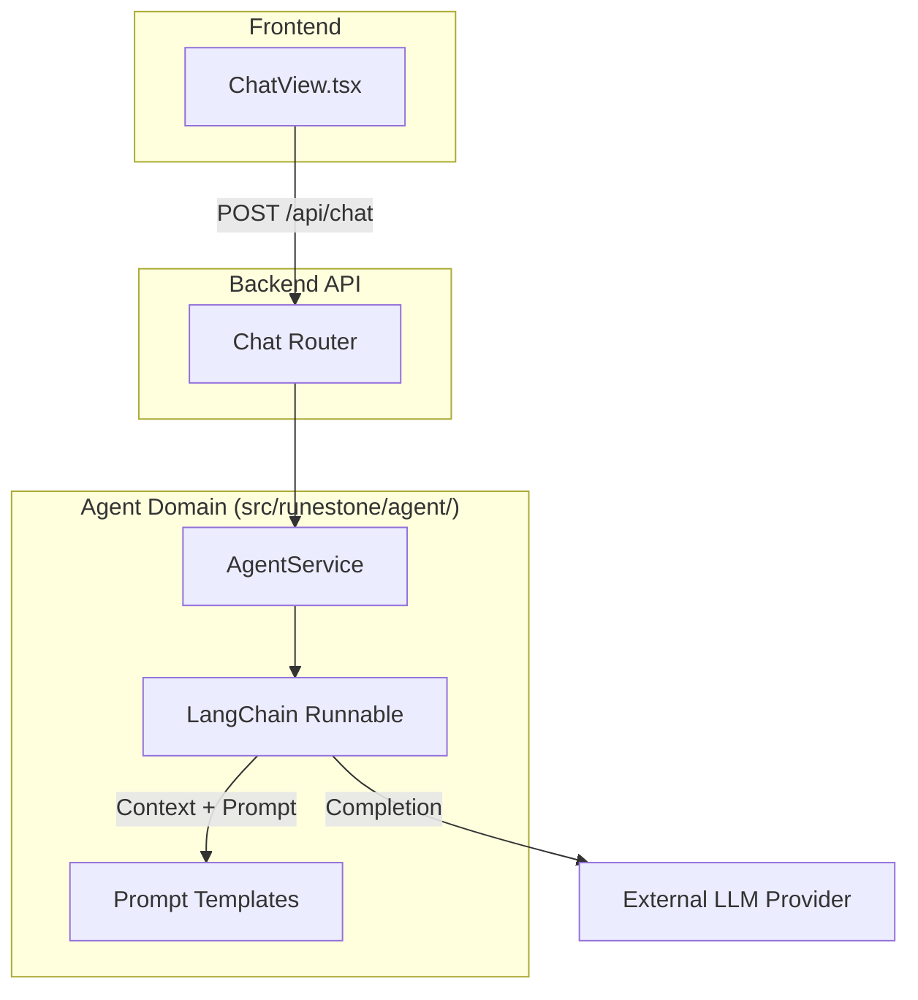

# Refactoring/Design Plan: Teacher Agent Chat Functionality (Web Only)

## 1. Executive Summary & Goals
This plan establishes the foundation for a "Teacher Agent" within the Runestone application. It focuses on creating a dedicated, extensible backend package for the agent using LangChain and exposing it via a new Web UI tab.

**Key Goals:**
1.  **Architectural Foundation:** Create a dedicated `src/runestone/agent/` package to house the agent logic, ensuring scalability for future features (memory, tools, RAG).
2.  **LangChain Integration:** Implement a basic conversational agent using LangChain, configurable via environment variables.
3.  **Web Interface:** Provide a user-friendly "Chat" tab in the frontend for real-time interaction with the teacher agent.
4.  **Quality Assurance:** Implement comprehensive unit and integration tests for the new agent components.

**Out of Scope:**
*   Telegram integration (deferred to a future update).
*   Persistent database storage for chat history (session-based for now).
*   Advanced RAG or Tool usage (future phases).

## 2. Current Situation Analysis
*   **Backend:** The current architecture is service-based (`src/runestone/services`). There is no dedicated structure for complex agentic behaviors or LangChain integration.
*   **Frontend:** The React application has a tabbed interface but lacks a conversational UI.
*   **Testing:** Existing tests are located in `tests/` and `frontend/src/test/`. New functionality requires corresponding test coverage.

## 3. Proposed Solution / Refactoring Strategy

### 3.1. High-Level Design
We will introduce a new architectural domain `src/runestone/agent/` to encapsulate all AI agent logic. This separates "Agent" complexity from standard business logic "Services".

### 3.2. Key Components
1.  **Agent Package (`src/runestone/agent/`):**
    *   **`service.py`**: The main entry point. Initializes the LangChain model and manages the conversation chain.
    *   **`schemas.py`**: Pydantic models for chat requests (messages, history) and responses.
    *   **`prompts.py`**: Storage for the System Prompt (Teacher persona).
2.  **API Layer:**
    *   **`src/runestone/api/chat_endpoints.py`**: New router handling chat requests.
3.  **Frontend:**
    *   **`ChatView.tsx`**: A new component for the chat interface.

### 3.3. Detailed Action Plan / Phases

#### Phase 1: Core Setup & Configuration
*   **Objective:** Install dependencies and configure environment settings.
*   **Priority:** High
*   **Task 1.1: Dependencies**
    *   **Action:** Add `langchain`, `langchain-openai`, and `langchain-community` to `pyproject.toml`.
    *   **Deliverable:** Updated `pyproject.toml` and lock file.
*   **Task 1.2: Configuration**
    *   **Action:** Update `src/runestone/config.py` and `.env.example`.
    *   **New Settings:**
        *   `CHAT_PROVIDER` (default: "openai")
        *   `CHAT_MODEL` (default: "gpt-4o")
        *   `TEACHER_SYSTEM_PROMPT` (default: "You are a helpful Swedish language teacher...")

#### Phase 2: Agent Backend Implementation
*   **Objective:** Build the agent logic in a dedicated package.
*   **Priority:** High
*   **Task 2.1: Package Structure**
    *   **Action:** Create directory `src/runestone/agent/` and `src/runestone/agent/__init__.py`.
*   **Task 2.2: Schemas**
    *   **Action:** Create `src/runestone/agent/schemas.py`.
    *   **Details:** Define `ChatMessage` (role, content) and `ChatRequest` (message, history), `ChatResponse`.
*   **Task 2.3: Prompt Management**
    *   **Action:** Create `src/runestone/agent/prompts.py`.
    *   **Details:** Define the base prompt template for the teacher persona.
*   **Task 2.4: Agent Service**
    *   **Action:** Create `src/runestone/agent/service.py`.
    *   **Logic:**
        *   Initialize `ChatOpenAI` (or generic LangChain chat model) using settings.
        *   Implement `generate_response(message: str, history: List[ChatMessage]) -> str`.
        *   Construct the prompt using System Message + History + User Message.

#### Phase 3: API Layer
*   **Objective:** Expose the agent to the frontend.
*   **Priority:** High
*   **Task 3.1: Chat Endpoint**
    *   **Action:** Create `src/runestone/api/chat_endpoints.py`.
    *   **Logic:** Inject `AgentService` dependency. Define `POST /api/chat/message`.
*   **Task 3.2: Router Registration**
    *   **Action:** Update `src/runestone/api/main.py` to include the new chat router.

#### Phase 4: Frontend Implementation
*   **Objective:** Create the user interface.
*   **Priority:** Medium
*   **Task 4.1: Chat Component**
    *   **Action:** Create `frontend/src/components/ChatView.tsx`.
    *   **UI:**
        *   Message list container (scrollable).
        *   Message bubbles (distinct styles for User vs. Teacher).
        *   Input field and Send button.
        *   Loading state indicator.
*   **Task 4.2: Navigation**
    *   **Action:** Update `frontend/src/components/Header.tsx` to add the "Chat" tab.
    *   **Action:** Update `frontend/src/App.tsx` to render `ChatView` when the tab is active.

#### Phase 5: Testing
*   **Objective:** Ensure reliability of the new agent logic.
*   **Priority:** High
*   **Task 5.1: Backend Unit Tests**
    *   **Action:** Create `tests/agent/test_service.py`.
    *   **Scope:** Mock the LangChain model. Verify that `AgentService` correctly formats prompts and handles history before calling the model.
*   **Task 5.2: API Integration Tests**
    *   **Action:** Create `tests/api/test_chat_endpoints.py`.
    *   **Scope:** Test the `/api/chat/message` endpoint with valid and invalid payloads. Ensure dependency injection works.
*   **Task 5.3: Frontend Tests**
    *   **Action:** Create `frontend/src/components/ChatView.test.tsx`.
    *   **Scope:** Verify rendering, input handling, and API call simulation (mocking the fetch/hook).

## 4. Key Considerations & Risk Mitigation
### 4.1. Technical Risks
*   **Context Window Limits:** Sending full history every time might exceed token limits.
    *   *Mitigation:* `AgentService` will implement a basic truncation strategy (e.g., keep only the last N messages) before sending to the LLM.
*   **Latency:** LLM responses can be slow.
    *   *Mitigation:* Frontend will show a clear "Typing..." or loading state. (Streaming response is out of scope for this MVP but architecturally possible later).

### 4.2. Dependencies
*   `langchain` ecosystem packages.

### 4.3. Non-Functional Requirements
*   **Modularity:** The `src/runestone/agent` package must be self-contained. It should not depend on `src/runestone/services` to avoid circular dependencies, though it may depend on `src/runestone/core`.
*   **Testability:** The `AgentService` must accept the LLM model as a dependency (or allow easy mocking) to facilitate unit testing without making real API calls.

## 5. Success Metrics / Validation Criteria
*   **Functional:** A user can type a message in the "Chat" tab and receive a coherent response from the "Teacher" persona.
*   **Context:** The agent remembers the immediate context of the conversation (e.g., user says "My name is Bob", then "What is my name?", agent replies "Bob").
*   **Code Quality:** All new tests in `tests/agent/` and `tests/api/` pass.

## 6. Assumptions
*   The conversation history is managed by the client (Frontend) and sent with every request for this stateless MVP.
*   No authentication changes are required; the chat endpoint will use the existing `get_current_user` dependency.

## 7. Open Questions
*   None.
