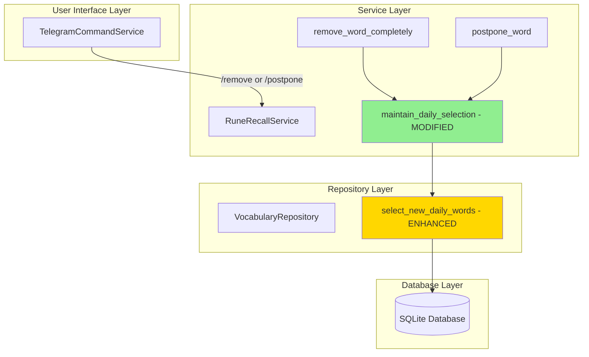
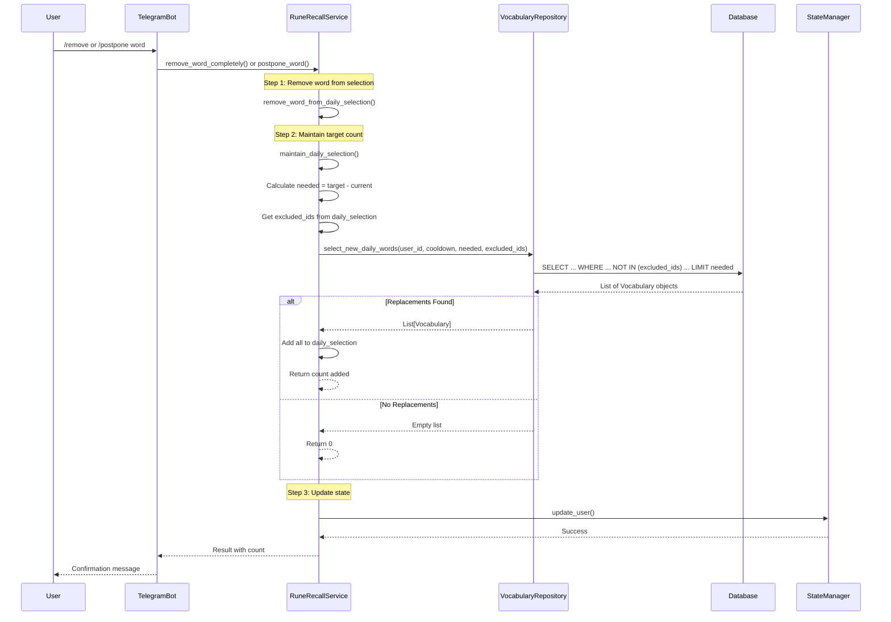

# Architectural Plan: Automatic Word Replacement for Remove/Postpone Commands

## Problem Statement

Currently, when users execute `/remove` or `/postpone` commands in the Telegram bot, words are removed from the daily selection but NOT replaced. This results in users having fewer than the configured `words_per_day` (default: 5) in their selection.

**Current Behavior:**
- User has 5 words in daily selection
- User removes/postpones 2 words
- User now has only 3 words → **Problem!**

**Desired Behavior:**
- User has 5 words in daily selection
- User removes/postpones 1 word
- System immediately selects 1 replacement word
- User still has 5 words (or fewer only if no words available)

---

## Solution Architecture

### High-Level Design

The solution maintains the target word count by:
1. **Unified replenishment logic**: Single method that ensures target word count is maintained
2. **Reuse existing queries**: Extend `select_new_daily_words` to support exclusions
3. **Automatic top-up**: After remove/postpone, automatically fill to target count
4. **Graceful degradation**: If no replacements available, continue with fewer words

### Component Architecture



---

## Detailed Design

### 1. Repository Layer Changes

#### Enhanced Method: `select_new_daily_words`

**Location**: `src/runestone/db/repository.py` (VocabularyRepository class)

**Current Signature**:
```python
def select_new_daily_words(self, user_id: int, cooldown_days: int = 7, limit: int = 100) -> List[Vocabulary]
```

**New Signature**:
```python
def select_new_daily_words(
    self,
    user_id: int,
    cooldown_days: int = 7,
    limit: int = 100,
    excluded_word_ids: Optional[List[int]] = None
) -> List[Vocabulary]
```

**Changes**: Add optional `excluded_word_ids` parameter to filter out words already in selection

**Implementation**:
```python
def select_new_daily_words(
    self,
    user_id: int,
    cooldown_days: int = 7,
    limit: int = 100,
    excluded_word_ids: Optional[List[int]] = None
) -> List[Vocabulary]:
    """
    Select new daily words for a user randomly, excluding recently learned words.

    Args:
        user_id: Database user ID
        cooldown_days: Number of days to exclude recently learned words
        limit: Maximum number of words to select
        excluded_word_ids: Optional list of word IDs to exclude (e.g., already in selection)

    Returns:
        List of Vocabulary objects
    """
    cutoff_date = datetime.now() - timedelta(days=cooldown_days)

    query = self.db.query(Vocabulary).filter(
        Vocabulary.user_id == user_id,
        Vocabulary.in_learn.is_(True),
        or_(Vocabulary.last_learned.is_(None), Vocabulary.last_learned < cutoff_date),
    )

    # NEW: Exclude specific word IDs if provided
    if excluded_word_ids:
        query = query.filter(~Vocabulary.id.in_(excluded_word_ids))

    result = query.order_by(func.random()).limit(limit).all()
    return result
```

**Benefits**:
- ✅ Reuses existing, tested logic
- ✅ Single method for all word selection needs
- ✅ Minimal change (backward compatible - excluded_word_ids is optional)
- ✅ No code duplication

---

### 2. Service Layer Changes

#### Renamed & Enhanced Method: `maintain_daily_selection`

**Location**: `src/runestone/services/rune_recall_service.py` (RuneRecallService class)

**Old Name**: `replenish_daily_selection_if_empty`
**New Name**: `maintain_daily_selection`

**Old Signature**:
```python
def replenish_daily_selection_if_empty(self, username: str, user_data: UserData) -> None
```

**New Signature**:
```python
def maintain_daily_selection(self, username: str, user_data: UserData) -> int
```

**Purpose**: Ensure user has target number of words, adding replacements as needed

**Implementation**:
```python
def maintain_daily_selection(self, username: str, user_data: UserData) -> int:
    """
    Ensure user has target number of words in daily selection.
    Adds replacement words as needed to reach words_per_day target.

    Args:
        username: Username for logging purposes
        user_data: UserData object for the user

    Returns:
        Number of words added (0 if no words added or needed)
    """
    current_count = len(user_data.daily_selection)
    target_count = self.words_per_day

    # Check if we need to add words
    if current_count >= target_count:
        logger.debug(
            f"User {username} already has {current_count}/{target_count} words, "
            "no maintenance needed"
        )
        return 0

    # Calculate how many words we need to add
    needed = target_count - current_count
    logger.info(
        f"User {username} has {current_count}/{target_count} words, "
        f"attempting to add {needed} replacement(s)"
    )

    # Get list of word IDs to exclude (already in selection)
    excluded_ids = [word.id_ for word in user_data.daily_selection]

    # Select replacement words (reusing existing method with exclusions)
    new_words = self.vocabulary_repository.select_new_daily_words(
        user_id=user_data.db_user_id,
        cooldown_days=self.cooldown_days,
        limit=needed,
        excluded_word_ids=excluded_ids if excluded_ids else None
    )

    if new_words:
        # Add new words to daily selection
        for word in new_words:
            user_data.daily_selection.append(
                WordOfDay(id_=word.id, word_phrase=word.word_phrase)
            )

        added_count = len(new_words)
        logger.info(
            f"Added {added_count} replacement word(s) for user {username} "
            f"(now {len(user_data.daily_selection)}/{target_count})"
        )
        return added_count
    else:
        logger.info(
            f"No replacement words available for user {username} "
            f"(current: {current_count}/{target_count}, all words in cooldown or exhausted)"
        )
        return 0
```

**Returns**:
- `int`: Number of words added (0 if none added)

**Benefits**:
- ✅ Single unified method for maintaining selection
- ✅ Works for both empty selection (adds all) and partial (adds some)
- ✅ Clearer name reflects actual purpose
- ✅ Returns count for informative messages

---

#### Modified Method: `remove_word_completely`

**Changes**:
1. Remove word from selection
2. Call `maintain_daily_selection()` to top up
3. Update success message with replacement count

**Implementation**:
```python
def remove_word_completely(self, username: str, word_phrase: str) -> Dict[str, Any]:
    """
    Remove word from both database and daily_selection.

    Args:
        username: Username of the user
        word_phrase: Word phrase to remove completely

    Returns:
        Dictionary with 'success' bool, 'message' str, and optional metadata
    """
    try:
        user_data = self.state_manager.get_user(username)
        if not user_data:
            return {"success": False, "message": f"User '{username}' not found"}

        # Find the word in database by word_phrase and user_id
        matching_word = self.vocabulary_repository.get_vocabulary_item_by_word_phrase(
            word_phrase, user_data.db_user_id
        )

        if not matching_word:
            return {"success": False, "message": f"Word '{word_phrase}' not found in your vocabulary"}

        # Remove from database (set in_learn = False)
        db_success = self.vocabulary_repository.delete_vocabulary_item_by_word_phrase(
            word_phrase, user_data.db_user_id
        )

        if not db_success:
            return {"success": False, "message": f"Failed to remove word '{word_phrase}' from vocabulary"}

        # Remove from daily_selection
        removed_from_selection = self.remove_word_from_daily_selection(user_data, word_phrase)

        # MODIFIED: Maintain target word count (adds replacements if needed)
        added_count = 0
        if removed_from_selection:
            added_count = self.maintain_daily_selection(username, user_data)

        # Update user data in state
        self.update_user_daily_selection(username, user_data)

        # Prepare success message
        status_msg = "removed from vocabulary"
        if removed_from_selection:
            status_msg += " and daily selection"
            if added_count > 0:
                word_word = "word" if added_count == 1 else "words"
                status_msg += f" (added {added_count} replacement {word_word})"
            elif len(user_data.daily_selection) < self.words_per_day:
                status_msg += " (no replacement available - words in cooldown)"

        logger.info(f"User {username} removed word '{word_phrase}' from vocabulary")

        return {
            "success": True,
            "message": f"Word '{word_phrase}' {status_msg}.",
            "removed_from_selection": removed_from_selection,
            "replacements_added": added_count,
        }

    except Exception as e:
        logger.error(f"Error removing word '{word_phrase}' for user {username}: {e}")
        return {"success": False, "message": "An error occurred while removing the word"}
```

---

#### Modified Method: `postpone_word`

**Changes**: Same pattern as `remove_word_completely`

```python
def postpone_word(self, username: str, word_phrase: str) -> Dict[str, Any]:
    """
    Remove word from daily_selection only (postpone learning).

    Args:
        username: Username of the user
        word_phrase: Word phrase to postpone

    Returns:
        Dictionary with 'success' bool, 'message' str, and metadata
    """
    try:
        user_data = self.state_manager.get_user(username)
        if not user_data:
            return {"success": False, "message": f"User '{username}' not found"}

        # Remove from daily_selection
        removed_from_selection = self.remove_word_from_daily_selection(user_data, word_phrase)

        if removed_from_selection:
            # MODIFIED: Maintain target word count (adds replacements if needed)
            added_count = self.maintain_daily_selection(username, user_data)

            # Update user data in state
            self.update_user_daily_selection(username, user_data)

            # Prepare success message
            message = f"Word '{word_phrase}' postponed (removed from today's selection)"
            if added_count > 0:
                word_word = "word" if added_count == 1 else "words"
                message += f". Added {added_count} replacement {word_word} to maintain selection."
            elif len(user_data.daily_selection) < self.words_per_day:
                message += ". No replacement available (words in cooldown)."

            logger.info(f"User {username} postponed word '{word_phrase}'")

            return {
                "success": True,
                "message": message,
                "replacements_added": added_count,
            }
        else:
            return {
                "success": False,
                "message": f"Word '{word_phrase}' was not in today's selection."
            }

    except Exception as e:
        logger.error(f"Error postponing word '{word_phrase}' for user {username}: {e}")
        return {"success": False, "message": "An error occurred while postponing the word"}
```

---

#### Update All Callers of Old Method

**Files to Update**:
1. `src/runestone/services/rune_recall_service.py` - Update internal calls
2. Any tests that reference `replenish_daily_selection_if_empty`

**Changes Required**:
```python
# OLD:
self.replenish_daily_selection_if_empty(username, user_data)

# NEW:
self.maintain_daily_selection(username, user_data)
```

**Note**: The new method is backward compatible - it just has a better name and returns a value

---

## Data Flow

### Flow for `/remove` or `/postpone` Command



---

## Key Improvements Over Original Plan

### 1. Code Reuse
✅ **Before**: Create new `select_single_replacement_word` method
✅ **After**: Enhance existing `select_new_daily_words` with optional parameter

**Benefits**:
- No code duplication
- Single method for all word selection
- Easier to maintain and test

### 2. Unified Maintenance Logic
✅ **Before**: Separate `replenish_daily_selection_if_empty` only for empty case
✅ **After**: Unified `maintain_daily_selection` handles all cases

**Benefits**:
- One method to maintain selection count
- Works for empty, partial, or full selections
- Clearer semantics and intent

### 3. Batch Replacement
✅ **Before**: Add one word at a time
✅ **After**: Calculate needed count and select all at once

**Benefits**:
- More efficient (single DB query)
- Better for multiple rapid removals
- Simpler logic

### 4. Better Return Values
✅ Methods now return counts/results for informative messages

---

## Edge Cases & Handling

### 1. No Available Words
**Scenario**: All words are in cooldown or already in selection

**Handling**:
- `select_new_daily_words` returns empty list
- `maintain_daily_selection` returns 0
- Success message indicates "no replacement available (words in cooldown)"

### 2. Selection Becomes Empty
**Scenario**: User removes the only word

**Handling**:
- `maintain_daily_selection` calculates needed = 5 - 0 = 5
- Selects up to 5 new words (just like initial selection)
- No special case needed!

### 3. Multiple Rapid Removals
**Scenario**: User removes 3 words in quick succession

**Handling**:
- Each removal independently calls `maintain_daily_selection`
- First removal: adds 1 replacement
- Second removal: adds 1 replacement
- Third removal: adds 1 replacement
- Result: User maintains ~5 words throughout

### 4. Partial Availability
**Scenario**: User removes 2 words, but only 1 replacement available

**Handling**:
- `maintain_daily_selection` requests 2 words
- Repository returns only 1 (that's all available)
- User ends up with 4/5 words
- Message: "Added 1 replacement word"

---

## Testing Strategy

### 1. Unit Tests - Repository Layer

**File**: `tests/db/test_db_repository.py`

```python
def test_select_new_daily_words_with_exclusions():
    """Test that excluded_word_ids are properly filtered."""
    # Given: User has 5 words in database
    # When: Call with excluded_word_ids=[1, 2], limit=3
    # Then: Should return at most 3 words, none with id 1 or 2

def test_select_new_daily_words_all_excluded():
    """Test when all available words are excluded."""
    # Given: User has 3 words total, all in selection
    # When: Call with excluded_word_ids=[1, 2, 3]
    # Then: Should return empty list

def test_select_new_daily_words_backward_compatible():
    """Test that method works without excluded_word_ids (None)."""
    # Given: User has words in database
    # When: Call without excluded_word_ids parameter
    # Then: Should work as before (no filtering)

def test_select_new_daily_words_empty_exclusions():
    """Test with empty exclusions list."""
    # Given: User has words
    # When: Call with excluded_word_ids=[]
    # Then: Should work same as None (no filtering)
```

### 2. Unit Tests - Service Layer

**File**: `tests/services/test_rune_recall_service.py`

```python
def test_maintain_daily_selection_adds_needed_count():
    """Test that method adds exact number of needed words."""
    # Given: User has 3/5 words, 10 available
    # When: Call maintain_daily_selection
    # Then: Should add 2 words, return 2

def test_maintain_daily_selection_already_at_target():
    """Test when selection already has target count."""
    # Given: User has 5/5 words
    # When: Call maintain_daily_selection
    # Then: Should add 0 words, return 0

def test_maintain_daily_selection_no_words_available():
    """Test when no replacement words available."""
    # Given: All words in cooldown or selected
    # When: Call maintain_daily_selection
    # Then: Should return 0, keep current selection

def test_maintain_daily_selection_partial_availability():
    """Test when fewer words available than needed."""
    # Given: Need 3 words, only 1 available
    # When: Call maintain_daily_selection
    # Then: Should add 1 word, return 1

def test_maintain_daily_selection_from_empty():
    """Test filling selection from completely empty."""
    # Given: User has 0 words, 10 available
    # When: Call maintain_daily_selection
    # Then: Should add 5 words, return 5

def test_remove_word_completely_maintains_count():
    """Test remove command maintains word count."""
    # Given: User has 5 words, 5 more available
    # When: Remove 1 word
    # Then: Should have 5 words (4 old + 1 new)

def test_remove_word_completely_no_replacement():
    """Test remove when no replacement available."""
    # Given: All remaining words in cooldown
    # When: Remove word
    # Then: Should have 4 words, success message indicates no replacement

def test_postpone_word_maintains_count():
    """Test postpone command maintains word count."""
    # Similar to remove test

def test_postpone_word_no_replacement():
    """Test postpone when no replacement available."""
    # Similar to remove test

def test_multiple_removals_batch():
    """Test multiple removals still maintain target."""
    # Given: User has 5 words, 10 available
    # When: Remove 3 words in sequence
    # Then: Should still have 5 words after each removal
```

### 3. Integration Tests

```python
def test_remove_maintains_target_across_operations():
    """Test full flow of multiple operations."""
    # Given: Complete system with user and words
    # When: Sequence of remove, postpone, bump operations
    # Then: Selection maintained appropriately throughout

def test_cooldown_prevents_immediate_reselection():
    """Test that removed words respect cooldown."""
    # Given: Word just learned (in cooldown)
    # When: Remove from selection
    # Then: Should not be reselected as replacement
```

---

## Migration Notes

### Methods Renamed
1. `replenish_daily_selection_if_empty` → `maintain_daily_selection`

### Methods Enhanced
1. `select_new_daily_words` - Added optional `excluded_word_ids` parameter

### Backward Compatibility
- ✅ All changes are backward compatible
- ✅ Existing calls work without modification
- ✅ Tests need updates only for new behavior validation

---

## Success Criteria

✅ **Primary Goal**: When user removes/postpones a word, system automatically selects replacements to maintain `words_per_day` count

✅ **Code Reuse**: Leverages existing `select_new_daily_words` method instead of creating new one

✅ **Unified Logic**: Single `maintain_daily_selection` method handles all maintenance scenarios

✅ **Graceful Degradation**: If no replacements available, operation succeeds with fewer words (no error)

✅ **User Feedback**: Success messages clearly indicate how many replacements were added

✅ **Efficiency**: Batch replacement in single DB query

✅ **No Breaking Changes**: All changes are backward compatible

✅ **Test Coverage**: Comprehensive tests for all scenarios

---

## Implementation Steps

1. ✅ Analyze current implementation
2. ✅ Design solution architecture (revised)
3. ⏳ Enhance `select_new_daily_words` with `excluded_word_ids` parameter
4. ⏳ Rename and enhance `replenish_daily_selection_if_empty` → `maintain_daily_selection`
5. ⏳ Modify `remove_word_completely` to use `maintain_daily_selection`
6. ⏳ Modify `postpone_word` to use `maintain_daily_selection`
7. ⏳ Update all callers of old method name
8. ⏳ Update existing tests for new behavior
9. ⏳ Add new tests for exclusion logic
10. ⏳ Test all edge cases
11. ⏳ Update documentation/docstrings

---

## Summary

This revised architectural plan provides a **cleaner, more maintainable solution** by:

1. **Reusing existing code**: Enhanced `select_new_daily_words` instead of creating new method
2. **Unified maintenance**: Single `maintain_daily_selection` method for all scenarios
3. **Batch efficiency**: Selects all needed replacements in one query
4. **Better semantics**: Clear method names that reflect actual purpose
5. **Backward compatible**: All changes can be adopted incrementally

The implementation is simpler, more efficient, and easier to maintain than the original proposal.
