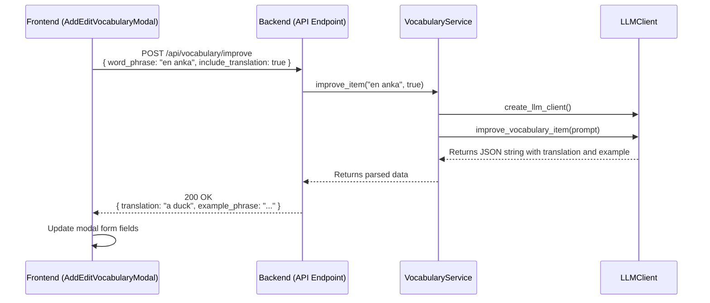

# Refactoring/Design Plan: LLM-Powered Vocabulary Improvement

## 1. Executive Summary & Goals
This plan outlines the steps to integrate a Large Language Model (LLM) for enhancing vocabulary items within the Runestone application. The primary objective is to provide users with AI-powered assistance to automatically generate translations and example sentences for vocabulary words.

- **Goal 1:** Implement a backend endpoint that leverages the active LLM client to generate translations and examples for a given word or phrase.
- **Goal 2:** Add "Fill All" and "Fill Example" buttons to the Add/Edit Vocabulary modal in the frontend to trigger this functionality.
- **Goal 3:** Ensure a seamless user experience with appropriate loading states and feedback during the LLM generation process, targeting a response time under 3 seconds.

## 2. Current Situation Analysis
The current system allows users to manually add, edit, and delete vocabulary items through the `AddEditVocabularyModal.tsx` component. The backend has a `VocabularyService` that handles CRUD operations against the database but lacks any LLM integration for content generation. The core LLM logic is encapsulated within `RunestoneProcessor` and various `LLMClient` implementations, which are currently used for OCR and text analysis but not for vocabulary enhancement.

## 3. Proposed Solution / Refactoring Strategy
### 3.1. High-Level Design / Architectural Overview
The solution involves a new, dedicated API endpoint that the frontend can call to get LLM-generated content for a vocabulary item. The backend will extend its service layer to orchestrate the LLM interaction, ensuring separation of concerns.



### 3.2. Key Components / Modules
- **`VocabularyService` (Backend):** A new method will be added to orchestrate the LLM call. It will be responsible for creating an `LLMClient`, formatting the prompt, calling the client, parsing the response, and returning it.
- **`BaseLLMClient` & Implementations (Backend):** A new abstract method `improve_vocabulary_item` will be added and implemented in `OpenAIClient` and `GeminiClient`.
- **`/api/vocabulary/improve` Endpoint (Backend):** A new FastAPI endpoint to expose the vocabulary improvement functionality.
- **`useVocabulary.ts` Hook (Frontend):** A new asynchronous function will be added to communicate with the new backend endpoint.
- **`AddEditVocabularyModal.tsx` (Frontend):** This component will be modified to include the new buttons, manage loading states, and update its form fields with the data received from the LLM.

### 3.3. Detailed Action Plan / Phases

#### Phase 1: Backend Implementation
- **Objective(s):** Create a robust API endpoint for LLM-powered vocabulary enhancement.
- **Priority:** High

- **Task 1.1: Define API Schemas**
  - **Rationale/Goal:** Establish a clear and validated data contract for the new feature.
  - **Estimated Effort:** S
  - **Deliverable/Criteria for Completion:**
    - In `src/runestone/api/schemas.py`, add:
      - `VocabularyImproveRequest(BaseModel)` with fields: `word_phrase: str`, `include_translation: bool`.
      - `VocabularyImproveResponse(BaseModel)` with fields: `translation: Optional[str] = None`, `example_phrase: str`.

- **Task 1.2: Create New Prompt Template**
  - **Rationale/Goal:** Create an effective prompt to instruct the LLM to generate accurate translations and examples in a structured JSON format.
  - **Estimated Effort:** S
  - **Deliverable/Criteria for Completion:**
    - In `src/runestone/core/prompts.py`, add a new `VOCABULARY_IMPROVE_PROMPT_TEMPLATE` string. This prompt should instruct the LLM to return a JSON object with `translation` and `example_phrase` keys.

- **Task 1.3: Extend LLM Client Interface**
  - **Rationale/Goal:** Maintain a consistent interface across all LLM clients.
  - **Estimated Effort:** M
  - **Deliverable/Criteria for Completion:**
    - In `src/runestone/core/clients/base.py`, add a new abstract method: `def improve_vocabulary_item(self, prompt: str) -> str:`.
    - In `src/runestone/core/clients/openai_client.py` and `src/runestone/core/clients/gemini_client.py`, implement the `improve_vocabulary_item` method. This implementation will be very similar to the existing `analyze_content` method.

- **Task 1.4: Implement Service Layer Logic**
  - **Rationale/Goal:** Encapsulate the business logic for vocabulary improvement, including LLM client instantiation and interaction.
  - **Estimated Effort:** M
  - **Deliverable/Criteria for Completion:**
    - In `src/runestone/dependencies.py`, modify `get_vocabulary_service` to also inject `settings`: `def get_vocabulary_service(repo: ..., settings: Annotated[Settings, Depends(get_settings)]) -> VocabularyService:`. Update the `VocabularyService` constructor to accept `settings`.
    - In `src/runestone/services/vocabulary_service.py`, add a new method `improve_item(self, word_phrase: str, include_translation: bool) -> VocabularyImproveResponse`.
    - This method will:
      1.  Create an `LLMClient` using `create_llm_client(settings=self.settings)`.
      2.  Format the `VOCABULARY_IMPROVE_PROMPT_TEMPLATE`.
      3.  Call `client.improve_vocabulary_item()`.
      4.  Parse the JSON response from the LLM.
      5.  Handle potential parsing errors.
      6.  Return a `VocabularyImproveResponse` object.

- **Task 1.5: Create API Endpoint**
  - **Rationale/Goal:** Expose the new functionality via a RESTful API.
  - **Estimated Effort:** S
  - **Deliverable/Criteria for Completion:**
    - In `src/runestone/api/endpoints.py`, add a new endpoint `POST /vocabulary/improve`.
    - This endpoint will accept a `VocabularyImproveRequest`, call the `vocabulary_service.improve_item` method, and return the `VocabularyImproveResponse`.

- **Task 1.6: Add Backend Tests**
  - **Rationale/Goal:** Ensure the new backend functionality is reliable and correct.
  - **Estimated Effort:** M
  - **Deliverable/Criteria for Completion:**
    - Add unit tests for the `VocabularyService.improve_item` method, mocking the `LLMClient`.
    - Add an integration test for the `/api/vocabulary/improve` endpoint.

---

#### Phase 2: Frontend Implementation
- **Objective(s):** Integrate the new LLM feature into the user interface.
- **Priority:** High (dependent on Phase 1)

- **Task 2.1: Add API Call to Hook**
  - **Rationale/Goal:** Centralize the new API communication logic within the existing vocabulary hook.
  - **Estimated Effort:** S
  - **Deliverable/Criteria for Completion:**
    - In `frontend/src/hooks/useVocabulary.ts`, add a new exported function `improveVocabularyItem(wordPhrase: string, includeTranslation: boolean): Promise<{ translation?: string; example_phrase: string }>`.
    - This function will make a `POST` request to the `/api/vocabulary/improve` endpoint and return the JSON response.

- **Task 2.2: Update Modal UI and State**
  - **Rationale/Goal:** Add the user-facing buttons and loading state management to the modal.
  - **Estimated Effort:** M
  - **Deliverable/Criteria for Completion:**
    - In `frontend/src/components/AddEditVocabularyModal.tsx`:
      - Add a new state variable: `const [isImproving, setIsImproving] = useState(false);`.
      - Add two `CustomButton` components: "Fill All" and "Fill Example". Place them logically, perhaps in a `Box` container between the "Swedish Word/Phrase" field and the "English Translation" field.
      - The buttons should be disabled if `isImproving` is true or if `wordPhrase` is empty.

- **Task 2.3: Implement Button Logic**
  - **Rationale/Goal:** Connect the UI buttons to the backend functionality and update the form state.
  - **Estimated Effort:** M
  - **Deliverable/Criteria for Completion:**
    - In `AddEditVocabularyModal.tsx`, create `onClick` handlers for the new buttons.
    - The handlers will:
      1.  Set `setIsImproving(true)`.
      2.  Call the `improveVocabularyItem` function from the hook with the appropriate `includeTranslation` flag.
      3.  On success, update the form state using `setTranslation(response.translation)` (if applicable) and `setExamplePhrase(response.example_phrase)`.
      4.  Use a `try...finally` block to ensure `setIsImproving(false)` is always called.
      5.  Handle potential errors by setting an error message.

- **Task 2.4: Add Frontend Tests**
  - **Rationale/Goal:** Verify the new frontend logic and API integration.
  - **Estimated Effort:** S
  - **Deliverable/Criteria for Completion:**
    - In `frontend/src/hooks/useVocabulary.test.ts`, add tests for the new `improveVocabularyItem` function, mocking the `fetch` call.

### 3.5. API Design / Interface Changes
**New Endpoint:** `POST /api/vocabulary/improve`

- **Request Body (`VocabularyImproveRequest`):**
  ```json
  {
    "word_phrase": "string",
    "include_translation": "boolean"
  }
  ```
- **Success Response (`200 OK`, `VocabularyImproveResponse`):**
  ```json
  {
    "translation": "string | null",
    "example_phrase": "string"
  }
  ```
- **Error Responses:**
  - `422 Unprocessable Entity`: If the request body is invalid.
  - `500 Internal Server Error`: If the LLM call or response parsing fails.

## 4. Key Considerations & Risk Mitigation
### 4.1. Technical Risks & Challenges
- **LLM Prompt Engineering:** The quality of the generated content is highly dependent on the prompt. The initial prompt may require tuning.
  - **Mitigation:** The prompt will explicitly request a JSON output to simplify parsing. The prompt will be tested with various inputs during development.
- **API Latency:** LLM API calls can be slow. The target response time is under 3 seconds. A slow response could lead to a poor user experience.
  - **Mitigation:** The frontend will implement clear loading indicators (e.g., disabling buttons, showing a spinner icon) to provide immediate feedback. If the 3-second target is consistently missed during testing, we may need to evaluate using faster LLM models (e.g., `gpt-4o-mini` is a good starting choice).
- **LLM Response Reliability:** The LLM may occasionally fail to return valid JSON or provide low-quality content.
  - **Mitigation:** The backend service will include robust error handling to catch JSON parsing errors and will return a meaningful error to the frontend.

### 4.2. Dependencies
- **Internal:** Frontend (Phase 2) tasks are dependent on the completion of Backend (Phase 1) tasks.
- **External:** The feature is dependent on the availability and performance of the configured third-party LLM provider (OpenAI or Gemini).

### 4.3. Non-Functional Requirements (NFRs) Addressed
- **Usability:** The feature significantly improves usability by reducing manual data entry for users, making the vocabulary-building process faster and more efficient.
- **Reliability:** Error handling on both the frontend and backend will ensure that failures in the LLM service do not crash the application and that users are informed of issues.
- **Performance:** The design targets a response time of under 3 seconds for the LLM generation request. The asynchronous frontend call with clear loading states ensures the main application UI remains responsive while waiting for the LLM.

## 5. Success Metrics / Validation Criteria
- **Feature Adoption:** The new buttons are used by users when adding/editing vocabulary items.
- **Qualitative Feedback:** Users report that the generated translations and examples are accurate and helpful.
- **Functionality:** The "Fill All" button correctly populates both translation and example fields, and the "Fill Example" button populates only the example field. The system handles API errors gracefully.

## 6. Assumptions Made
- The application is already configured with valid API keys for at least one LLM provider (`OPENAI_API_KEY` or `GEMINI_API_KEY`).
- The existing `LLMClient` implementations are capable of handling simple text-generation tasks and can be easily extended.
- The user is expected to review and potentially correct the LLM-generated content before saving.
