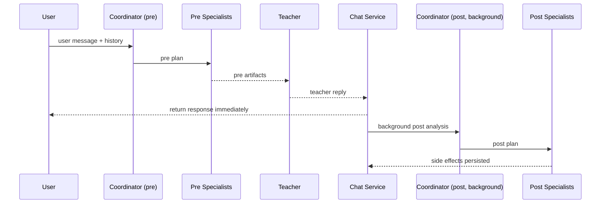
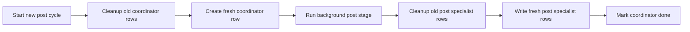
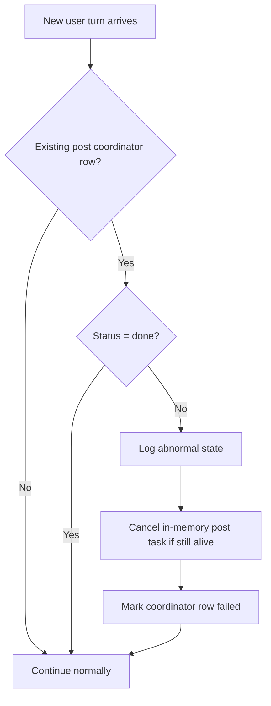

# Agent Swarm: Architecture and Contract

This document is the source of truth for the current agent-swarm architecture, routing contract, tool ownership, and async-post behavior.

Historical context and earlier exploration were merged here from [`AGENT_SWARM_ASYNC_POST_DESIGN.md`](AGENT_SWARM_ASYNC_POST_DESIGN.md). Keep this file authoritative; treat the design doc as archival context only.

For milestone tracking, see [`AGENT_SWARM_PLAN.md`](AGENT_SWARM_PLAN.md).

## Current Status

Implemented now:

- pre-first orchestration with async post processing
- stage-specific coordinator planning (`pre_response` vs `post_response`)
- teacher reply saved and returned before background post work finishes
- post-stage replanning from the actual teacher reply
- coordinator lifecycle tracking rows in `agent_side_effects`
- coordinator-row ownership guard for post-result persistence and terminal status writes
- in-memory post-task registry with stale next-turn cancellation
- image flow using the same async-post pattern

Still planned, but not implemented:

- `MemoryKeeper`
- `NewsAgent`

Explicit non-goals for the current design:

- no grammar specialist
- no durable queue or worker system
- no retry/replay loops for failed post stages
- no multiple user-facing reply agents

## Decision Summary

### 1. Pre Stage Is the Main Specialist Stage

Most specialist work should happen before the teacher responds.

Good fits for pre-stage specialist execution:

- explicit word saving requests
- reading learner memory
- news lookup when the student already provided a topic
- other retrieval or persistence actions that can be decided from the student turn

### 2. Grammar Stays Teacher-Owned

Grammar tools remain directly available to the teacher.

Why:

- grammar lookup is often an in-the-moment pedagogical choice
- the teacher may decide mid-reasoning that grammar lookup would help
- splitting grammar into a specialist would make the interaction less natural

### 3. Post Stage Still Exists

A pure pre-only model is too weak for teacher-dependent persistence actions.

Examples:

- teacher-highlighted words worth saving
- teacher-triggered memory updates
- other persistence decisions that depend on the final teacher reply

### 4. Post Stage Runs in Background

The teacher response is saved and returned immediately. After that, the system:

1. replans post-stage routing from the actual teacher reply
2. runs post specialists
3. persists side effects

This background work is best-effort.

## Tool and Specialist Ownership

### TeacherAgent

Owns:

- final user-facing response
- grammar tools
- memory tools
- `read_url`

Responsibilities:

- pedagogical quality
- tone and conversational flow
- compact memory retrieval at the start of a chat
- on-demand memory inspection when more detail is needed
- natural use of pre-specialist outputs and recent side effects

### CoordinatorAgent

Owns:

- stage-specific routing only

Responsibilities:

- decide which specialists to run for the current stage
- keep routing conservative
- return structured `CoordinatorPlan`

Rules:

- for `pre_response`, populate only `pre_response`
- for `post_response`, populate only `post_response`
- never speculate about future teacher behavior during pre-stage planning
- use the actual teacher reply as a primary signal during post-stage planning

### WordKeeper

Owns:

- useful-word capture via `prioritize_words_for_learning`

Runs in `pre_response` when:

- the student explicitly asks to save or remember words

Runs in `post_response` when:

- the teacher reply explicitly highlights words worth learning

### MemoryKeeper (planned)

Intended role:

- post-stage memory maintenance when the final teacher reply provides the signal
- review and update `area_to_improve` status and priority when the turn shows progress or regression

### NewsAgent (planned)

Intended role:

- pre-stage news lookup when the user already provided a clear topic

## Tool Cases

### WordKeeper

Explicit student request examples:

- "save these words"
- "remember this phrase"
- "add these words to my vocabulary"

Decision:

- handle in pre stage

Teacher-highlighted vocabulary examples:

- "these are key words"
- "these are good words to memorize"
- "let's keep these words in mind"

Decision:

- handle in post stage

### Read URL

[`read_url`](../src/runestone/agents/tools/read_url.py) remains a direct teacher tool.

### News

[`search_news_with_dates`](../src/runestone/agents/tools/news.py) should be specialist-driven when possible.

Known-topic examples:

- "let's read news about history"
- "show me Swedish news about the economy"

Decision:

- handle in pre stage

Vague examples:

- "let's read some news"
- "give me some news"

Decision:

- do not run a news specialist yet
- let the teacher clarify the topic first

### Memory

[`memory.py`](../src/runestone/agents/tools/memory.py) is still the richest future specialist area.

Decision split:

- reading fits pre stage well
- writing may happen in pre or post depending on whether the trigger is explicit from the student or derived from the teacher reply

## Contracts

### CoordinatorAgent Contract

Input:

- latest user message
- recent chat history
- current stage (`pre_response` or `post_response`)
- actual teacher response for post-stage planning
- available specialist names

Output:

- `CoordinatorPlan`
  - `pre_response`
  - `post_response`
  - `audit`

### TeacherAgent Contract

Input:

- latest user message
- recent conversation history
- `[PRE_RESULTS]`
- `[RECENT_SIDE_EFFECTS]`

Output:

- final user-facing response

### WordKeeper Contract

Input:

- latest user message
- recent relevant history
- teacher response when running in post stage

Output artifacts:

- saved words
- skipped words
- tool action summary

## Orchestration Flow

Visible path:

1. user message
2. pre coordinator
3. pre specialists
4. teacher reply
5. save assistant message
6. return HTTP response

Background path:

1. mark coordinator `running`
2. replan from actual teacher reply
3. run post specialists
4. persist specialist rows
5. mark coordinator `done`

## Side-Effect Model

The `agent_side_effects` store remains the internal system of record for post-stage tracking and specialist artifacts.

Why:

- `chat_messages` should stay user-visible
- orchestration state is internal machinery
- mixing them would pollute chat-history semantics

### Coordinator Tracking Row

Conventions:

- `specialist_name="coordinator"`
- `phase="post_response"`
- `status` in `pending | running | done | failed`

### Specialist Result Rows

Specialist result statuses stay:

- `no_action`
- `action_taken`
- `error`

Teacher-facing loading must exclude coordinator rows.

## Cleanup and Safety Policy

### Cleanup Separation

Coordinator lifecycle rows and specialist result rows are managed independently.

Coordinator cleanup:

- remove or replace older coordinator rows for the chat when starting a new post cycle

Specialist cleanup:

- replace previous post specialist rows only when the current post run is ready to persist fresh results

### Minimal Safety Rule

Late background work must not overwrite newer coordinator state.

Practical rule:

- post writes and terminal coordinator status updates may proceed only when `coordinator_row_id == latest_coordinator_row.id`

## Next-Turn Handling

Before processing a new user turn for an existing chat:

1. load the latest coordinator row
2. continue normally if there is no row or status is `done`
3. treat `pending`, `running`, and `failed` as abnormal stale state
4. cancel the live in-memory task if it still exists
5. mark the row `failed` if needed
6. continue with the new turn without replay

## Async Execution Policy

The background post stage is best-effort.

It should:

1. create coordinator row with `pending`
2. return the teacher reply to the user
3. start background task
4. mark coordinator row `running`
5. run post coordinator
6. run post specialists
7. save specialist rows
8. mark coordinator row `done`

If anything fails:

- mark coordinator row `failed`
- log clearly
- do not retry automatically

## In-Memory Task Tracking

Track one live `asyncio.Task` per active chat post stage, keyed by `chat_id`.

Rules:

- store the task handle when background work starts
- remove it when work completes
- wrap the post stage in a hard timeout
- if a new turn arrives while the task is still alive, cancel it

## Observability

Prefix conventions:

- `[agents:manager]`
- `[agents:coordinator]`
- `[agents:side-effects]`
- `[agents:post-task]`
- `[agents:<specialist>]`

## Future Work

Possible future extraction work:

- `MemoryKeeper`
- `NewsAgent`

These are roadmap ideas, not part of the current async-post commitment.
