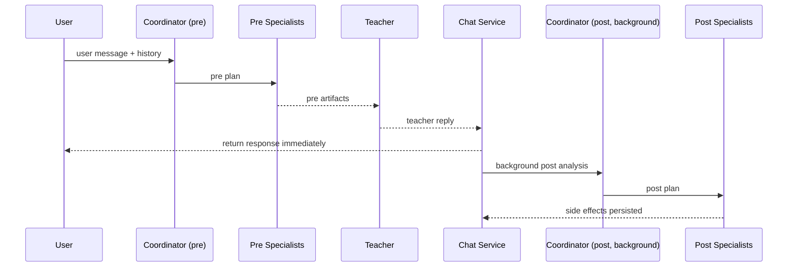
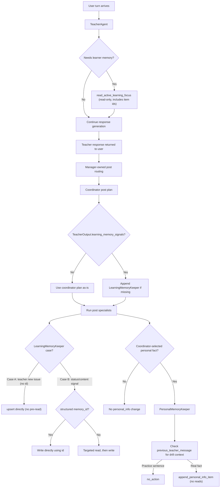
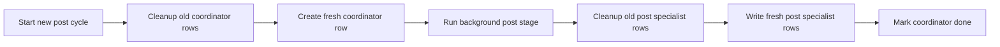
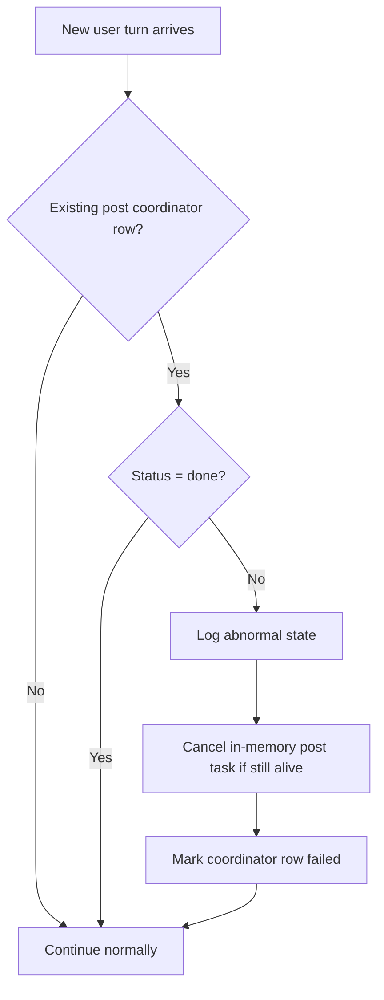

# Agent Swarm Architecture

This document is the source of truth for the current agent-swarm architecture, routing contract, tool ownership, async-post behavior, and memory-maintenance boundaries.

Use it to understand how a turn flows through the swarm, which agent owns which decisions and tools, what each specialist contract expects, and which behaviors are current runtime commitments versus future work.

Historical exploration has been consolidated into this contract and the implementation tracks. Keep this file authoritative.

For milestone tracking, see [`agent-swarm-plan.md`](agent-swarm-plan.md).
For chat-reset memory cleanup details, see
[`memory-maintainer.md`](memory-maintainer.md).

## Index

- [Current Status](#current-status)
- [LLM Configuration](#llm-configuration)
- [Architecture](#architecture)
- [Memory Maintainer](#memory-maintainer)
- [Tool Cases](#tool-cases)
- [Contracts](#contracts)
- [Future Work](#future-work)
- [Decision Log](#decision-log)

## Current Status

Implemented now:

- pre-first orchestration with async post processing
- stage-specific coordinator planning (`pre_response` vs `post_response`)
- teacher reply saved and returned before background post work finishes
- post-stage replanning from the actual teacher reply
- coordinator lifecycle tracking rows in `agent_side_effects`
- coordinator-row ownership guard for post-result persistence and terminal status writes
- in-memory post-task registry with stale next-turn cancellation
- image flow using the same async-post pattern
- `LearningMemoryKeeper` specialist running in post stage for `area_to_improve` maintenance
- `PersonalMemoryKeeper` specialist running in post stage for append-only `personal_info` capture
- `memory_maintainer` specialist running in background after chat reset for scoped startup cleanup
- `NewsAgent` specialist running in pre stage for topic-based news retrieval
- teacher-side memory model narrowed to read-only lookup (`read_active_learning_focus`) during response generation
- first-turn startup memory uses `personal_info_summary` plus top-priority `area_to_improve` starter items

Explicit non-goals for the current design:

- no grammar specialist
- no durable queue or worker system
- no retry/replay loops for failed post stages
- no multiple user-facing reply agents

## LLM Configuration

`Settings.get_agent_llm_settings()` is the single resolution boundary for chat
model configuration. It returns an `AgentLLMSettings` value containing the
provider, model, temperature, reasoning level, request timeout, and maximum
retry count. `build_chat_model()` consumes that value directly; callers do not
carry their own timeout constants or overrides.

Teacher, coordinator, WordKeeper, NewsAgent, and MemoryMaintainer each have
their own timeout and retry environment variables. LearningMemoryKeeper and
PersonalMemoryKeeper share the `MEMORY_KEEPER_*` provider, model, temperature,
and reasoning settings, but use separate
`LEARNING_MEMORY_KEEPER_LLM_TIMEOUT_SECONDS` /
`LEARNING_MEMORY_KEEPER_MAX_RETRIES` and
`PERSONAL_MEMORY_KEEPER_LLM_TIMEOUT_SECONDS` /
`PERSONAL_MEMORY_KEEPER_MAX_RETRIES` budgets. The internal `memory_keeper`
settings alias resolves to the learning-memory budget.

Timeouts are validated as positive and retry counts as non-negative. The
resolved values are passed to both `ChatOpenAI` (for OpenAI and OpenRouter) and
`ChatGoogleGenerativeAI` (for Gemini). In particular, Gemini uses the configured
timeout as-is; the model factory does not impose a minimum timeout.

For tool-using memory keepers, the same per-agent retry count also configures
their existing `ModelRetryMiddleware`. Tool-call run limits and LangGraph
recursion limits remain fixed safety bounds rather than environment settings.

## Architecture

### Overview

Most specialist work should happen before the teacher responds. The pre stage is the default specialist stage for work that can be decided directly from the student turn. The post stage still exists for persistence actions that depend on the final teacher reply, and it runs in background after the user-visible response is already saved and returned.

Good fits for pre-stage specialist execution:

- explicit word saving requests
- news lookup when the student already provided a topic
- other retrieval or persistence actions that can be decided from the student turn

The teacher response is saved and returned immediately. After that, the system:

1. replans post-stage routing from the actual teacher reply
2. runs post specialists
3. persists side effects

This background work is best-effort.

Visible path:

1. user message
2. pre coordinator
3. pre specialists
4. teacher reply
5. save assistant message
6. return HTTP response

Background path:

1. mark coordinator `running`
2. replan from actual teacher reply
3. run post specialists
4. persist specialist rows
5. mark coordinator `done`

### Roles and Ownership

#### TeacherAgent

Owns:

- final user-facing response
- grammar tools
- memory read tool (`read_active_learning_focus`) for on-demand active-learning inspection
- `read_url`

Responsibilities:

- pedagogical quality
- tone and conversational flow
- compact memory retrieval at the start of a chat
- on-demand memory inspection when more detail is needed
- natural use of pre-specialist outputs and recent side effects

Grammar tools remain directly available to the teacher.

Why:

- grammar lookup is often an in-the-moment pedagogical choice
- the teacher may decide mid-reasoning that grammar lookup would help
- splitting grammar into a specialist would make the interaction less natural

#### CoordinatorAgent

Owns:

- stage-specific routing only

Responsibilities:

- decide which specialists to run for the current stage
- keep routing conservative
- return structured `CoordinatorPlan`

Rules:

- for `pre_response`, populate only `pre_response`
- for `post_response`, populate only `post_response`
- never speculate about future teacher behavior during pre-stage planning
- use the actual teacher reply as a primary signal during post-stage planning
- return routing items that only explain which specialist should run and why;
  execution details such as specialist history windows are manager-owned policy

#### WordKeeper

Owns:

- useful-word capture via `prioritize_words_for_learning`

Runs in `pre_response` when:

- the student explicitly asks to save or remember words

Runs after the teacher response when:

- `TeacherOutput.vocabulary_candidates` is non-empty
- `AgentsManager` dispatches a direct background `word_keeper` branch in parallel with
  coordinator-owned post specialists

Does not do:

- mine post-stage vocabulary from teacher prose
- inspect distant chat history to resolve vague earlier-turn save requests
- receive post-stage routing from the post coordinator

#### LearningMemoryKeeper

Owns:

- post-stage `area_to_improve` maintenance when the teacher reply provides an explicit learning signal
- explicit student-requested edits to learning topics (reprioritize, mark mastered, correct description)
- one structured extraction followed by Python-owned, allowlisted database operations

Does not own:

- personal facts (native language, hometown, goals) — that is `PersonalMemoryKeeper`'s domain
- broad startup compaction or duplicate cleanup sweeps; those belong to
  [`memory_maintainer`](memory-maintainer.md)

#### PersonalMemoryKeeper

Owns:

- post-stage append-only capture of durable personal facts (`personal_info`)
- filtering out drill/exercise responses by inspecting `previous_teacher_message`
- explicit student corrections or deletion requests (appended with `status="outdated"`)

Does not own:

- reading or deduplicating personal info — duplicates are reconciled by `memory_maintainer`
- learning progress signals (`area_to_improve`) — that is `LearningMemoryKeeper`'s domain

#### NewsAgent

Owns:

- pre-stage news lookup when the user already provided a clear topic
- topical `search_news_with_dates` retrieval before the teacher responds
- selective `read_url` article reads when snippets are too thin for teacher composition

### Memory Architecture

Memory architecture is intentionally split between teacher-time reading and post-phase maintenance.

#### Teacher-side memory reads

`TeacherAgent` remains the normal reader of learner memory.

Principles:

- Keep routine memory reading on the teacher side rather than extracting a separate read specialist.
- Inject a compact starter-memory bundle only at the start of a chat to keep the default prompt small.
- Let the teacher inspect active-learning memory on demand through `read_active_learning_focus` when the turn needs it.
- Treat memory access during response generation as read-only; the teacher should not claim direct persistence.

Current startup-memory shape:

- `personal_info_summary` when available
- chat-session-scoped `area_to_improve` focus loaded from a frozen ordered id set
- initial batch selected from top 5 `area_to_improve` items across `struggling`
  and `improving`
- initial ranking by priority first, then recency
- `area_to_improve` starter items serialized as untrusted quoted-data text

#### Chat session learning focus freeze

Teacher startup focus for `area_to_improve` is intentionally stable within a
single chat session.

Why:

- the teacher may start drilling one batch of topics early in the chat
- `LearningMemoryKeeper` or `memory_maintainer` may later update item statuses
- reselecting a fresh top-5 slice every turn can silently swap ids and reorder
  topics mid-session
- the teacher then loses continuity and may refer to stale or mismatched item
  ids

Current behavior:

- on first use for a `chat_id`, the backend selects the ordered focus batch
  from the current highest-priority `area_to_improve` items in `struggling` or
  `improving`
- that ordered id set is persisted in `chat_session_learning_focus`
- on later turns, teacher startup memory reuses the same stored ids in the same
  order, but hydrates them from live memory rows so current `content`, `status`,
  and `priority` are still fresh
- the batch stays frozen while at least one stored item is not `mastered`
- when all stored items are now `mastered`, the backend reseeds a new ordered
  batch and injects an explicit teacher-facing note so the teacher can
  acknowledge completion and move on cleanly
- if some stored ids drift away because rows were deleted or merged, the system
  keeps the remaining stored ids instead of silently refilling the batch
  mid-session; reseeding happens only when the stored batch is no longer viable
- when a new chat session starts and `current_chat_id` rotates, old
  `chat_session_learning_focus` rows for prior chat ids are deleted as part of
  chat-start cleanup

This freeze is intentionally not a second per-session status machine. Durable
learning state still lives only in the normal memory-item statuses such as
`struggling`, `improving`, and `mastered`.

#### Post-phase memory maintenance

`LearningMemoryKeeper` and `PersonalMemoryKeeper` together own durable memory maintenance after the actual teacher reply is known.

**LearningMemoryKeeper** principles:

- Run maintenance only in `post_response`, not on the synchronous user-visible path.
- Use `TeacherOutput.learning_memory_signals` as the primary teacher-driven durability signal.
- Let the post-phase Coordinator route explicit student requests to edit tracked
  `area_to_improve` items.
- After Coordinator plans the post phase, manager deterministically appends
  `learning_memory_keeper` when `learning_memory_signals` is non-empty and the
  plan did not already include it.
- Keep `teacher_response` available only as secondary context for interpreting the structured signal.
- Default to `no_action`; avoid additive or corrective writes without clear evidence.
- Parse validated structured `memory_id` values in Python. Targeted turns load only
  those rows; stale, unauthorized, and wrong-category ids are terminal and never
  fall back to creation.
- For untagged turns, load at most 100 fresh `area_to_improve` rows across
  `struggling`, `improving`, and `mastered`, then expose sanitized snapshots to one
  structured extraction call.
- Treat model output as an untrusted plan. Python enforces cardinality, duplicate,
  mutation, ownership, category, and target-allowlist rules before writes.
- Execute accepted writes through `MemoryItemService` in deterministic order and
  build actions and artifacts from service calls that actually completed.

**PersonalMemoryKeeper** principles:

- Append-only: Python uses only `append_personal_info_item`; the specialist never reads memory.
- Receives a manager-owned two-message history window so `run()` can extract
  `previous_teacher_message` to detect drill/exercise context; raw history is not
  exposed to the LLM.
- Uses one structured extraction call to classify practice responses and extract at
  most five facts; Python validates the plan before appending.
- Duplicate `personal_info` rows from append-first writes are an accepted tradeoff; reconciliation belongs to `memory_maintainer`.

Scope of maintenance:

- create a new durable memory item when the turn reveals a recurring issue or stable fact worth storing
- update `area_to_improve` content, status, and priority when the turn shows progress or regression
- delete or correct memory when the student explicitly asks or confirms an existing item is wrong

Area-to-improve review rules:

- repeated struggle keeps the item in `struggling` and may increase urgency by lowering numeric priority
- visible progress moves the item toward `improving` and may reduce urgency by raising numeric priority
- confirmed mastery marks the item `mastered`
- new recurring issues create a fresh `area_to_improve` item with an explicit initial priority

### Memory Maintainer

`memory_maintainer` is a background specialist scheduled after chat reset. It is
not routed through the coordinator and does not block the new session from
starting.

It reviews only `area_to_improve` memory with status `struggling` or
`improving`, then conservatively consolidates obvious duplicates. It now uses a
structured multi-pass planner plus plain Python execution rather than a
tool-calling agent. Background mode is merge-only; optional priority review is
available from the CLI.

For the full runtime, structured flow, logging contract, and ownership boundary, see
[`memory-maintainer.md`](memory-maintainer.md).

### Post-Response Runtime

The `agent_side_effects` store remains the internal system of record for post-stage tracking and specialist artifacts.

Why:

- `chat_messages` should stay user-visible
- orchestration state is internal machinery
- mixing them would pollute chat-history semantics

#### Side-effect persistence

Coordinator tracking row conventions:

- `specialist_name="coordinator"`
- `phase="post_response"`
- `status` in `pending | running | done | failed`

Specialist result statuses stay:

- `no_action`
- `action_taken`
- `error`

Teacher-facing loading must exclude coordinator rows.

#### Async execution policy

The background post stage is best-effort.

It should:

1. create coordinator row with `pending`
2. return the teacher reply to the user
3. start background task
4. mark coordinator row `running`
5. run post coordinator
6. run post specialists
7. save specialist rows
8. mark coordinator row `done`

If anything fails:

- mark coordinator row `failed`
- log clearly
- do not retry automatically

#### In-memory task tracking

Track one live `asyncio.Task` per active chat post stage, keyed by `chat_id`.

Rules:

- store the task handle when background work starts
- remove it when work completes
- wrap the post stage in a hard timeout
- if a new turn arrives while the task is still alive, cancel it

### Safety and Cleanup

#### Cleanup separation

Coordinator lifecycle rows and specialist result rows are managed independently.

Coordinator cleanup:

- remove or replace older coordinator rows for the chat when starting a new post cycle

Specialist cleanup:

- replace previous post specialist rows only when the current post run is ready to persist fresh results

#### Stale-writer safety

Late background work must not overwrite newer coordinator state.

Practical rule:

- post writes and terminal coordinator status updates may proceed only when `coordinator_row_id == latest_coordinator_row.id`

#### Next-turn handling

Before processing a new user turn for an existing chat:

1. load the latest coordinator row
2. continue normally if there is no row or status is `done`
3. treat `pending`, `running`, and `failed` as abnormal stale state
4. cancel the live in-memory task if it still exists
5. mark the row `failed` if needed
6. continue with the new turn without replay

#### Runaway Tool-Use Prevention

Tool-using specialists retain strict `recursion_limit` values. LearningMemoryKeeper
and PersonalMemoryKeeper no longer construct LangGraph agent loops: each performs
one bounded structured-output model invocation, followed by deterministic Python
validation and service calls. MemoryMaintainer likewise uses bounded
structured-output passes.

### Observability

Prefix conventions:

- `[agents:manager]`
- `[agents:coordinator]`
- `[agents:side-effects]`
- `[agents:post-task]`
- `[agents:<specialist>]`

## Tool Cases

### Word Capture

Explicit student request examples:

- "save these words"
- "remember this phrase"
- "add these words to my vocabulary"

Decision:

- handle in pre stage

Teacher-emitted vocabulary candidate examples:

- `TeacherOutput.vocabulary_candidates = [{"word_phrase": "begripa", "context_phrase": "Jag begriper inte."}]`
- visible teacher wording may still highlight useful words, but the structured field is the authoritative signal

Decision:

- handle in post stage

### URL Reading

[`read_url`](../src/runestone/agents/tools/read_url.py) remains a direct teacher tool.

### News Lookup

[`search_news_with_dates`](../src/runestone/agents/tools/news.py) should be specialist-driven when possible.

Known-topic examples:

- "let's read news about history"
- "show me Swedish news about the economy"

Decision:

- handle in pre stage

Vague examples:

- "let's read some news"
- "give me some news"

Decision:

- do not run a news specialist yet
- let the teacher clarify the topic first

### Memory Access and Maintenance

[`memory.py`](../src/runestone/agents/tools/memory.py) supports a split ownership model between teacher read access and post-stage maintenance.

Decision split:

- reading is teacher-owned via `read_active_learning_focus` plus first-turn starter memory
- writing and maintenance are post-phase specialist work (`MemoryKeeper`)
- starter-memory reads for `area_to_improve` are stable per `chat_id`, while
  maintenance agents remain free to update the live rows that are rehydrated on
  later turns

## Contracts

### CoordinatorAgent Contract

Input:

- latest user message
- recent chat history
- current stage (`pre_response` or `post_response`)
- actual teacher response for post-stage planning
- available specialist names

Output:

- `CoordinatorPlan`
  - `pre_response`
  - `post_response`
  - `audit`

Routing items contain only:

- specialist `name`
- routing `reason`

`AgentsManager` owns deterministic specialist history policy:

- `news_agent`: 2 messages
- `word_keeper`: 0 messages
- `learning_memory_keeper`: 0 messages
- `personal_memory_keeper`: 2 messages

### TeacherAgent Contract

Input:

- latest user message
- recent conversation history
- `[PRE_RESULTS]`
- `[RECENT_SIDE_EFFECTS]`

Output:

- final user-facing response
- optional structured `vocabulary_candidates`
- optional structured `learning_memory_signals`

### WordKeeper Contract

Pre-response extraction input:

- latest user message
- `target_translation_language`

Post-response save/enrichment input:

- structured `vocabulary_candidates`
- `target_translation_language`

Notes:

- pre-response extraction evaluates the current user message and may use the immediately
  preceding teacher message to resolve deictic save requests
- post-response WordKeeper does not receive chat history or teacher prose
- `VocabularyService` normalizes, deduplicates, assigns candidate ids, and prioritizes
  existing rows before enrichment

Output artifacts:

- saved words
- skipped words
- tool action summary

Priority behavior:

- normal/manual vocabulary defaults to `priority_learn=9`
- WordKeeper/`prioritize_words_for_learning` decrements existing/restored words (`max(priority-1, 0)`)
- brand-new agent-created words start at `priority_learn=4`

### LearningMemoryKeeper Contract

Input:

- `student_message`: current student message for local context only
- `teacher_response`: secondary teacher context
- `learning_memory_signals`: primary structured teacher durability signal
- `target_memory_ids`: validated ids derived from structured `memory_id` values

Output:

- specialist result with:
  - `status` (`no_action` | `action_taken` | `error`)
  - `info_for_teacher`
  - `artifacts` (`trigger_source`, summary, notes)

### PersonalMemoryKeeper Contract

Input:

- `student_message`: student's current message
- `teacher_response`: teacher's current response
- `previous_teacher_message`: immediately preceding teacher message (extracted from
  the manager-owned two-message history window; not exposed directly to the LLM)

Output:

- specialist result with:
  - `status` (`no_action` | `action_taken` | `error`)
  - `info_for_teacher`
  - `artifacts` (`trigger_source`, summary, notes)

### Shared Status Conventions

Coordinator lifecycle rows use:

- `pending`
- `running`
- `done`
- `failed`

Specialist result rows use:

- `no_action`
- `action_taken`
- `error`

## Future Work

Possible future extraction work remains outside the current async-post commitment, but `NewsAgent`
is now part of the implemented pre-stage specialist set.

## Decision Log

The entries below capture accepted decisions from implementation planning documents that are now reflected in code.

### 2026-03-26: Async Post Architecture Is the Default Runtime Contract

Source: consolidated into [`agent-swarm-plan.md`](agent-swarm-plan.md)

Decisions:

- Keep the user-visible path synchronous only through teacher response generation and assistant-message persistence.
- Start post-stage orchestration in background after response return, with one tracked task per chat.
- Track post lifecycle in `agent_side_effects` using coordinator rows (`pending` → `running` → terminal state).
- Replan post routing from the actual teacher response, not from pre-response speculation.
- Enforce stale-writer safety: post persistence and terminal status writes must target the latest coordinator row only.
- On next-turn stale detection (`pending`/`running`/`failed`), cancel live task, mark failed if current, and continue without retry/replay.
- Keep grammar tooling teacher-owned; do not introduce a grammar specialist.

### 2026-04-01: Memory Ownership Split (Teacher Reads, MemoryKeeper Maintains)

Source: consolidated into [`agent-swarm-plan.md`](agent-swarm-plan.md)

Decisions:

- Keep memory reading on `TeacherAgent` via `read_active_learning_focus` for on-demand active-learning inspection.
- Keep first-turn memory context compact by default rather than loading the full memory state.
- Move durable memory maintenance to post stage and assign it to `MemoryKeeper`.
- Trigger memory maintenance conservatively from explicit durable teacher signals or explicit student memory-edit instructions.
- Keep memory updates evidence-driven (`no_action` bias); avoid blind churn on status/priority without clear turn evidence.
- Keep mastered topics represented as `area_to_improve` items with status `mastered`.

### 2026-06-22: MemoryKeeper Split into LearningMemoryKeeper and PersonalMemoryKeeper

Decisions:

- Split the single `MemoryKeeper` into two focused specialists to reduce prompt complexity and tool surface.
- `LearningMemoryKeeper` owns all `area_to_improve` writes; receives zero chat history.
- `PersonalMemoryKeeper` is append-only (single tool: `append_personal_info_item`); never reads memory.
- `PersonalMemoryKeeper` receives a manager-owned two-message window so `run()` can
  extract `previous_teacher_message` for drill detection — raw history is not
  forwarded to the LLM.
- Both specialists share `MEMORY_KEEPER_*` config; no new env vars needed.

### 2026-07-06: MemoryKeepers moved to deterministic structured output

Decisions:

- Replace both tool-calling agent loops with one structured extraction per run.
- Keep all authorization, target allowlisting, cardinality checks, and persistence in Python.

### 2026-07-07: Specialist History Windows Moved Fully Into Manager Policy

Source: superseded `docs/todo/specialist-history-size-determinism.md`

Decisions:

- Remove `chat_history_size` from coordinator prompts and the `RoutingItem` contract.
- Keep coordinator output focused on specialist selection plus routing reason only.
- Keep current effective history behavior unchanged by moving the policy fully into
  `AgentsManager`.
- Hardcode the current specialist windows as manager-owned constants:
  `news_agent=2`, `word_keeper=0`, `learning_memory_keeper=0`,
  `personal_memory_keeper=2`.
- Continue passing the immediately previous teacher message to `word_keeper` and
  deriving `previous_teacher_message` for `PersonalMemoryKeeper` without exposing raw
  history to the model payload.
- Pre-read only tagged learning targets when tags are present; otherwise supply at
  most 100 sanitized learning targets for semantic reconciliation.
- Preserve append-only personal memory and classify drill responses from the
  previous teacher message before Python appends accepted facts.
- Report partial persistence accurately with one action per actual service call
  and privacy-safe reason codes.
