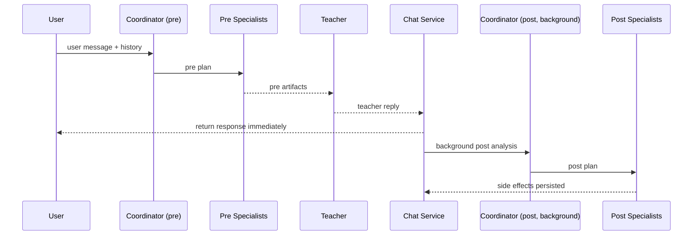
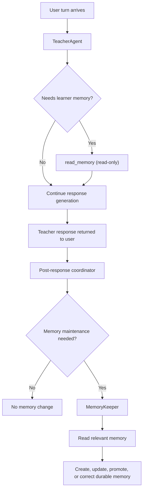
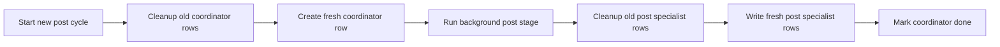
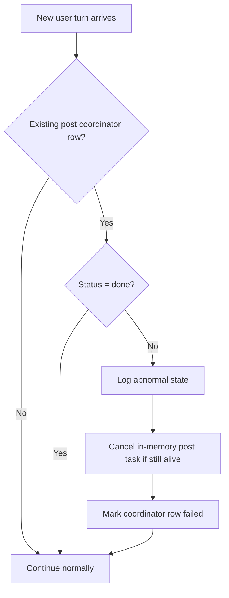

# Agent Swarm Architecture

This document is the source of truth for the current agent-swarm architecture, routing contract, tool ownership, async-post behavior, and memory-maintenance boundaries.

Use it to understand how a turn flows through the swarm, which agent owns which decisions and tools, what each specialist contract expects, and which behaviors are current runtime commitments versus future work.

Historical exploration has been consolidated into this contract and the implementation tracks. Keep this file authoritative.

For milestone tracking, see [`agent-swarm-plan.md`](agent-swarm-plan.md).

## Index

- [Current Status](#current-status)
- [Architecture](#architecture)
- [Tool Cases](#tool-cases)
- [Contracts](#contracts)
- [Future Work](#future-work)
- [Decision Log](#decision-log)

## Current Status

Implemented now:

- pre-first orchestration with async post processing
- stage-specific coordinator planning (`pre_response` vs `post_response`)
- teacher reply saved and returned before background post work finishes
- post-stage replanning from the actual teacher reply
- coordinator lifecycle tracking rows in `agent_side_effects`
- coordinator-row ownership guard for post-result persistence and terminal status writes
- in-memory post-task registry with stale next-turn cancellation
- image flow using the same async-post pattern
- `MemoryKeeper` specialist running in post stage for durable memory maintenance
- teacher-side memory model narrowed to read-only lookup (`read_memory`) during response generation
- compact first-turn starter memory injection (`personal_info` active, top-priority `area_to_improve` struggling/improving, active `knowledge_strength`)

Still planned, but not implemented:

- `NewsAgent`

Explicit non-goals for the current design:

- no grammar specialist
- no durable queue or worker system
- no retry/replay loops for failed post stages
- no multiple user-facing reply agents

## Architecture

### Overview

Most specialist work should happen before the teacher responds. The pre stage is the default specialist stage for work that can be decided directly from the student turn. The post stage still exists for persistence actions that depend on the final teacher reply, and it runs in background after the user-visible response is already saved and returned.

Good fits for pre-stage specialist execution:

- explicit word saving requests
- news lookup when the student already provided a topic
- other retrieval or persistence actions that can be decided from the student turn

The teacher response is saved and returned immediately. After that, the system:

1. replans post-stage routing from the actual teacher reply
2. runs post specialists
3. persists side effects

This background work is best-effort.

Visible path:

1. user message
2. pre coordinator
3. pre specialists
4. teacher reply
5. save assistant message
6. return HTTP response

Background path:

1. mark coordinator `running`
2. replan from actual teacher reply
3. run post specialists
4. persist specialist rows
5. mark coordinator `done`

### Roles and Ownership

#### TeacherAgent

Owns:

- final user-facing response
- grammar tools
- memory read tool (`read_memory`) for on-demand inspection
- `read_url`
- direct news lookup tool (`search_news_with_dates`) until `NewsAgent` is extracted

Responsibilities:

- pedagogical quality
- tone and conversational flow
- compact memory retrieval at the start of a chat
- on-demand memory inspection when more detail is needed
- natural use of pre-specialist outputs and recent side effects

Grammar tools remain directly available to the teacher.

Why:

- grammar lookup is often an in-the-moment pedagogical choice
- the teacher may decide mid-reasoning that grammar lookup would help
- splitting grammar into a specialist would make the interaction less natural

#### CoordinatorAgent

Owns:

- stage-specific routing only

Responsibilities:

- decide which specialists to run for the current stage
- keep routing conservative
- return structured `CoordinatorPlan`

Rules:

- for `pre_response`, populate only `pre_response`
- for `post_response`, populate only `post_response`
- never speculate about future teacher behavior during pre-stage planning
- use the actual teacher reply as a primary signal during post-stage planning

#### WordKeeper

Owns:

- useful-word capture via `prioritize_words_for_learning`

Runs in `pre_response` when:

- the student explicitly asks to save or remember words

Runs in `post_response` when:

- the teacher reply explicitly highlights words worth learning

#### MemoryKeeper

Owns:

- post-stage memory maintenance when the final teacher reply provides the signal
- explicit student-requested memory edits in the current turn when routed by post coordinator
- review and update `area_to_improve` status and priority when the turn shows progress or regression
- promotion from `area_to_improve` to `knowledge_strength`

#### NewsAgent (planned)

Intended role:

- pre-stage news lookup when the user already provided a clear topic

### Memory Architecture

Memory architecture is intentionally split between teacher-time reading and post-phase maintenance.

#### Teacher-side memory reads

`TeacherAgent` remains the normal reader of learner memory.

Principles:

- Keep routine memory reading on the teacher side rather than extracting a separate read specialist.
- Inject a compact starter-memory bundle only at the start of a chat to keep the default prompt small.
- Let the teacher inspect more memory on demand through filtered `read_memory` calls when the turn needs it.
- Treat memory access during response generation as read-only; the teacher should not claim direct persistence.

Current starter-memory shape:

- active `personal_info`
- top 5 `area_to_improve` items across `struggling` and `improving`
- ranking by priority first, then recency
- active `knowledge_strength`

#### Post-phase memory maintenance

`MemoryKeeper` owns durable memory maintenance after the actual teacher reply is known.

Principles:

- Run maintenance only in `post_response`, not on the synchronous user-visible path.
- Use the actual `teacher_response` as the strongest teacher-driven signal for durable updates.
- Allow explicit student memory-edit instructions from the current turn to trigger maintenance as well.
- Default to `no_action`; avoid additive or corrective writes without clear evidence.
- Read relevant memory before writing so updates can correct stale state instead of blindly appending more notes.

Scope of maintenance:

- create a new durable memory item when the turn reveals a recurring issue or stable fact worth storing
- update `area_to_improve` content, status, and priority when the turn shows progress or regression
- promote mastered `area_to_improve` items into `knowledge_strength`
- delete or correct memory only when the student explicitly asks or confirms an existing item is wrong

Area-to-improve review rules:

- repeated struggle keeps the item in `struggling` and may increase urgency by lowering numeric priority
- visible progress moves the item toward `improving` and may reduce urgency by raising numeric priority
- confirmed mastery marks the item `mastered` and promotes it to `knowledge_strength`
- new recurring issues create a fresh `area_to_improve` item with an explicit initial priority

### Post-Response Runtime

The `agent_side_effects` store remains the internal system of record for post-stage tracking and specialist artifacts.

Why:

- `chat_messages` should stay user-visible
- orchestration state is internal machinery
- mixing them would pollute chat-history semantics

#### Side-effect persistence

Coordinator tracking row conventions:

- `specialist_name="coordinator"`
- `phase="post_response"`
- `status` in `pending | running | done | failed`

Specialist result statuses stay:

- `no_action`
- `action_taken`
- `error`

Teacher-facing loading must exclude coordinator rows.

#### Async execution policy

The background post stage is best-effort.

It should:

1. create coordinator row with `pending`
2. return the teacher reply to the user
3. start background task
4. mark coordinator row `running`
5. run post coordinator
6. run post specialists
7. save specialist rows
8. mark coordinator row `done`

If anything fails:

- mark coordinator row `failed`
- log clearly
- do not retry automatically

#### In-memory task tracking

Track one live `asyncio.Task` per active chat post stage, keyed by `chat_id`.

Rules:

- store the task handle when background work starts
- remove it when work completes
- wrap the post stage in a hard timeout
- if a new turn arrives while the task is still alive, cancel it

### Safety and Cleanup

#### Cleanup separation

Coordinator lifecycle rows and specialist result rows are managed independently.

Coordinator cleanup:

- remove or replace older coordinator rows for the chat when starting a new post cycle

Specialist cleanup:

- replace previous post specialist rows only when the current post run is ready to persist fresh results

#### Stale-writer safety

Late background work must not overwrite newer coordinator state.

Practical rule:

- post writes and terminal coordinator status updates may proceed only when `coordinator_row_id == latest_coordinator_row.id`

#### Next-turn handling

Before processing a new user turn for an existing chat:

1. load the latest coordinator row
2. continue normally if there is no row or status is `done`
3. treat `pending`, `running`, and `failed` as abnormal stale state
4. cancel the live in-memory task if it still exists
5. mark the row `failed` if needed
6. continue with the new turn without replay

### Observability

Prefix conventions:

- `[agents:manager]`
- `[agents:coordinator]`
- `[agents:side-effects]`
- `[agents:post-task]`
- `[agents:<specialist>]`

## Tool Cases

### Word Capture

Explicit student request examples:

- "save these words"
- "remember this phrase"
- "add these words to my vocabulary"

Decision:

- handle in pre stage

Teacher-highlighted vocabulary examples:

- "these are key words"
- "these are good words to memorize"
- "let's keep these words in mind"

Decision:

- handle in post stage

### URL Reading

[`read_url`](../src/runestone/agents/tools/read_url.py) remains a direct teacher tool.

### News Lookup

[`search_news_with_dates`](../src/runestone/agents/tools/news.py) should be specialist-driven when possible.

Known-topic examples:

- "let's read news about history"
- "show me Swedish news about the economy"

Decision:

- handle in pre stage

Vague examples:

- "let's read some news"
- "give me some news"

Decision:

- do not run a news specialist yet
- let the teacher clarify the topic first

### Memory Access and Maintenance

[`memory.py`](../src/runestone/agents/tools/memory.py) supports a split ownership model between teacher read access and post-stage maintenance.

Decision split:

- reading is teacher-owned via filtered `read_memory`
- writing and maintenance are post-phase specialist work (`MemoryKeeper`)

## Contracts

### CoordinatorAgent Contract

Input:

- latest user message
- recent chat history
- current stage (`pre_response` or `post_response`)
- actual teacher response for post-stage planning
- available specialist names

Output:

- `CoordinatorPlan`
  - `pre_response`
  - `post_response`
  - `audit`

### TeacherAgent Contract

Input:

- latest user message
- recent conversation history
- `[PRE_RESULTS]`
- `[RECENT_SIDE_EFFECTS]`

Output:

- final user-facing response

### WordKeeper Contract

Input:

- latest user message
- recent relevant history
- teacher response when running in post stage

Output artifacts:

- saved words
- skipped words
- tool action summary

### MemoryKeeper Contract

Input:

- latest user message (explicit student memory-edit signal)
- recent chat history (context only, not trigger source)
- teacher response (primary teacher-driven durability signal)
- routing reason from coordinator

Output:

- specialist result with:
  - `status` (`no_action` | `action_taken` | `error`)
  - `actions` summary
  - `info_for_teacher`
  - `artifacts` (`trigger_source`, summary, notes)

### Shared Status Conventions

Coordinator lifecycle rows use:

- `pending`
- `running`
- `done`
- `failed`

Specialist result rows use:

- `no_action`
- `action_taken`
- `error`

## Future Work

Possible future extraction work:

- `NewsAgent`

These are roadmap ideas, not part of the current async-post commitment.

## Decision Log

The entries below capture accepted decisions from implementation planning documents that are now reflected in code.

### 2026-03-26: Async Post Architecture Is the Default Runtime Contract

Source: [`agent-swarm-async-post-implementation-plan.md`](agent-swarm-async-post-implementation-plan.md)

Decisions:

- Keep the user-visible path synchronous only through teacher response generation and assistant-message persistence.
- Start post-stage orchestration in background after response return, with one tracked task per chat.
- Track post lifecycle in `agent_side_effects` using coordinator rows (`pending` → `running` → terminal state).
- Replan post routing from the actual teacher response, not from pre-response speculation.
- Enforce stale-writer safety: post persistence and terminal status writes must target the latest coordinator row only.
- On next-turn stale detection (`pending`/`running`/`failed`), cancel live task, mark failed if current, and continue without retry/replay.
- Keep grammar tooling teacher-owned; do not introduce a grammar specialist.

### 2026-04-01: Memory Ownership Split (Teacher Reads, MemoryKeeper Maintains)

Source: [`agent-swarm-memory-maintenance-plan.md`](agent-swarm-memory-maintenance-plan.md)

Decisions:

- Keep memory reading on `TeacherAgent` via filtered `read_memory` for on-demand inspection.
- Keep first-turn memory context compact by default rather than loading the full memory state.
- Move durable memory maintenance to post stage and assign it to `MemoryKeeper`.
- Trigger memory maintenance conservatively from explicit durable teacher signals or explicit student memory-edit instructions.
- Keep memory updates evidence-driven (`no_action` bias); avoid blind churn on status/priority without clear turn evidence.
- Keep promotion path explicit (`area_to_improve` → `knowledge_strength`) rather than ad hoc delete/recreate behavior.
