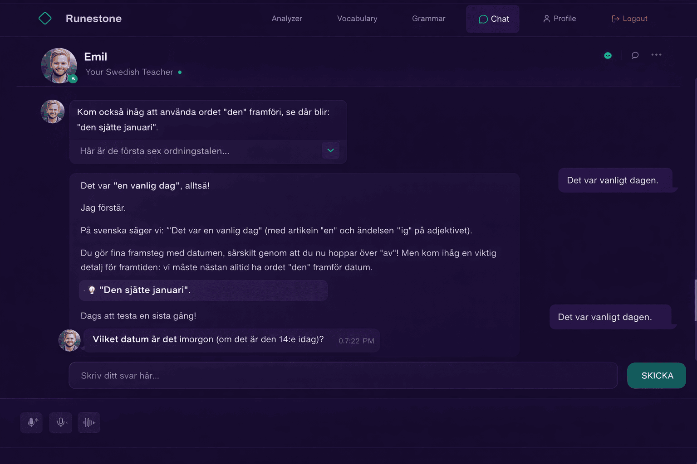

# Chat Redesign Plan

## Goal

Redesign the chat surface so it feels like a conversation with Björn, the Swedish teacher, while preserving the current chat, image upload, voice, transcription, TTS, memory, and new-chat behavior.

## Design Reference

## Implementation Summary

- Add a reusable teacher avatar component with a fallback `B` avatar until the final portrait asset is ready.
- Replace the old chat title block with a Björn persona header.
- Render assistant messages with the teacher avatar and narrower teaching-focused bubbles.
- Render assistant markdown formatting and highlight correction/tip snippets as teaching callouts.
- Add message timestamps from existing chat history `created_at` data and optimistic frontend timestamps.
- Restyle the composer with `Skriv ditt svar här...`, a visible `SKICKA` action, and compact voice/image controls.

## Acceptance Checklist

- Björn appears in the chat header with `Your Swedish Teacher`.
- Fallback avatar appears in the header and beside assistant messages.
- User messages align right; assistant messages align left with readable line length.
- Assistant markdown renders formatted text instead of raw `**` markers.
- Teaching correction/tip snippets render as highlighted callouts.
- Input row resembles the desired design and remains usable on mobile.
- Existing image upload, voice recording, voice playback, transcription options, memory, and new-chat behavior still work.
- Playwright desktop and mobile screenshots are captured and compared against the desired design.
