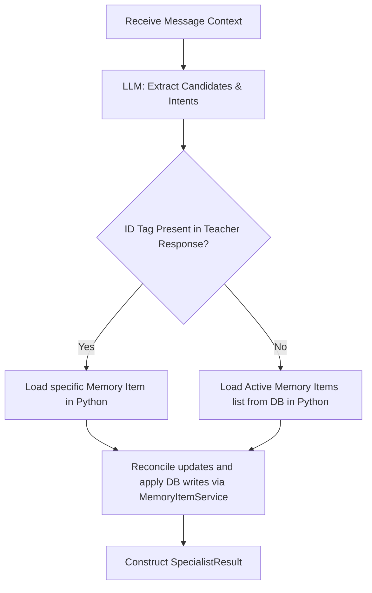

# TODO: Refactor Memory Keepers to Deterministic Structured Output

## Context & Goal
The current `LearningMemoryKeeperSpecialist` and `PersonalMemoryKeeperSpecialist` are built as tool-using agents using LangChain's `create_agent` loop. In this setup, the LLM decides which tools (e.g. `read_areas_to_improve`, `upsert_memory_item`, `append_personal_info_item`) to call in a multi-turn reasoning loop.

Following the successful pattern established by `WordKeeperSpecialist` and background `MemoryMaintainer`, we will refactor both Memory Keepers to use a **deterministic structured JSON extraction pipeline**. This eliminates the agent execution loop and moves control flow/database operations strictly into Python.

### Key Benefits
* **Reliability**: Structurally prevents infinite tool loops, missing calls, and tool argument hallucinations.
* **Token Savings**: Avoids injecting tool schemas into system prompts and sending multi-turn scratchpads.
* **Bounded Latency**: Replaces multi-turn agent reasoning with a single, structured LLM query.
* **Clean Code**: Control flow is handled by plain Python code rather than prompting instructions.

---

## Proposed Architecture

### 1. Learning Memory Keeper Specialist (`learning_memory_keeper.py`)
Instead of letting the LLM choose from 6 different tools inside a loop, the refactored specialist will follow this deterministic flow:



#### New Extraction Schemas
Define in `src/runestone/agents/schemas.py` or directly inside the specialist:
```python
class LearningMemoryKeeperUpdate(BaseModel):
    target_id: Optional[int] = Field(None, description="The memory item ID parsed from [memory:area_to_improve:<id>] tag if present")
    action_type: Literal["upsert", "update_status", "update_content", "delete"]
    key: str = Field(..., description="Short English descriptor of the grammar/language concept")
    content: str = Field(..., description="Explanation of what the student struggles with")
    status: Literal["struggling", "mastered"] = "struggling"
    priority: Optional[int] = Field(None, description="Priority rating (0=critical, 9=minor)")

class LearningMemoryKeeperExtraction(BaseModel):
    decision: Literal["no_action", "update_memory"]
    updates: list[LearningMemoryKeeperUpdate] = Field(default_factory=list)
```

#### Execution Logic (Python-driven)
* Call `self.model.with_structured_output(LearningMemoryKeeperExtraction)`.
* If `decision == "no_action"`, return early.
* For each extracted update:
  * Check if `target_id` is supplied and exists in the DB.
  * If no `target_id` is supplied (Case A/B/C without tags), query `MemoryItemService.list_memory_items` to match concepts and avoid duplicates.
  * Deterministically select and call the appropriate `MemoryItemService` method:
    * `upsert_memory_item(...)`
    * `update_item_status(...)`
    * `update_item_content_in_category(...)`
    * `update_item_priority(...)`
    * `delete_item(...)`
* Wrap operations in `provide_memory_item_service()` context manager.

---

### 2. Personal Memory Keeper Specialist (`personal_memory_keeper.py`)
Instead of using `append_personal_info_item` via an agent loop:

#### New Extraction Schemas
```python
class PersonalMemoryKeeperFact(BaseModel):
    key: str = Field(..., description="Short English descriptor (lives_in, learning_goal, etc.)")
    content: str = Field(..., description="The fact in clear, concise English")
    status: Literal["active", "correction", "outdated"] = "active"

class PersonalMemoryKeeperExtraction(BaseModel):
    decision: Literal["no_action", "append_fact"]
    facts: list[PersonalMemoryKeeperFact] = Field(default_factory=list)
```

#### Execution Logic (Python-driven)
* Call `self.model.with_structured_output(PersonalMemoryKeeperExtraction)`.
* In Python, validate facts against drill/practice rules (e.g. check if the previous teacher message was an exercise prompt).
* Call `MemoryItemService.append_personal_info_item(...)` directly.

---

## Action Items

### Phase 1: Schemas & Specialists
- [ ] Define `LearningMemoryKeeperExtraction` and `PersonalMemoryKeeperExtraction` models.
- [ ] Refactor `learning_memory_keeper.py`:
  - Remove `_build_agent()` and LangChain agent helper methods.
  - Implement deterministic `run()` logic using structured model outputs and direct `MemoryItemService` calls.
- [ ] Refactor `personal_memory_keeper.py`:
  - Remove agent logic and direct the flow through structured outputs and `MemoryItemService.append_personal_info_item`.

### Phase 2: Test Suite Adjustment
- [ ] Update unit tests in `test_learning_memory_keeper.py`:
  - Remove LangChain agent mocks (`create_agent`, `ToolCallLimitMiddleware`).
  - Mock the structured model responses and assert that the correct database service calls are triggered with correct arguments.
- [ ] Update unit tests in `test_personal_memory_keeper.py`.

### Phase 3: Validation
- [ ] Execute linter checks: `make backend-lint`.
- [ ] Run backend tests locally: `ENV_FILE=.env.test uv run pytest -q --tb=line -x` and verify everything passes.
