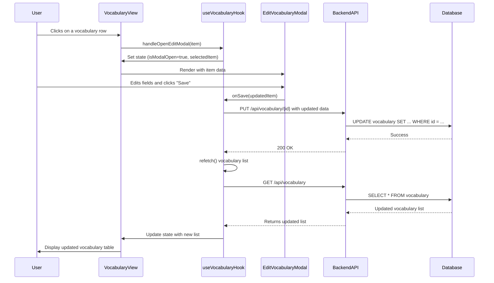

# Refactoring Plan: Implement Vocabulary Record Editing

## 1. Executive Summary & Goals
This plan outlines the steps to introduce functionality for editing vocabulary records within the application. The primary goal is to enhance user control over their saved vocabulary by allowing modifications to key fields.

- **Goal 1: Create an Editing Interface.** Develop a user-friendly modal window for editing vocabulary entries.
- **Goal 2: Implement Full-Stack Update Logic.** Add the necessary frontend state management, API endpoint, and backend database logic to persist changes.
- **Goal 3: Ensure Data Integrity and UX.** The vocabulary view should reflect changes immediately upon a successful edit, providing a seamless user experience.

## 2. Current Situation Analysis
The current system displays a list of saved vocabulary items in the `VocabularyView.tsx` component using a `DataTable`. This view is read-only. The `in_learn` checkbox is present but disabled, with a `TODO` comment indicating that update functionality is missing. There is no backend endpoint or frontend logic to support editing or updating existing vocabulary records. The user interaction to trigger an edit (e.g., clicking a row) is supported by the `DataTable` component but is not currently utilized in `VocabularyView.tsx`.

## 3. Proposed Solution / Refactoring Strategy
### 3.1. High-Level Design / Architectural Overview
We will implement a full-stack feature enabling vocabulary editing. The user will click a row in the vocabulary table, which will open a modal pre-filled with the record's data. After editing and saving, a `PUT` request will be sent to a new backend endpoint, the database will be updated, and the frontend vocabulary list will be refreshed to show the changes.



### 3.2. Key Components / Modules
- **`EditVocabularyModal.tsx` (New):** A new React component responsible for rendering the editing form within a modal dialog. It will manage its internal form state and delegate save actions.
- **`useVocabulary.ts` (Modified):** The existing hook will be expanded to manage the state for the edit modal (visibility, selected item) and to include a function for making the API call to update a vocabulary item.
- **`VocabularyView.tsx` (Modified):** This component will be updated to handle row clicks to trigger the modal and to render the new `EditVocabularyModal` component.
- **`endpoints.py` (Modified):** A new `PUT /api/vocabulary/{item_id}` endpoint will be added to handle update requests.
- **`vocabulary_service.py` & `repository.py` (Modified):** These backend modules will be updated with methods to find and update a specific vocabulary record in the database.
- **`schemas.py` (Modified):** A new Pydantic schema, `VocabularyUpdate`, will be created for request body validation on the new endpoint.

### 3.3. Detailed Action Plan / Phases

#### Phase 1: Backend Implementation
- **Objective(s):** Create the API endpoint and database logic required to update a vocabulary record.
- **Priority:** High

- **Task 1.1: Define Update Schema**
  - **Rationale/Goal:** Create a Pydantic model to validate the incoming update request payload.
  - **Estimated Effort:** S
  - **Deliverable/Criteria for Completion:** A new `VocabularyUpdate` class is added to `src/runestone/api/schemas.py` with optional fields: `word_phrase`, `translation`, `example_phrase`, and `in_learn`.

- **Task 1.2: Implement Repository Update Method**
  - **Rationale/Goal:** Add the data access logic to update a vocabulary record in the database.
  - **Estimated Effort:** S
  - **Deliverable/Criteria for Completion:** A new method `update_vocabulary_item` is added to `VocabularyRepository` in `src/runestone/db/repository.py`. This method finds a vocabulary item by its ID and user ID, updates its fields from the provided data, and commits the transaction.

- **Task 1.3: Implement Service Update Method**
  - **Rationale/Goal:** Create the service layer logic that orchestrates the update, including fetching the record and calling the repository.
  - **Estimated Effort:** S
  - **Deliverable/Criteria for Completion:** A new method `update_vocabulary_item` is added to `VocabularyService` in `src/runestone/services/vocabulary_service.py`. It handles fetching the item, applying updates, and returning the updated record.

- **Task 1.4: Create API Endpoint**
  - **Rationale/Goal:** Expose the update functionality via a RESTful API endpoint.
  - **Estimated Effort:** M
  - **Deliverable/Criteria for Completion:** A new `PUT` endpoint at `/vocabulary/{item_id}` is created in `src/runestone/api/endpoints.py`. It uses the `VocabularyService` to perform the update and handles potential errors (e.g., item not found).

#### Phase 2: Frontend Implementation
- **Objective(s):** Build the user interface and state management for editing vocabulary.
- **Priority:** High

- **Task 2.1: Create Edit Vocabulary Modal Component**
  - **Rationale/Goal:** Develop the reusable modal component for the editing form.
  - **Estimated Effort:** M
  - **Deliverable/Criteria for Completion:** A new file `frontend/src/components/EditVocabularyModal.tsx` is created. The component uses MUI `Modal`, `TextField`, `StyledCheckbox`, and `CustomButton` to create the form. It accepts props for visibility, the item to edit, and close/save handlers.

- **Task 2.2: Enhance `useVocabulary` Hook**
  - **Rationale/Goal:** Add state management for the editing process and the API call logic.
  - **Estimated Effort:** M
  - **Deliverable/Criteria for Completion:** The `useRecentVocabulary` hook in `frontend/src/hooks/useVocabulary.ts` is updated to include:
    - State variables for modal visibility (`isEditModalOpen`) and the selected item (`editingItem`).
    - Handler functions to open and close the modal.
    - An `updateVocabularyItem` async function that sends a `PUT` request to the new backend endpoint and calls `refetch` on success.

- **Task 2.3: Integrate Modal into `VocabularyView`**
  - **Rationale/Goal:** Connect the `DataTable` to the new modal and hook logic.
  - **Estimated Effort:** S
  - **Deliverable/Criteria for Completion:** The `frontend/src/components/VocabularyView.tsx` component is modified to:
    - Use the new state and handlers from the `useRecentVocabulary` hook.
    - Pass an `onRowClick` handler to `DataTable` that triggers the edit modal.
    - Render the `<EditVocabularyModal />` with the correct props.

### 3.4. Data Model Changes
No changes are required for the database schema (`src/runestone/db/models.py`). The existing `Vocabulary` model supports all required fields.

### 3.5. API Design / Interface Changes
- **New Endpoint:** `PUT /api/vocabulary/{item_id}`
  - **Description:** Updates a specific vocabulary item.
  - **Request Body:** `VocabularyUpdate` schema.
    ```json
    {
      "word_phrase": "string (optional)",
      "translation": "string (optional)",
      "example_phrase": "string (optional)",
      "in_learn": "boolean (optional)"
    }
    ```
  - **Success Response:** `200 OK` with the updated `Vocabulary` object.
  - **Error Responses:**
    - `404 Not Found`: If the `item_id` does not exist.
    - `422 Unprocessable Entity`: If the request body is invalid.
    - `500 Internal Server Error`: For database or other server errors.

## 4. Key Considerations & Risk Mitigation
### 4.1. Technical Risks & Challenges
- **Risk:** Frontend state synchronization. The UI must accurately reflect the state of the data after an edit.
  - **Mitigation:** Upon a successful update, the `useVocabulary` hook will automatically call its `refetch` function. This is a simple and robust way to ensure the data displayed is always fresh from the server, avoiding complex client-side state manipulation.
- **Risk:** Form handling in the modal. Managing controlled components and validation can be complex.
  - **Mitigation:** The `EditVocabularyModal` will manage its own form state internally using `useState`. The initial state will be populated from the selected item prop, and changes will be tracked locally until the user clicks "Save".

### 4.2. Dependencies
- **Internal:** Frontend tasks (Phase 2) are dependent on the completion of the backend API endpoint (Phase 1).

### 4.3. Non-Functional Requirements (NFRs) Addressed
- **Usability:** The modal-based editing flow provides a focused and intuitive user experience without navigating away from the main vocabulary list.
- **Maintainability:** The new logic is encapsulated within specific components and hooks (`EditVocabularyModal`, `useVocabulary`), adhering to the existing architecture and promoting separation of concerns.
- **Reliability:** The plan includes refetching data after an update, ensuring data consistency between the client and server.

## 5. Success Metrics / Validation Criteria
- A user can click on any row in the vocabulary table, and an edit modal appears.
- The modal is pre-populated with the correct data for the selected row.
- The user can modify the `word_phrase`, `translation`, `example_phrase`, and `in_learn` fields.
- Clicking "Save" persists the changes to the database and updates the vocabulary table in the UI.
- Clicking "Cancel" or closing the modal discards any changes.
- The backend endpoint is covered by automated tests.

## 6. Assumptions Made
- The current hardcoded `user_id=1` on the backend is sufficient for this task; a full authentication system is not required.
- The Material-UI component library is the standard for new UI elements like modals and text fields.
- A `PUT` request is an acceptable method for this update operation.

## 7. Open Questions / Areas for Further Investigation
- Should there be client-side validation in the edit modal (e.g., preventing empty `word_phrase` or `translation`)?
  - **Recommendation:** Yes, basic validation (non-empty required fields) should be added to the modal to provide immediate feedback to the user. This can be a follow-up task if not included in the initial implementation.