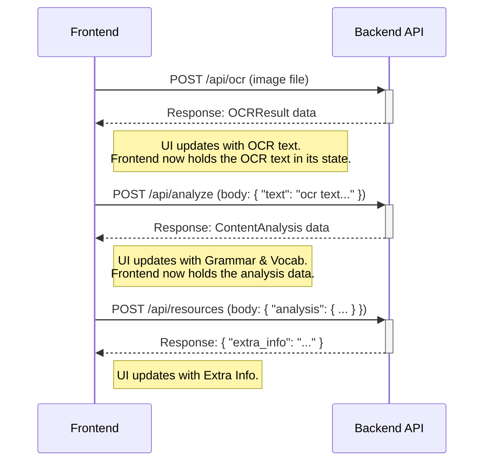

# Refactoring Plan: Decompose Monolithic Image Processing Endpoint

## 1. Executive Summary & Goals
This plan outlines the refactoring of the single, long-running `/api/process` endpoint into a multi-step, asynchronous workflow orchestrated by the frontend. The backend will be refactored to be stateless between calls, with the frontend holding all intermediate data. The primary objective is to significantly improve the frontend's perceived performance by displaying analysis results incrementally as they become available.

**Key Goals:**
1.  **Improve Frontend Responsiveness:** Eliminate the long wait time by splitting the backend processing into smaller, independent, stateless steps.
2.  **Enable Asynchronous UI Updates:** Allow the frontend to fetch and display results for each processing stage (OCR, Analysis, Resources) as soon as it's ready.
3.  **Enhance System Modularity:** Decompose the backend services and API into more focused, single-responsibility components that operate on data inputs rather than shared state, improving maintainability and testability.

## 2. Current Situation Analysis
The current system uses a single monolithic endpoint, `/api/process`. When a user uploads an image, the frontend sends it to this endpoint and waits for the entire processing pipeline (OCR, content analysis, and resource search) to complete. This can take a significant amount of time, leaving the user with a generic "Processing..." message without any intermediate feedback.

**Key Pain Points:**
-   **Poor User Experience:** The UI is blocked until the slowest processing step is finished, leading to high perceived latency.
-   **Monolithic Backend Logic:** The `RunestoneProcessor.process_image` method combines multiple distinct concerns, making it less modular and harder to test or modify individual steps.
-   **Backend State Management (Implicit):** The current process relies on a temporary file on the server to pass the image data through the processing stages, which adds complexity. The user has requested to remove this.

## 3. Proposed Solution / Refactoring Strategy
### 3.1. High-Level Design / Architectural Overview
We will transition from a single synchronous API call to a frontend-orchestrated, multi-step asynchronous process. The backend will expose three stateless endpoints. The frontend will upload the image to the first endpoint, receive the OCR text, then send that text to the second endpoint for analysis, and finally send the analysis result to the third endpoint to get supplementary resources.

**New Stateless Workflow Diagram:**

### 3.2. Key Components / Modules
-   **`api.endpoints` (Modified):** The existing `/process` endpoint will be removed and replaced with three new, stateless endpoints: `/ocr`, `/analyze`, and `/resources`.
-   **`core.processor`, `core.ocr`, `core.analyzer` (Modified):** The logic will be refactored to be stateless. Methods will accept data (image bytes, text, analysis data) as direct arguments instead of file paths or internal state.
-   **`api.schemas` (Modified):** New Pydantic schemas will be created for the request and response bodies of the new endpoints.
-   **`frontend/hooks/useImageProcessing.ts` (Modified):** This hook will be heavily refactored to manage the new multi-step state (e.g., `ocrResult`, `analysisResult`) and orchestrate the sequence of API calls, passing the result from one call as the payload for the next.

### 3.3. Detailed Action Plan / Phases
#### Phase 1: Backend Refactoring
-   **Objective(s):** Decompose the backend logic and expose it through new, granular, stateless API endpoints.
-   **Priority:** High

-   **Task 1.1: Refactor Core Services to be Stateless**
    -   **Rationale/Goal:** Decouple processing logic from the filesystem. Methods should accept data directly and return results.
    -   **Estimated Effort:** M
    -   **Deliverable/Criteria for Completion:**
        -   `OCRProcessor.extract_text` is modified to accept an image (`PIL.Image`) object instead of a `Path`.
        -   `RunestoneProcessor` is refactored. The `process_image` method is removed. New methods are created: `run_ocr(image_bytes)`, `run_analysis(text)`, and `run_resource_search(analysis_data)`.

-   **Task 1.2: Define New API Schemas**
    -   **Rationale/Goal:** Create strongly-typed data contracts for the new endpoints.
    -   **Estimated Effort:** S
    -   **Deliverable/Criteria for Completion:** New Pydantic models are added to `src/runestone/api/schemas.py` for each new request (e.g., `AnalysisRequest`, `ResourceRequest`). Existing models (`OCRResult`, `ContentAnalysis`) will be reused for responses.

-   **Task 1.3: Implement New API Endpoints**
    -   **Rationale/Goal:** Expose the refactored service logic via the new REST API structure.
    -   **Estimated Effort:** L
    -   **Deliverable/Criteria for Completion:** The old `/api/process` endpoint in `src/runestone/api/endpoints.py` is removed. The new endpoints (`/ocr`, `/analyze`, `/resources`) are implemented. `/ocr` will read the uploaded file into memory, and subsequent endpoints will receive JSON payloads.

#### Phase 2: Frontend Refactoring
-   **Objective(s):** Update the frontend to orchestrate the new API workflow and display results incrementally.
-   **Priority:** High

-   **Task 2.1: Redesign `useImageProcessing` Hook State**
    -   **Rationale/Goal:** Adapt the hook's state to hold partial results from each step of the pipeline.
    -   **Estimated Effort:** M
    -   **Deliverable/Criteria for Completion:** The state in `frontend/src/hooks/useImageProcessing.ts` is changed from a single `result` object to separate state variables: `ocrResult`, `analysisResult`, `resourcesResult`, and a `processingStep` status string (e.g., 'OCR', 'ANALYZING', 'RESOURCES', 'DONE').

-   **Task 2.2: Rewrite `processImage` Orchestration Logic**
    -   **Rationale/Goal:** Implement the client-side orchestration of the multi-step API calls.
    -   **Estimated Effort:** L
    -   **Deliverable/Criteria for Completion:** The `processImage` function in the hook now makes a sequence of `fetch` calls. It awaits the `/ocr` call, updates state with the OCR text, then uses that text to call `/analyze`, updates state again, and so on. It must handle errors at any stage.

-   **Task 2.3: Update UI Components for Incremental Rendering**
    -   **Rationale/Goal:** Modify the UI to render data as it arrives, providing immediate feedback to the user.
    -   **Estimated Effort:** M
    -   **Deliverable/Criteria for Completion:** `ResultsDisplay.tsx` is updated to render tabs and content based on which parts of the state (`ocrResult`, `analysisResult`, etc.) are populated. `ProcessingStatus.tsx` is updated to show more specific messages based on the `processingStep` state.

#### Phase 3: Testing and Finalization
-   **Objective(s):** Ensure the new implementation is robust and correct.
-   **Priority:** Medium

-   **Task 3.1: Update Frontend and Backend Tests**
    -   **Rationale/Goal:** Align all tests with the new asynchronous, multi-step, stateless logic.
    -   **Estimated Effort:** M
    -   **Deliverable/Criteria for Completion:**
        -   Frontend tests in `useImageProcessing.test.ts` are rewritten to mock the new sequence of API calls and assert intermediate state changes.
        -   Backend unit tests are created for each of the three new API endpoints.

### 3.5. API Design / Interface Changes
-   **`POST /api/ocr`**
    -   Request: `FormData` with `file` (image).
    -   Response (200 OK): `OCRResult` schema.
-   **`POST /api/analyze`**
    -   Request: `{"text": "string"}` (The text from the `/ocr` step).
    -   Response (200 OK): `ContentAnalysis` schema.
-   **`POST /api/resources`**
    -   Request: `{"analysis": ContentAnalysis}` (The analysis from the `/analyze` step).
    -   Response (200 OK): `{"extra_info": "string"}`.
-   **`DELETE /api/process`**
    -   The existing endpoint will be removed.

## 4. Key Considerations & Risk Mitigation
### 4.1. Technical Risks & Challenges
-   **Increased Network Chattiness:** This design increases the number of HTTP requests from one to three.
    -   **Mitigation:** This is an intentional trade-off. The significant improvement in perceived performance and user experience justifies the additional network calls.
-   **Larger Request Payloads:** The frontend will send the full OCR text and analysis JSON back to the server.
    -   **Mitigation:** For typical textbook pages, the size of this data is well within standard HTTP request limits and should not pose a performance issue. We will proceed with this assumption.

### 4.2. Dependencies
-   **Task Dependencies:** Phase 2 (Frontend) is dependent on the completion of Phase 1 (Backend). Within phases, tasks are largely sequential as listed.
-   **External Dependencies:** None. This is a self-contained refactoring effort.

### 4.3. Non-Functional Requirements (NFRs) Addressed
-   **Performance:** Perceived performance will be drastically improved. The user will see the first meaningful result (OCR text) much faster.
-   **Usability:** The UI will provide continuous feedback on the processing status, creating a more engaging and less frustrating user experience.
-   **Maintainability & Simplicity:** By making the backend stateless, we eliminate the complexity of managing temporary files and their cleanup, resulting in a simpler, more robust, and easier-to-maintain system.

## 5. Success Metrics / Validation Criteria
-   The time to first meaningful result (OCR text appearing in the UI) is reduced to the duration of only the `/ocr` API call.
-   The UI successfully displays OCR text while the analysis step is still in progress.
-   The full, end-to-end processing flow across the new endpoints produces the same final result as the original monolithic endpoint.
-   Frontend and backend test suites pass, covering the new asynchronous flow and individual stateless endpoints.

## 6. Assumptions Made
-   The frontend is capable of orchestrating the API calls and managing the intermediate state (OCR text, analysis results).
-   The data passed between steps (e.g., full OCR text, full analysis object) is not prohibitively large to be sent over HTTP in request bodies.
-   The overhead of processing the image from bytes in memory on each `/ocr` call is acceptable and does not require file-based persistence.

## 7. Open Questions / Areas for Further Investigation
-   None. The user's clarification has provided a clear and simple path forward.