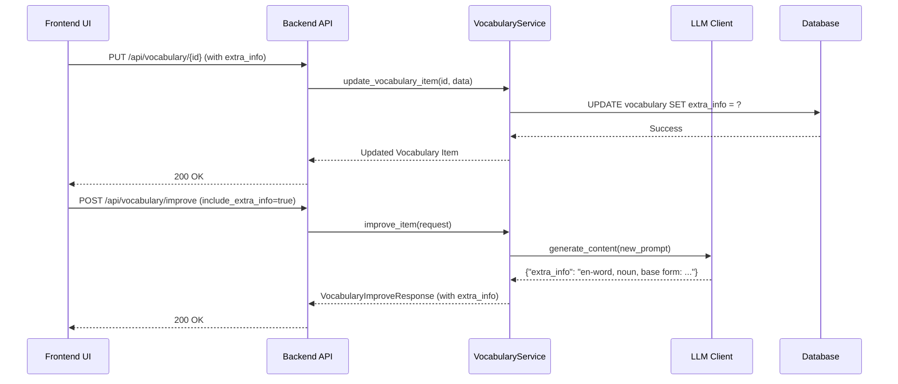

# Refactoring Plan: Add `extra_info` Field to Vocabulary

## 1. Executive Summary & Goals
This plan outlines the steps to introduce a new `extra_info` field to the vocabulary system. This field will store grammatical details about a word (e.g., word form, base form, en/ett classification for nouns) and will be populated via a Large Language Model (LLM).

- **Goal 1: Database & API Extension:** Integrate the `extra_info` field into the backend data model and expose it through the existing API endpoints.
- **Goal 2: UI Integration:** Display the `extra_info` field in the vocabulary view and provide UI controls within the add/edit modal for manual and LLM-powered population.
- **Goal 3: LLM Enhancement:** Develop a new LLM prompt to generate the `extra_info` content and integrate it into the vocabulary improvement service.

## 2. Current Situation Analysis
The current system allows for storing a Swedish word/phrase, its English translation, and an example phrase. An LLM-powered "improve" feature exists, capable of generating the translation and/or the example phrase for a given word. This feature is exposed via the `/api/vocabulary/improve` endpoint and is used in the `AddEditVocabularyModal` component. The new `extra_info` field needs to be integrated into this existing structure.

## 3. Proposed Solution / Refactoring Strategy
### 3.1. High-Level Design / Architectural Overview
The strategy is to extend the existing full-stack vertical slice for vocabulary management. We will add the `extra_info` field from the database layer up to the UI layer. The existing LLM improvement endpoint (`/api/vocabulary/improve`) will be enhanced with new parameters to control the generation of `extra_info`, avoiding the need for a new endpoint and promoting code reuse.

### 3.2. Key Components / Modules
- **`runestone/db/models.py`**: The `Vocabulary` SQLAlchemy model will be modified.
- **`runestone/api/schemas.py`**: Pydantic schemas (`Vocabulary`, `VocabularyItemCreate`, `VocabularyUpdate`, `VocabularyImproveRequest`, `VocabularyImproveResponse`) will be updated.
- **`runestone/core/prompts.py`**: The existing vocabulary improvement prompt will be modified to generate the `extra_info` content.
- **`runestone/services/vocabulary_service.py`**: The `VocabularyService` will be updated to handle the new field in CRUD operations and to orchestrate the new LLM call.
- **`runestone/api/endpoints.py`**: The `/vocabulary/improve` endpoint will be modified to handle the extended request and response.
- **`frontend/src/hooks/useVocabulary.ts`**: The `SavedVocabularyItem` type and the `improveVocabularyItem` API call function will be updated.
- **`frontend/src/components/AddEditVocabularyModal.tsx`**: This component will be modified to include a new text field and a button for `extra_info`, and the "Fill All" logic will be updated.
- **`frontend/src/components/VocabularyView.tsx`**: The data table will be updated to display the `extra_info` column.

### 3.3. Detailed Action Plan / Phases
#### Phase 1: Backend Implementation
- **Objective(s):** Extend the backend to fully support the `extra_info` field, including storage, API exposure, and LLM generation.
- **Priority:** High

- **Task 1.1: Update Database Model**
    - **Rationale/Goal:** Add the `extra_info` column to the database schema.
    - **File(s) to Modify:** `src/runestone/db/models.py`
    - **Action:** In the `Vocabulary` model, add `extra_info = Column(Text, nullable=True, default=None)`. Add `'extra_info'` to the `UPDATABLE_FIELDS` set.
    - **Estimated Effort:** S
    - **Deliverable/Criteria for Completion:** The `Vocabulary` model is updated with the new field.

- **Task 1.2: Generate Database Migration**
    - **Rationale/Goal:** Create and apply a database migration to alter the existing `vocabulary` table.
    - **Action:** Run `alembic revision --autogenerate -m "add extra_info to vocabulary table"` and then `alembic upgrade head`.
    - **Estimated Effort:** S
    - **Deliverable/Criteria for Completion:** A new Alembic migration script is generated and successfully applied to the database.

- **Task 1.3: Update API Schemas**
    - **Rationale/Goal:** Reflect the new data field in the API contracts.
    - **File(s) to Modify:** `src/runestone/api/schemas.py`
    - **Action:**
        - Add `extra_info: Optional[str] = None` to `Vocabulary`, `VocabularyItemCreate`, and `VocabularyUpdate` Pydantic models.
        - Add `include_extra_info: bool = False` to `VocabularyImproveRequest`.
        - Add `extra_info: Optional[str] = None` to `VocabularyImproveResponse`.
    - **Estimated Effort:** S
    - **Deliverable/Criteria for Completion:** All relevant Pydantic schemas are updated.

- **Task 1.4: Enhance LLM Prompt for `extra_info`**
    - **Rationale/Goal:** Update the vocabulary improvement prompt to generate the required grammatical information.
    - **File(s) to Modify:** `src/runestone/core/prompts.py`
    - **Action:** Modify `VOCABULARY_IMPROVE_PROMPT_TEMPLATE` to be more dynamic. It should conditionally include instructions for generating `extra_info`. The prompt will instruct the LLM to return a JSON object containing an `extra_info` key, whose value is a simple, human-readable string (e.g., `"en-word, noun, base form: ord"`).
    - **Estimated Effort:** M
    - **Deliverable/Criteria for Completion:** The prompt template is updated to support conditional generation of `extra_info`.

- **Task 1.5: Update Vocabulary Service**
    - **Rationale/Goal:** Implement the business logic for handling `extra_info` in CRUD and LLM-powered generation.
    - **File(s) to Modify:** `src/runestone/services/vocabulary_service.py`
    - **Action:**
        - Update `save_vocabulary_item`, `update_vocabulary_item`, and `get_vocabulary` to handle the `extra_info` field.
        - Modify the `improve_item` method to dynamically construct the prompt using the updated template based on `include_translation` and `include_extra_info`.
        - Ensure the response parsing logic correctly extracts the `extra_info` string from the LLM's JSON response.
    - **Estimated Effort:** L
    - **Deliverable/Criteria for Completion:** `VocabularyService` correctly handles the `extra_info` field for all relevant operations.

- **Task 1.6: Update Backend Tests**
    - **Rationale/Goal:** Ensure backend changes are covered by tests.
    - **File(s) to Modify:** `tests/services/test_services_vocabulary_service.py`, `tests/api/test_vocabulary_improve_endpoint.py`.
    - **Action:** Add tests for the new `extra_info` generation logic in the service and for the updated API endpoint behavior.
    - **Estimated Effort:** M
    - **Deliverable/Criteria for Completion:** Backend tests are updated and passing.

#### Phase 2: Frontend Implementation
- **Objective(s):** Integrate the `extra_info` field into the user interface for display and interaction.
- **Priority:** High (dependent on Phase 1)

- **Task 2.1: Update Frontend Data Types**
    - **Rationale/Goal:** Align frontend data structures with the new API contract.
    - **File(s) to Modify:** `frontend/src/hooks/useVocabulary.ts`, `frontend/src/components/AddEditVocabularyModal.tsx`.
    - **Action:** Add `extra_info: string | null;` to the `SavedVocabularyItem` interface in both files.
    - **Estimated Effort:** S
    - **Deliverable/Criteria for Completion:** Frontend types are updated.

- **Task 2.2: Update `useVocabulary` Hook**
    - **Rationale/Goal:** Update the API client function to support requesting `extra_info`.
    - **File(s) to Modify:** `frontend/src/hooks/useVocabulary.ts`
    - **Action:**
        - Modify `improveVocabularyItem` function to accept an options object: `{ includeTranslation: boolean, includeExtraInfo: boolean }`.
        - Update the `body` of the `fetch` call to include `include_translation` and `include_extra_info` based on the options.
        - Update the function's return type to include `extra_info?: string`.
    - **Estimated Effort:** M
    - **Deliverable/Criteria for Completion:** The hook is capable of requesting and receiving `extra_info` from the API.

- **Task 2.3: Update `AddEditVocabularyModal` Component**
    - **Rationale/Goal:** Add UI elements for the `extra_info` field and its LLM-population functionality.
    - **File(s) to Modify:** `frontend/src/components/AddEditVocabularyModal.tsx`
    - **Action:**
        - Add a new state variable: `const [extraInfo, setExtraInfo] = useState("");`.
        - Add a new `TextField` for `extraInfo`, placed below the "Example Phrase" field, labeled "Extra Info".
        - Add a new `IconButton` (e.g., `<AutoFixNormal />`) positioned inside the `extraInfo` `TextField`.
        - The new button's `onClick` handler will call `improveVocabularyItem` with `{ includeTranslation: false, includeExtraInfo: true }`, then update the `extraInfo` state with the result.
        - The new button's `disabled` state should be tied to the existing `isImproving` state variable.
        - Modify `handleFillAll`: it should now call `improveVocabularyItem` with `{ includeTranslation: true, includeExtraInfo: true }`, and update all relevant state variables (`translation`, `examplePhrase`, `extraInfo`).
        - Modify `handleSave` to include `extra_info: extraInfo.trim() || null` in the payload.
    - **Estimated Effort:** L
    - **Deliverable/Criteria for Completion:** The modal correctly displays, edits, and populates the `extra_info` field, including handling the loading state.

- **Task 2.4: Update `VocabularyView` Component**
    - **Rationale/Goal:** Display the new `extra_info` field in the main vocabulary list.
    - **File(s) to Modify:** `frontend/src/components/VocabularyView.tsx`
    - **Action:** Add a new column object to the `columns` array passed to the `DataTable` component for the `extra_info` field.
    - **Estimated Effort:** S
    - **Deliverable/Criteria for Completion:** The `extra_info` is visible as a column in the vocabulary table.

### 3.4. Data Model Changes
- **Table:** `vocabulary`
- **Column to Add:**
    - `name`: `extra_info`
    - `type`: `TEXT`
    - `nullable`: `TRUE`
    - `default`: `NULL`

### 3.5. API Design / Interface Changes
- **Endpoint:** `POST /api/vocabulary/improve`
    - **Request Body (`VocabularyImproveRequest`):**
        - Add `include_extra_info: bool = False` (optional boolean).
    - **Response Body (`VocabularyImproveResponse`):**
        - Add `extra_info: Optional[str] = None` (optional string).
- **Other Endpoints:**
    - `GET /api/vocabulary`, `POST /api/vocabulary/item`, `PUT /api/vocabulary/{item_id}` will now include the optional `extra_info` field in their request/response bodies. This is a non-breaking change.

## 4. Key Considerations & Risk Mitigation
### 4.1. Technical Risks & Challenges
- **LLM Prompt Reliability:** The LLM might not consistently return well-structured or accurate data for the `extra_info` field.
    - **Mitigation:** The prompt will be designed to request a JSON object. The backend service will include robust parsing with fallbacks to handle malformed responses. The plan includes a dedicated task for prompt design, which may require iteration.
- **API Response Latency:** Adding more generation tasks to a single LLM call might increase the response time for the "Fill All" feature.
    - **Mitigation:** The LLM model (`gpt-4o-mini` or `gemini-2.0-flash-exp`) is generally fast. We will monitor performance during development. If latency becomes an issue, we can consider making separate, parallel API calls from the frontend, though this would increase complexity.

### 4.2. Dependencies
- **Internal:** Frontend tasks (Phase 2) are dependent on the completion of Backend tasks (Phase 1).
- **External:** The functionality relies on the availability and performance of the configured LLM provider (OpenAI or Gemini).

### 4.3. Non-Functional Requirements (NFRs) Addressed
- **Usability:** The new feature enhances the application's value by providing crucial grammatical context for vocabulary items, directly improving the user's learning experience.
- **Maintainability:** By extending the existing `improve` endpoint instead of adding a new one, we maintain a cohesive API and reduce code duplication.
- **Extensibility:** The pattern of adding boolean flags (`include_...`) to the `improve` endpoint makes it easy to add more LLM-powered fields in the future without introducing breaking changes.

## 5. Success Metrics / Validation Criteria
- The `extra_info` column is successfully added to the `vocabulary` table in the database.
- The `extra_info` field can be viewed and edited in the UI.
- The new "Fill Extra Info" button successfully populates the `extra_info` field using the LLM.
- The "Fill All" button successfully populates `translation`, `example_phrase`, AND `extra_info` fields in a single action.
- The `extra_info` column is visible and populated in the main `VocabularyView` table.
- All new and existing tests pass.

## 6. Assumptions Made
- The project's Alembic setup is functional for generating and applying database migrations.
- The existing LLM client implementations are capable of handling the new, more structured JSON-based prompts without modification to the client classes themselves.
- Adding optional fields to the existing API endpoints is an acceptable, non-breaking change for the system's architecture.
