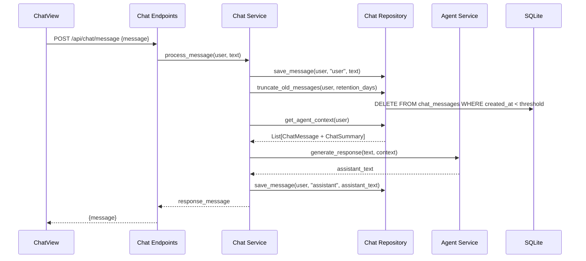

# Refactoring Plan: Backend Chat Persistence, Truncation, and Context Decoupling

## 1. Executive Summary & Goals
This plan outlines the migration of chat history from frontend state to backend SQLite storage. It introduces automated time-based truncation on every interaction and prepares the system for future "history compression" by decoupling the raw UI history from the agent's context.

- **Goal 1:** Implement persistent SQLite storage for chat messages with a configurable 7-day retention policy.
- **Goal 2:** Decouple "Raw History" (UI display) from "Agent Context" (LLM prompt injection) using a dedicated service layer.
- **Goal 3:** Add "New Chat" functionality and automated truncation logic triggered on every message exchange.
- **Goal 4:** Establish a `ChatSummary` table structure to support future N-to-M message compression experiments.

## 2. Current Situation Analysis
- **Volatile History:** Messages are stored in the `useChat` hook; refreshing the browser wipes the conversation.
- **Heavy Payloads:** The frontend currently sends the entire history array to the backend in every `POST` request.
- **No Cleanup:** There is no mechanism to prune old messages or reset the conversation.
- **Coupled Context:** The LLM receives the exact same list of messages the user sees, preventing future optimizations like summarization or filtering.

## 3. Proposed Solution / Refactoring Strategy

### 3.1. High-Level Design / Architectural Overview
The backend will manage the lifecycle of chat data. The `ChatService` will act as the orchestrator, ensuring that every message sent by the user triggers a cleanup of expired records before fetching the specific context required by the `AgentService`.

### 3.2. Key Components / Modules
- **`runestone.db.models`**: Add `ChatMessage` and `ChatSummary` SQLAlchemy models.
- **`runestone.db.chat_repository`**: New repository for message CRUD, time-based truncation, and context retrieval.
- **`runestone.services.chat_service`**: New service to handle the business logic of chat interactions and history management.
- **`runestone.agent.service`**: Refactored to accept a structured context instead of raw history from the API request.

### 3.3. Detailed Action Plan / Phases

#### Phase 1: Data Layer & Configuration
- **Priority:** High
- **Task 1.1: Update Settings**
    - Add `chat_history_retention_days` (default: 7) to `runestone.config.Settings`.
- **Task 1.2: Implement Models**
    - Create `ChatMessage` table for raw logs.
    - Create `ChatSummary` table for future compression results.
- **Task 1.3: Implement ChatRepository**
    - `add_message`: Persist individual messages.
    - `get_raw_history`: Fetch all messages for the UI.
    - `get_context_for_agent`: Fetch messages (and eventually summaries) for the LLM.
    - `truncate_history`: Delete messages older than the configured days.
    - `clear_all_history`: Delete all records for a user (New Chat).

#### Phase 2: Service Layer & API Refactoring
- **Priority:** High
- **Task 2.1: Implement ChatService**
    - Orchestrate: Save User Msg -> Truncate -> Fetch Context -> Call Agent -> Save Assistant Msg.
- **Task 2.2: Refactor AgentService**
    - Update `generate_response` to accept the pre-fetched context list.
    - Remove internal truncation logic (now handled by the repository).
- **Task 2.3: Update Endpoints**
    - `GET /api/chat/history`: Fetch raw logs for UI initialization.
    - `DELETE /api/chat/history`: Trigger `clear_all_history`.
    - `POST /api/chat/message`: Remove `history` from the request schema.

#### Phase 3: Frontend Integration
- **Priority:** Medium
- **Task 3.1: Refactor useChat Hook**
    - Add `useEffect` to fetch history from backend on mount.
    - Update `sendMessage` to omit history payload.
    - Add `startNewChat` function to call the `DELETE` endpoint.
- **Task 3.2: UI Enhancements**
    - Add "New Chat" button to `ChatView.tsx` (suggested location: next to the title or in the input area).
    - Ensure the UI handles the empty state (no messages) by showing the default teacher greeting.

### 3.4. Data Model Changes

**Table: `chat_messages`**
| Column | Type | Constraints |
| :--- | :--- | :--- |
| `id` | Integer | Primary Key |
| `user_id` | Integer | Foreign Key (`users.id`), Indexed |
| `role` | String | "user" or "assistant" |
| `content` | Text | Not Null |
| `created_at` | DateTime | Indexed, Default: func.now() |

**Table: `chat_summaries` (Future-proofing)**
| Column | Type | Constraints |
| :--- | :--- | :--- |
| `id` | Integer | Primary Key |
| `user_id` | Integer | Foreign Key (`users.id`), Indexed |
| `summary_content` | Text | Not Null |
| `last_message_id` | Integer | Reference to the last message included in this summary |
| `created_at` | DateTime | Default: func.now() |

### 3.5. API Design / Interface Changes
- **`GET /api/chat/history`**: Returns `List[ChatMessageSchema]`.
- **`DELETE /api/chat/history`**: Returns `204 No Content`.
- **`POST /api/chat/message`**:
    - **Request:** `{ "message": "string" }`
    - **Response:** `{ "message": "string" }`

## 4. Key Considerations & Risk Mitigation
- **Truncation Performance:** Truncating on every message is efficient in SQLite for single-user scopes (small row counts).
- **Agent Context Decoupling:** By fetching context via a dedicated repository method, we can later change the logic to include `ChatSummary` records without modifying the API or Frontend.
- **Race Conditions:** Standard SQLAlchemy session management will prevent issues during the "Save -> Truncate -> Fetch" sequence.

## 5. Success Metrics / Validation Criteria
- Chat history persists across page reloads.
- Messages older than 7 days (or configured value) are deleted automatically.
- The "New Chat" button successfully clears the database and UI.
- The `AgentService` maintains conversation awareness using backend-provided context.

## 6. Assumptions Made
- The `user_id` is reliably provided by the `get_current_user` dependency.
- The frontend is responsible for displaying the initial "Björn" greeting when the message list is empty.
- SQLite is the intended storage for both raw messages and future summaries.

## 7. Open Questions / Areas for Further Investigation
- **Compression Logic:** The specific algorithm for N->M compression (e.g., summarizing every 10 messages) will be implemented in a subsequent task using the `ChatSummary` table defined here.
