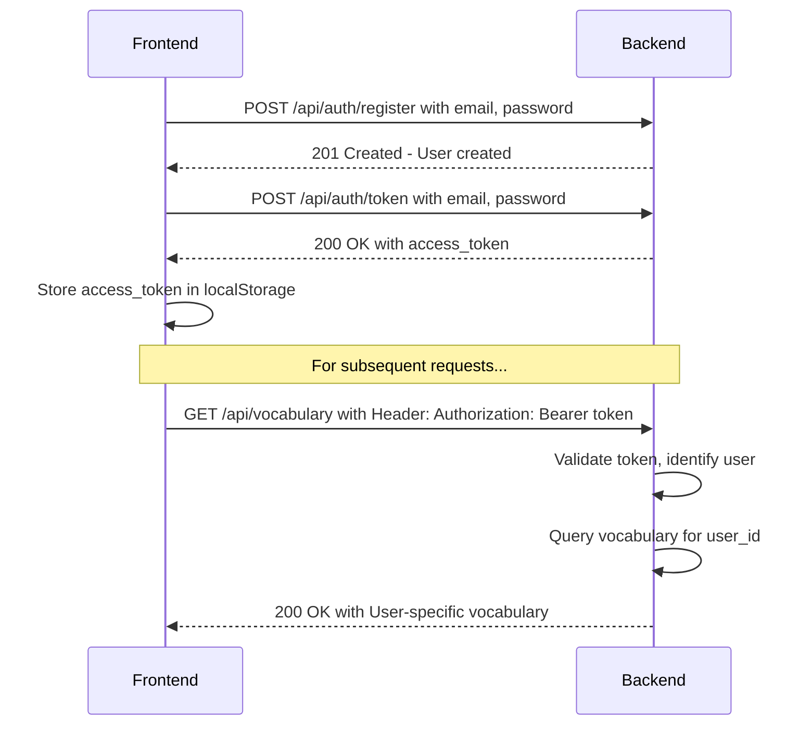

# Refactoring Plan: Multi-User Authentication and Profiles

## 1. Executive Summary & Goals
This plan outlines the necessary steps to refactor the Runestone application from a single-user system to a multi-user platform with token-based authentication and user profiles. The primary objective is to enable data isolation, allowing each user to have their own private vocabulary.

- **Goal 1: Implement Secure User Registration and Authentication.** Introduce endpoints for user creation and token-based login.
- **Goal 2: Protect User-Specific Data.** Ensure all relevant API endpoints are secured and that data, particularly vocabulary, is scoped to the authenticated user.
- **Goal 3: Create a User Profile Management Feature.** Allow users to view and edit their profile information and see basic usage statistics.

## 2. Current Situation Analysis
The existing system is designed for a single user. The database [`Vocabulary`](src/runestone/db/models.py:13) model contains a `user_id` column, but it's a placeholder and not linked to an actual user entity. All API endpoints, except for grammar cheatsheets, implicitly operate on this global dataset. The frontend hooks ([`useVocabulary`](frontend/src/hooks/useVocabulary.ts:40), [`useImageProcessing`](frontend/src/hooks/useImageProcessing.ts)) make unauthenticated requests to the API. This architecture needs to be extended to support user-specific data contexts.

**Key Observations:**
- Current [`VocabularyRepository`](src/runestone/db/repository.py:20) has `user_id: int = 1` hardcoded as default parameter
- All vocabulary operations currently use this hardcoded user ID
- Telegram bot integration exists but user association is managed via state files
- No authentication middleware currently in place

## 3. Proposed Solution / Refactoring Strategy
### 3.1. High-Level Design / Architectural Overview
We will introduce a standard token-based authentication system. The backend will be responsible for issuing JSON Web Tokens (JWT) upon successful login, and the frontend will store this token and include it in subsequent API requests. A new [`User`](src/runestone/db/models.py) model will be added to the database, and the [`Vocabulary`](src/runestone/db/models.py:13) model will be linked to it via a foreign key.

**Authentication Flow:**

### 3.2. Key Components / Modules
1.  **Backend `auth` Module:** A new module ([`src/runestone/auth/`](src/runestone/auth/)) will be created to encapsulate all authentication logic, including password hashing, token creation/verification, and user dependency injection for FastAPI.
2.  **Backend [`User`](src/runestone/db/models.py) Model & Repository:** A new `User` model will be added to [`db/models.py`](src/runestone/db/models.py). The [`VocabularyRepository`](src/runestone/db/repository.py:20) will be updated to remove hardcoded `user_id` defaults and require explicit user_id parameters.
3.  **Frontend `AuthContext`:** A React Context ([`frontend/src/context/AuthContext.tsx`](frontend/src/context/AuthContext.tsx)) will be created to manage the user's authentication state (token, user data) and provide it to the entire application.
4.  **Frontend `api` Utility:** A new utility ([`frontend/src/utils/api.ts`](frontend/src/utils/api.ts)) will wrap the native `fetch` API to automatically include the `Authorization` header in requests, centralizing API call logic.
5.  **Frontend Auth Pages:** New components for Login, Registration, and User Profile will be created under [`frontend/src/components/auth/`](frontend/src/components/auth/).

### 3.3. Detailed Action Plan / Phases

#### Phase 1: Backend - Core User & Auth Infrastructure
- **Objective(s):** Establish the database schema for users and create the fundamental registration and login endpoints.
- **Priority:** High

- **Task 1.1:** Create [`User`](src/runestone/db/models.py) Database Model
    - **Rationale/Goal:** Define the schema for the `users` table to store user credentials and profile information.
    - **Estimated Effort:** S
    - **Deliverable/Criteria for Completion:** A new `User` model is defined in [`src/runestone/db/models.py`](src/runestone/db/models.py) with fields: `id`, `email`, `hashed_password`, `name`, `surname`, `timezone`, and `pages_recognised_count`.

- **Task 1.2:** Update [`Vocabulary`](src/runestone/db/models.py:13) Model and Create Migrations
    - **Rationale/Goal:** Link vocabulary entries to users and generate the necessary database schema changes.
    - **Estimated Effort:** M
    - **Deliverable/Criteria for Completion:** The `user_id` in [`src/runestone/db/models.py::Vocabulary`](src/runestone/db/models.py:13) is updated to be a `ForeignKey` to `users.id`. A new Alembic migration script is generated and successfully applied, creating the `users` table and updating the `vocabulary` table. **Note:** Migration will be handled by a separate manual script (see Task 1.2.1).

- **Task 1.2.1:** Create User Initialization Script
    - **Rationale/Goal:** Provide a safe way to create the initial user and migrate existing data.
    - **Estimated Effort:** S
    - **Deliverable/Criteria for Completion:** A script [`scripts/init_user.py`](scripts/init_user.py) is created that:
        1. Creates a user with `id=1`, `email='user1@example.com'`, `name='user1'`, `password='test123test'`
        2. Updates all existing vocabulary rows to set `user_id = 1`
        3. Adds the foreign key constraint
        4. Can be run manually before deployment
        5. Includes instructions in README for changing credentials after first run

- **Task 1.3:** Implement `auth` Service and Utilities
    - **Rationale/Goal:** Create reusable functions for password hashing, password verification, and JWT creation.
    - **Estimated Effort:** M
    - **Deliverable/Criteria for Completion:** A new [`src/runestone/auth/security.py`](src/runestone/auth/security.py) module is created containing functions like `hash_password`, `verify_password`, and `create_access_token`. `passlib` and `python-jose` will be used. The access token expiration will be set to 1 week. **JWT secret key will be stored in environment variable `JWT_SECRET_KEY`.**

- **Task 1.4:** Add JWT Configuration to Settings
    - **Rationale/Goal:** Centralize JWT configuration in the application settings.
    - **Estimated Effort:** S
    - **Deliverable/Criteria for Completion:** [`src/runestone/config.py`](src/runestone/config.py) is updated to include:
        - `jwt_secret_key: str` (required environment variable)
        - `jwt_algorithm: str = "HS256"` (default)
        - `jwt_expiration_days: int = 7` (default)
        - Password validation: `min_password_length: int = 6` (minimum 6 characters)

- **Task 1.5:** Create Registration and Login Endpoints
    - **Rationale/Goal:** Expose public endpoints for user creation and authentication.
    - **Estimated Effort:** M
    - **Deliverable/Criteria for Completion:** New endpoints `POST /api/auth/register` and `POST /api/auth/token` are created in a new [`src/runestone/api/auth_endpoints.py`](src/runestone/api/auth_endpoints.py) file. The login endpoint returns a JWT. Registration validates password length (minimum 6 characters). Both endpoints use JSON format for consistency.

#### Phase 2: Backend - Securing Endpoints
- **Objective(s):** Protect all user-specific endpoints and update data access logic to be user-aware.
- **Priority:** High

- **Task 2.1:** Create `get_current_user` Dependency
    - **Rationale/Goal:** Implement a reusable FastAPI dependency to decode the JWT from the `Authorization` header and retrieve the corresponding user from the database.
    - **Estimated Effort:** M
    - **Deliverable/Criteria for Completion:** A `get_current_user` function is created in [`src/runestone/auth/dependencies.py`](src/runestone/auth/dependencies.py). It raises an `HTTPException` for invalid or missing tokens.

- **Task 2.2:** Update Service Layer to be User-Aware
    - **Rationale/Goal:** Modify all business logic that handles user data to operate within the context of a specific user.
    - **Estimated Effort:** L
    - **Deliverable/Criteria for Completion:**
        - Methods in [`VocabularyService`](src/runestone/services/vocabulary_service.py) are updated to accept a `user_id` parameter
        - [`RunestoneProcessor.run_analysis()`](src/runestone/core/processor.py) is updated to accept and pass through `user_id`
        - All database queries in [`VocabularyRepository`](src/runestone/db/repository.py:20) have hardcoded `user_id: int = 1` defaults **removed**
        - All methods require explicit `user_id` parameter
        - `.filter(user_id == current_user_id)` clause is applied to all queries

- **Task 2.3:** Apply Authentication to API Endpoints
    - **Rationale/Goal:** Secure all endpoints that handle sensitive or user-specific data.
    - **Estimated Effort:** M
    - **Deliverable/Criteria for Completion:** The `get_current_user` dependency is added to all endpoints in [`src/runestone/api/endpoints.py`](src/runestone/api/endpoints.py) except for the [`/health`](src/runestone/api/endpoints.py:503) endpoint. The [`/api/grammar/*`](src/runestone/api/endpoints.py:513) endpoints will remain public.

#### Phase 3: Backend - User Profile & Stats
- **Objective(s):** Implement the API for managing user profiles and retrieving stats.
- **Priority:** Medium

- **Task 3.1:** Create User Profile Endpoints
    - **Rationale/Goal:** Allow users to view and update their profile information.
    - **Estimated Effort:** M
    - **Deliverable/Criteria for Completion:** `GET /api/users/me` and `PUT /api/users/me` endpoints are created. The PUT endpoint allows updating `name`, `surname`, `timezone`, and `password`.

- **Task 3.2:** Implement User Stats Logic
    - **Rationale/Goal:** Provide data for the user profile statistics.
    - **Estimated Effort:** S
    - **Deliverable/Criteria for Completion:** The `GET /api/users/me` response is augmented with stats: `words_in_learn_count`, `words_learned_count`, and `pages_recognised_count`.

- **Task 3.3:** Implement Page Recognition Counter
    - **Rationale/Goal:** To track the number of pages a user has successfully analyzed.
    - **Estimated Effort:** S
    - **Deliverable/Criteria for Completion:** The [`POST /api/analyze`](src/runestone/api/endpoints.py:121) endpoint is updated to increment the `pages_recognised_count` for the authenticated user upon successful completion of the analysis.

- **Task 3.4:** Create Password Reset Script
    - **Rationale/Goal:** Provide a manual way to reset user passwords when needed.
    - **Estimated Effort:** S
    - **Deliverable/Criteria for Completion:** A script [`scripts/reset_password.py`](scripts/reset_password.py) is created that:
        - Accepts user email as argument
        - Resets password to a default value (e.g., 'test123test')
        - Prints confirmation message
        - Can be run manually by admin

#### Phase 4: Frontend - Auth UI & State Management
- **Objective(s):** Build the user interface for authentication and create a global state management solution for the user's session.
- **Priority:** High

- **Task 4.1:** Create `AuthContext`
    - **Rationale/Goal:** Provide a centralized way to manage and access the auth token, user data, and login/logout functions throughout the app.
    - **Estimated Effort:** M
    - **Deliverable/Criteria for Completion:** An `AuthContext` is created in [`frontend/src/context/AuthContext.tsx`](frontend/src/context/AuthContext.tsx). It will handle storing/retrieving the token from `localStorage`. **Note:** localStorage is acceptable for this use case (1-2 users, low security requirements).

- **Task 4.2:** Create Login, Registration, and Profile Components
    - **Rationale/Goal:** Build the UI for user interaction with the auth system.
    - **Estimated Effort:** L
    - **Deliverable/Criteria for Completion:** New components are created: [`Login.tsx`](frontend/src/components/auth/Login.tsx), [`Register.tsx`](frontend/src/components/auth/Register.tsx), [`Profile.tsx`](frontend/src/components/auth/Profile.tsx). These will be simple forms. Password validation enforces minimum 6 characters.

- **Task 4.3:** Implement View Switching and Update Header
    - **Rationale/Goal:** Control what the user sees based on their authentication state.
    - **Estimated Effort:** M
    - **Deliverable/Criteria for Completion:** [`App.tsx`](frontend/src/App.tsx) is updated to render Login/Register views if the user is not authenticated, and the main app if they are. [`Header.tsx`](frontend/src/components/Header.tsx) is updated to show a "Profile" link and "Logout" button for authenticated users. A new "Profile" view is added to the main navigation. **Simple conditional rendering is sufficient - no routing library needed initially.**

#### Phase 5: Frontend - Integrating Auth with API Calls
- **Objective(s):** Connect the frontend to the newly secured backend endpoints.
- **Priority:** High

- **Task 5.1:** Create a Centralized API Utility
    - **Rationale/Goal:** Avoid duplicating token logic in every API call by creating a wrapper that automatically adds the `Authorization` header.
    - **Estimated Effort:** S
    - **Deliverable/Criteria for Completion:** A file [`frontend/src/utils/api.ts`](frontend/src/utils/api.ts) is created. It exports a function that takes an endpoint, method, and body, and performs a `fetch` call with the auth token from `AuthContext`. **Handles 401 responses by triggering logout.**

- **Task 5.2:** Refactor Hooks to Use Authenticated API Calls
    - **Rationale/Goal:** Update all data-fetching hooks to use the new authenticated API utility.
    - **Estimated Effort:** M
    - **Deliverable/Criteria for Completion:** [`useImageProcessing.ts`](frontend/src/hooks/useImageProcessing.ts) and [`useVocabulary.ts`](frontend/src/hooks/useVocabulary.ts) are refactored to use the new API utility. They should handle 401 Unauthorized errors by logging the user out (via AuthContext).

- **Task 5.3:** Connect Profile Page to API
    - **Rationale/Goal:** Make the user profile page functional.
    - **Estimated Effort:** S
    - **Deliverable/Criteria for Completion:** The [`Profile.tsx`](frontend/src/components/auth/Profile.tsx) component uses the API utility to fetch user data for display and submit updates.

#### Phase 6: Testing & Documentation
- **Objective(s):** Ensure authentication works correctly and is well-documented.
- **Priority:** High

- **Task 6.1:** Create Test Fixtures for Users
    - **Rationale/Goal:** Enable automated testing of authentication flows.
    - **Estimated Effort:** M
    - **Deliverable/Criteria for Completion:**
        - Test fixtures created in [`tests/conftest.py`](tests/conftest.py) for creating test users
        - Helper functions for generating valid JWT tokens for tests
        - Test database setup includes test users

- **Task 6.2:** Write Authentication Tests
    - **Rationale/Goal:** Verify authentication endpoints work correctly.
    - **Estimated Effort:** M
    - **Deliverable/Criteria for Completion:** Tests created in [`tests/api/test_auth_endpoints.py`](tests/api/test_auth_endpoints.py) covering:
        - User registration (success and validation errors)
        - User login (success and invalid credentials)
        - Token validation
        - Protected endpoint access (with and without valid tokens)

- **Task 6.3:** Update Existing Tests
    - **Rationale/Goal:** Ensure existing tests work with authentication.
    - **Estimated Effort:** L
    - **Deliverable/Criteria for Completion:** All existing API tests in [`tests/api/`](tests/api/) are updated to:
        - Create test users
        - Include authentication tokens in requests
        - Verify user isolation (one user can't access another's data)

- **Task 6.4:** Update Documentation
    - **Rationale/Goal:** Document the new authentication system.
    - **Estimated Effort:** S
    - **Deliverable/Criteria for Completion:** [`README.md`](README.md) is updated with:
        - Instructions for running the user initialization script
        - Environment variable documentation for `JWT_SECRET_KEY`
        - Instructions for password reset script
        - API authentication documentation

### 3.4. Data Model Changes
1.  **New `users` Table:**
    - `id` (PK, Integer)
    - `email` (String, Unique, Not Null)
    - `hashed_password` (String, Not Null)
    - `name` (String, Nullable)
    - `surname` (String, Nullable)
    - `timezone` (String, Nullable, default='UTC')
    - `pages_recognised_count` (Integer, Not Null, default=0)
    - `created_at` (DateTime)
    - `updated_at` (DateTime)

2.  **`vocabulary` Table Modification:**
    - The existing `user_id` column will be converted to a `ForeignKey` referencing `users.id`.
    - A migration script will be created to:
        1. Create a default user (via manual script: `id=1`, `email='user1@example.com'`, `name='user1'`, `password='test123test'`).
        2. Update all existing rows in the `vocabulary` table to set `user_id = 1`.
        3. Add the foreign key constraint.
    - **Migration will be run manually using the initialization script before deployment.**

### 3.5. API Design / Interface Changes
- **New Endpoints (under `/api/auth`):**
    - `POST /register`: Creates a new user. Body: `{email, password}` (JSON format).
    - `POST /token`: Authenticates a user. Body: `{email, password}` (JSON format for consistency). Returns: `{access_token, token_type}`.
- **New Endpoints (under `/api/users`):**
    - `GET /me`: Returns profile and stats for the authenticated user.
    - `PUT /me`: Updates profile for the authenticated user.
- **Modified Endpoints:**
    - All existing endpoints (except [`/api/grammar/*`](src/runestone/api/endpoints.py:513) and [`/api/health`](src/runestone/api/endpoints.py:503)) will now require an `Authorization: Bearer <token>` header.

## 4. Key Considerations & Risk Mitigation
### 4.1. Technical Risks & Challenges
- **Risk:** Incorrectly implementing security features (password hashing, token validation).
    - **Mitigation:** Use industry-standard libraries (`passlib` for hashing, `python-jose` for JWTs) and follow FastAPI's official security documentation.
- **Risk:** Data migration of existing vocabulary could fail.
    - **Mitigation:** The migration will be performed via a manual script that can be tested in development. Database backup will be performed before running it in production. Script includes rollback instructions.
- **Risk:** Hardcoded `user_id` defaults in repository methods could cause bugs.
    - **Mitigation:** All default `user_id` parameters will be removed from [`VocabularyRepository`](src/runestone/db/repository.py:20) methods, forcing explicit user_id passing. This will cause compilation errors if any call site is missed.
- **Risk:** Token expiration handling on frontend could cause poor UX.
    - **Mitigation:** Frontend will detect 401 responses and automatically log user out with a clear message. Token expiration is set to 1 week to minimize disruption for 1-2 user scenario.

### 4.2. Dependencies
- **Internal:** Frontend tasks (Phase 4 & 5) are dependent on the completion of Backend tasks (Phase 1 & 2).
- **External:** This plan introduces new Python dependencies (`passlib[bcrypt]`, `python-jose[cryptography]`). No frontend routing library needed initially - simple conditional rendering is sufficient.

### 4.3. Non-Functional Requirements (NFRs) Addressed
- **Security:** The core of this plan is to introduce authentication and authorization, significantly improving security by preventing unauthorized data access and isolating user data. Passwords will be securely hashed using bcrypt. JWT secret key will be stored in environment variables.
- **Usability:** The system becomes usable by multiple people simultaneously. Token expiration is set to 1 week to minimize login frequency for small user base.
- **Maintainability:** Centralizing auth logic in a dedicated backend module and an API utility on the frontend improves code organization and makes future security updates easier.
- **Testability:** Test fixtures and authentication helpers will be created to enable comprehensive testing of the authentication system.

### 4.4. Telegram Bot Integration
- **Current State:** Telegram bot exists and uses state files for user association (see [`src/runestone/config.py`](src/runestone/config.py:34) for bot token configuration).
- **Approach:** For the initial implementation, Telegram users will continue to be associated via state files. The state file will be manually updated to include the database user_id for each Telegram user.
- **Future Enhancement:** A proper Telegram user → database user linking mechanism could be implemented in a future phase, but is out of scope for this refactoring.

## 5. Success Metrics / Validation Criteria
- A new user can successfully register, log in, and receive a JWT.
- An authenticated user can use the application (upload images, save vocabulary), and the data is correctly associated with their user ID in the database.
- An unauthenticated user receives a 401 Unauthorized error when trying to access protected endpoints.
- A user can view their profile, update their information, and see their vocabulary stats.
- A user's `pages_recognised_count` increases after a successful analysis.
- A second registered user cannot see or interact with the first user's vocabulary.
- All tests pass: [`make frontend-test`](Makefile) and [`make backend-test`](Makefile).
- Password validation enforces minimum 6 characters.
- JWT secret key is loaded from environment variable.
- Manual scripts work correctly for user initialization and password reset.

## 6. Assumptions Made
- All existing vocabulary data can be assigned to a single, default user during migration (via manual script).
- A simple bearer token system with no refresh tokens is sufficient for the initial implementation (1-2 users).
- The frontend can be adapted to a multi-view structure using simple conditional rendering without a routing library.
- localStorage is acceptable for token storage given the low security requirements (1-2 users, personal use).
- Telegram bot integration can continue using state files for user association in the initial implementation.
- Manual scripts are acceptable for user initialization and password reset given the small user base.

## 7. Open Questions / Areas for Further Investigation
- ~~The JWT token expiration time will be set to 1 week, as requested. This is a long-lived token, and for higher security applications, a refresh token strategy would be preferable in the future.~~ **Resolved:** 1 week expiration is acceptable for 1-2 user scenario.
- **New:** Should we implement audit logging for authentication events (login attempts, password changes) for security monitoring? **Decision:** Not required for initial implementation given small user base.
- **New:** Should we add a "last login" timestamp to the User model for tracking user activity? **Decision:** Can be added in future if needed.

## 8. Additional Recommendations

### 8.1. Security Best Practices
- Store JWT secret key in environment variable (never commit to repository)
- Use strong, randomly generated JWT secret key (at least 32 characters)
- Consider using HTTPS in production (even for personal use)
- Regularly update dependencies for security patches

### 8.2. Development Workflow
1. Run user initialization script in development environment first
2. Test authentication flow thoroughly before production deployment
3. Backup production database before running migration
4. Change default user credentials immediately after first deployment

### 8.3. Future Enhancements (Out of Scope)
- Email verification for new registrations
- Password reset via email
- Refresh token mechanism for better security
- Rate limiting for login attempts
- Proper Telegram bot → database user linking
- OAuth2 integration (Google, GitHub login)
- Two-factor authentication (2FA)
- Session management and device tracking
