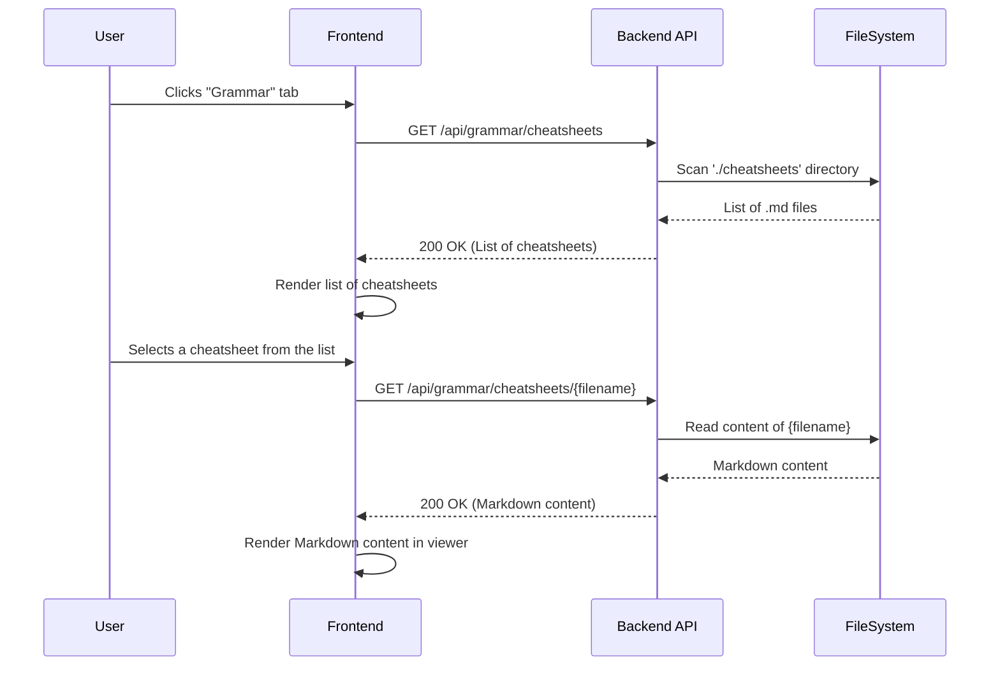

# Refactoring Plan: Integrate Grammar Cheatsheets into UI

## 1. Executive Summary & Goals
This plan details the implementation of a new "Grammar" section in the application's user interface. This section will serve as a document viewer for Markdown-based grammar cheatsheets located in the `./cheatsheets` directory, making theoretical information readily accessible to the user.

- **Goal 1: Backend Support:** Create secure API endpoints to list available grammar documents and retrieve their content.
- **Goal 2: Frontend Integration:** Add a "Grammar" navigation item and build a new view to display the list of cheatsheets and render their Markdown content.
- **Goal 3: Modularity & Reusability:** Implement the feature in a modular way, reusing existing Markdown parsing capabilities and ensuring the solution is maintainable and scalable.

## 2. Current Situation Analysis
The application currently has two main sections: "Analyser" and "Vocabulary". The frontend is a React application that communicates with a Python FastAPI backend. A directory named `cheatsheets` exists at the project root, containing several grammar-related documents in Markdown format. The frontend already possesses a utility (`markdownParser.ts`) for rendering Markdown to HTML, which is used in the `ResultsDisplay.tsx` component for showing OCR results. This existing capability can be leveraged for the new feature.

## 3. Proposed Solution / Refactoring Strategy
### 3.1. Architectural Decision: Backend-Driven API Endpoints
A key architectural decision is how to serve the cheatsheet files. Two primary options were considered:

**Option A: Frontend-Only (Files in `frontend/public`)**
- **Description:** Move the `cheatsheets` directory into `frontend/public`. The frontend application would then need a manually maintained manifest file (e.g., `public/cheatsheets/index.json`) to know which documents are available. It would fetch this manifest and then fetch the individual Markdown files directly.
- **Pros:**
    - Simpler initial setup; no backend changes required.
    - Files are served as static assets, which can be fast and easily cached.
- **Cons:**
    - **High Maintenance Burden:** A developer must manually update the `index.json` manifest every time a cheatsheet is added, removed, or renamed. This is error-prone and poor developer experience.
    - **Tight Coupling:** The content (cheatsheets) becomes part of the frontend build artifact. Updating a typo in a cheatsheet requires a full frontend rebuild and redeployment.
    - **Reduced Flexibility:** If we later decide to store cheatsheets in a database or a headless CMS, the entire frontend implementation would need to be refactored.

**Option B: Backend-Driven (API Endpoints)**
- **Description:** The backend exposes API endpoints to list and serve the cheatsheet files. The `cheatsheets` directory remains a content source managed by the backend.
- **Pros:**
    - **Decoupling:** The frontend is decoupled from the content source. It only needs to know about the API endpoints, not the underlying file system structure.
    - **Zero Maintenance for New Files:** Adding a new `.md` file to the `cheatsheets` directory automatically makes it available in the UI with no code changes.
    - **Future-Proof:** The backend API acts as an abstraction layer. The content source can be changed (e.g., to a database) in the future without requiring any changes to the frontend.
    - **Enhanced Security:** The backend provides a controlled gateway to the files, preventing direct file system exposure and allowing for robust validation (e.g., against path traversal).

**Recommendation:**
We will proceed with **Option B (Backend-Driven)**. While it requires slightly more initial work, it establishes a much more robust, maintainable, and scalable architecture. It correctly treats the cheatsheets as "content" served by an API, which is a standard and best practice for modern web applications.

### 3.2. High-Level Design / Architectural Overview
The solution involves a full-stack approach. The backend will be extended with a new set of API endpoints dedicated to serving the grammar cheatsheets. The frontend will be updated to include a new "Grammar" view, which will consume these endpoints to present a list of documents and display the content of the selected one. A two-pane layout is proposed for the UI, with a document list on the left and the content viewer on the right.



### 3.3. Key Components / Modules
- **Backend:**
    - **`GrammarService` (New):** A new service to encapsulate the logic for reading and listing files from the `cheatsheets` directory, including security validations.
    - **`endpoints.py` (Modification):** A new API router will be added to define `GET /api/grammar/cheatsheets` and `GET /api/grammar/cheatsheets/{filename}`.
    - **`schemas.py` (Modification):** New Pydantic models for API responses (`CheatsheetInfo`, `CheatsheetContent`).
- **Frontend:**
    - **`Header.tsx` (Modification):** Add the "Grammar" navigation button.
    - **`App.tsx` (Modification):** Add state to manage the new "Grammar" view.
    - **`useGrammar.ts` (New):** A React hook to handle API calls for fetching the cheatsheet list and content.
    - **`GrammarView.tsx` (New):** The main component for the "Grammar" section, orchestrating the layout, list, and content display.
    - **`MarkdownDisplay.tsx` (New):** A reusable component to render a Markdown string, extracted from the logic currently in `ResultsDisplay.tsx`.

### 3.4. Detailed Action Plan / Phases
#### Phase 1: Backend Implementation
- **Objective(s):** Create the necessary API endpoints and service logic to serve cheatsheet data and ensure it's available in the containerized environment.
- **Priority:** High

- **Task 1.1: Create `GrammarService`**
    - **Rationale/Goal:** To abstract file system operations and implement security checks against path traversal attacks.
    - **Action:**
        - Create `src/runestone/services/grammar_service.py`.
        - Implement `list_cheatsheets()`: Scans the `./cheatsheets` directory, filters for `.md` files, and returns a sorted list of objects containing the filename and a user-friendly title (e.g., from `adjectiv-komparation.md` to `Adjectiv Komparation`).
        - Implement `get_cheatsheet_content(filename)`: Takes a filename, validates it to prevent path traversal, and returns its content.
    - **Estimated Effort:** M
    - **Deliverable/Criteria for Completion:** A `GrammarService` class with methods to securely list and read cheatsheets is implemented with corresponding tests.

- **Task 1.2: Update API Schemas**
    - **Rationale/Goal:** Define the data contracts for the new grammar endpoints.
    - **File(s) to Modify:** `src/runestone/api/schemas.py`
    - **Action:**
        - Create `CheatsheetInfo(BaseModel)` with `filename: str` and `title: str`.
        - Create `CheatsheetContent(BaseModel)` with `content: str`.
    - **Estimated Effort:** S
    - **Deliverable/Criteria for Completion:** Pydantic schemas for cheatsheet list and content are defined.

- **Task 1.3: Create Grammar API Endpoints**
    - **Rationale/Goal:** Expose the `GrammarService` functionality via REST API.
    - **File(s) to Modify:** `src/runestone/api/endpoints.py`, `src/runestone/api/main.py`
    - **Action:**
        - Create a new `APIRouter` for grammar.
        - Add `GET /grammar/cheatsheets` endpoint that returns `List[CheatsheetInfo]`.
        - Add `GET /grammar/cheatsheets/{filename}` endpoint that returns `CheatsheetContent`.
        - Include the new router in the main FastAPI app in `main.py`.
    - **Estimated Effort:** M
    - **Deliverable/Criteria for Completion:** The two new endpoints are implemented, functional, and documented via FastAPI's OpenAPI generation.

- **Task 1.4: Add Dependency Injection**
    - **Rationale/Goal:** Integrate the new service into the application's dependency injection system.
    - **File(s) to Modify:** `src/runestone/dependencies.py`
    - **Action:** Add a `get_grammar_service` provider function.
    - **Estimated Effort:** S
    - **Deliverable/Criteria for Completion:** `GrammarService` can be injected into API endpoints.

- **Task 1.5: Update Docker Configuration**
    - **Rationale/Goal:** Ensure the `cheatsheets` directory is available to the backend service within its Docker container.
    - **File(s) to Modify:** `Dockerfile.backend`
    - **Action:** Add the line `COPY cheatsheets/ ./cheatsheets/` to the `Dockerfile.backend` before the `chown` command.
    - **Estimated Effort:** S
    - **Deliverable/Criteria for Completion:** The backend Docker image correctly includes the `cheatsheets` directory.

#### Phase 2: Frontend Implementation
- **Objective(s):** Build the UI for the "Grammar" section.
- **Priority:** High (dependent on Phase 1)

- **Task 2.1: Update Main Navigation**
    - **Rationale/Goal:** Add the "Grammar" view to the application's main navigation and state.
    - **File(s) to Modify:** `frontend/src/components/Header.tsx`, `frontend/src/App.tsx`
    - **Action:**
        - In `Header.tsx`, add a "Grammar" `CustomButton` next to "Vocabulary". Update the `currentView` type to include `'grammar'`.
        - In `App.tsx`, update the `currentView` state and `onViewChange` handler to support the `'grammar'` view. Add conditional rendering for the new `GrammarView` component.
    - **Estimated Effort:** S
    - **Deliverable/Criteria for Completion:** The "Grammar" button appears in the header and correctly switches the application view.

- **Task 2.2: Create `useGrammar` Hook**
    - **Rationale/Goal:** Encapsulate the logic for fetching grammar data from the new backend endpoints.
    - **File(s) to Create:** `frontend/src/hooks/useGrammar.ts`
    - **Action:** Create a new hook that exports functions to `fetchCheatsheets` and `fetchCheatsheetContent`. The hook should manage loading states, error states, and the fetched data.
    - **Estimated Effort:** M
    - **Deliverable/Criteria for Completion:** A custom hook provides a clean interface for components to interact with the grammar API.

- **Task 2.3: Create Reusable `MarkdownDisplay` Component**
    - **Rationale/Goal:** To avoid code duplication and create a reusable component for rendering Markdown content.
    - **File(s) to Create:** `frontend/src/components/ui/MarkdownDisplay.tsx`
    - **Action:** Create a component that accepts a `markdownContent: string` prop. Move the rendering logic from `ResultsDisplay.tsx` (the part that uses `parseMarkdown` and `dangerouslySetInnerHTML`) into this new component.
    - **Estimated Effort:** S
    - **Deliverable/Criteria for Completion:** A `MarkdownDisplay` component is created and can render any given Markdown string.

- **Task 2.4: Create `GrammarView` Component**
    - **Rationale/Goal:** Build the main UI for the grammar section.
    - **File(s) to Create:** `frontend/src/components/GrammarView.tsx`
    - **Action:**
        - Use the `useGrammar` hook to fetch the list of cheatsheets on component mount.
        - Implement a two-pane layout (e.g., using Material-UI `Grid` or `Box` with Flexbox).
        - **Left Pane:** Display a list of the fetched cheatsheets. Handle loading and error states. Make each item clickable.
        - **Right Pane:** Before a cheatsheet is selected, display "...". When a cheatsheet is clicked, use the `useGrammar` hook to fetch its content. Display a loading spinner while fetching. Once loaded, pass the content to the new `MarkdownDisplay` component for rendering.
    - **Estimated Effort:** L
    - **Deliverable/Criteria for Completion:** A fully functional "Grammar" view where users can select and read cheatsheets.

### 3.5. API Design / Interface Changes
- **`GET /api/grammar/cheatsheets`**
    - **Description:** Retrieves a list of available grammar cheatsheets.
    - **Response Body:** `List[CheatsheetInfo]`
        ```json
        [
          { "filename": "adjectiv-komparation.md", "title": "Adjectiv Komparation" },
          { "filename": "objectspronomen.md", "title": "Objektspronomen" }
        ]
        ```
- **`GET /api/grammar/cheatsheets/{filename}`**
    - **Description:** Retrieves the Markdown content of a specific cheatsheet.
    - **Path Parameter:** `filename: str` (e.g., `adjectiv-komparation.md`)
    - **Response Body:** `CheatsheetContent`
        ```json
        {
          "content": "# 📚 Adjective Comparison: Swedish Cheatsheet\n\n..."
        }
        ```

## 4. Key Considerations & Risk Mitigation
### 4.1. Technical Risks & Challenges
- **Security (Path Traversal):** The endpoint retrieving file content by filename is a potential security risk.
    - **Mitigation:** The `GrammarService` on the backend **must** strictly validate the `filename` parameter. It should sanitize the input to ensure it contains no directory separators (`/`, `\`) or parent directory references (`..`). The final path must be constructed by joining a trusted, hardcoded base directory (`./cheatsheets`) with the sanitized filename.
- **Deployment Context:** The `cheatsheets` directory must be included in the backend's Docker container.
    - **Mitigation:** This is explicitly addressed in **Task 1.5** by adding a `COPY` instruction to the `Dockerfile.backend`.

### 4.2. Dependencies
- The frontend implementation (Phase 2) is dependent on the completion of the backend API (Phase 1).

### 4.3. Non-Functional Requirements (NFRs) Addressed
- **Usability:** Provides users with direct access to learning materials within the application, creating a more integrated learning experience.
- **Maintainability:** Adding new cheatsheets is as simple as dropping a new `.md` file into the `cheatsheets` directory, requiring no code changes or redeployment.
- **Security:** The plan explicitly calls for path traversal validation on the backend to prevent unauthorized file access.

## 5. Success Metrics / Validation Criteria
- A "Grammar" button is present in the main navigation.
- Clicking the "Grammar" button displays a new view with a list of documents from the `./cheatsheets` directory.
- Selecting a document from the list displays its rendered Markdown content correctly in the view pane.
- The backend endpoints are functional and return the expected data.
- The backend correctly prevents attempts to access files outside the `cheatsheets` directory.
- The feature works correctly in the Dockerized environment.

## 6. Assumptions Made
- The `cheatsheets` directory will be located at the project root and copied into the backend container during the build process.
- All `.md` files within the `cheatsheets` directory are intended to be publicly accessible through the UI.
- The existing Markdown parser (`markdownParser.ts`) is suitable for rendering the content of the cheatsheets without modification.

## 7. Open Questions / Areas for Further Investigation
- **Resolved:** Should the cheatsheet list be sorted alphabetically or in a specific order?
    - **Decision:** Alphabetical sorting is sufficient.
- **Resolved:** How should the UI handle the initial state before any cheatsheet is selected?
    - **Decision:** Display "..." as a placeholder.
