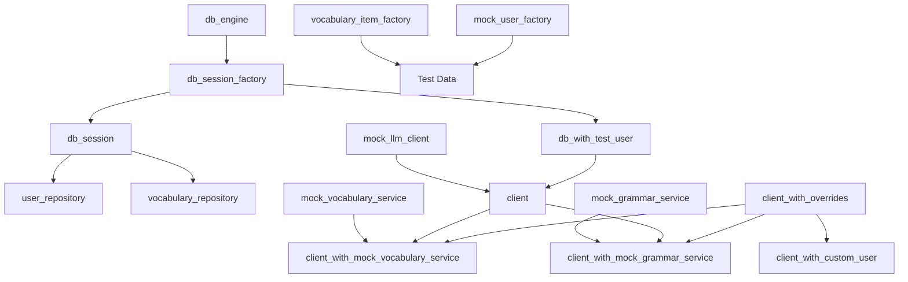

# Backend Test Refactoring Plan

## Executive Summary

This document outlines a comprehensive refactoring plan for backend tests, focusing on fixture consolidation, generalization, and improved test maintainability. The analysis identified significant duplication in database setup, client configuration, and mock service patterns across test files.

## Analysis Findings

### Current State

#### Database Strategy Analysis

**Current Approach**:
- [`tests/conftest.py:22-34`](tests/conftest.py:22-34) uses basic in-memory SQLite (`sqlite:///:memory:`)
- [`tests/api/conftest.py:40-41`](tests/api/conftest.py:40-41) uses shared in-memory with unique names (`sqlite:///file:memdb{uuid}?mode=memory&cache=shared&uri=true`)
- Database is created once per fixture scope and reused across tests
- No automatic cleanup between tests

**Performance Considerations**:
- In-memory databases are already fast (no disk I/O)
- Current shared approach can lead to test pollution
- Test isolation is not guaranteed

**Proposed Improvements** (based on user feedback):

1. **Use In-Memory Database Only** ✅ (Already implemented)
   - Current implementation already uses in-memory SQLite
   - No changes needed for this aspect

2. **Create Fresh Database Per Test** 🆕 (New proposal)
   - **Benefits**:
     - Complete test isolation
     - No data pollution between tests
     - Easier to debug failures
     - Parallel test execution safety
   - **Trade-offs**:
     - Slightly slower (minimal impact with in-memory)
     - More memory usage during test runs
     - Need to ensure proper cleanup
   - **Implementation**: Use `scope="function"` for all database fixtures

#### Fixture Duplication Patterns

1. **Database Setup Duplication**
   - [`tests/api/conftest.py:33-90`](tests/api/conftest.py:33-90) - Full database setup with user creation
   - [`tests/api/test_vocabulary_improve_endpoint.py:16-66`](tests/api/test_vocabulary_improve_endpoint.py:16-66) - Nearly identical database setup
   - [`tests/services/test_rune_recall_service.py:44-96`](tests/services/test_rune_recall_service.py:44-96) - Similar in-memory database pattern
   - [`tests/conftest.py:22-34`](tests/conftest.py:22-34) - Basic in-memory database

2. **Mock LLM Client Duplication**
   - [`tests/api/conftest.py:23-29`](tests/api/conftest.py:23-29) - Basic mock LLM client
   - [`tests/api/test_vocabulary_improve_endpoint.py:42-43`](tests/api/test_vocabulary_improve_endpoint.py:42-43) - Inline override function
   - [`tests/services/test_services_vocabulary_service.py:28-32`](tests/services/test_services_vocabulary_service.py:28-32) - Mock with default response

3. **Test User Creation Duplication**
   - [`tests/api/conftest.py:48-62`](tests/api/conftest.py:48-62) - Creates actual User model in database
   - [`tests/api/test_vocabulary_improve_endpoint.py:45-52`](tests/api/test_vocabulary_improve_endpoint.py:45-52) - Creates simple Mock user
   - Different approaches for same purpose

4. **Dependency Override Patterns**
   - [`tests/api/conftest.py:85-90`](tests/api/conftest.py:85-90) - Standard override pattern
   - [`tests/api/test_vocabulary_improve_endpoint.py:57-66`](tests/api/test_vocabulary_improve_endpoint.py:57-66) - Identical override pattern with cleanup
   - [`tests/api/test_grammar_endpoints.py:48-63`](tests/api/test_grammar_endpoints.py:48-63) - Manual override with cleanup

5. **Temporary Directory/File Fixtures**
   - [`tests/services/test_grammar_service.py:24-49`](tests/services/test_grammar_service.py:24-49) - Temp cheatsheets directory
   - [`tests/services/test_grammar_service.py:51-91`](tests/services/test_grammar_service.py:51-91) - Temp cheatsheets with categories
   - [`tests/services/test_rune_recall_service.py:22-35`](tests/services/test_rune_recall_service.py:22-35) - Temp state file
   - Similar patterns repeated across files

### Key Issues Identified

1. **Critical Duplication in `test_vocabulary_improve_endpoint.py`**
   - Lines 16-66 duplicate 90% of the `client` fixture from [`tests/api/conftest.py`](tests/api/conftest.py)
   - Only difference: adds `mock_service` and overrides `get_vocabulary_service`
   - Violates DRY principle significantly

2. **Inconsistent Mock Patterns**
   - Some tests use `Mock()`, others use `MagicMock()`
   - Mock LLM client has different default behaviors across files
   - No standardized approach to mock service creation

3. **Scattered Fixture Definitions**
   - Service-specific fixtures in test files instead of conftest
   - No clear hierarchy or organization
   - Difficult to discover and reuse fixtures

4. **Missing Generalized Fixtures**
   - No parameterized fixtures for different dependency override scenarios
   - No factory fixtures for common test data patterns
   - Limited fixture composition

## Recommendations

### Priority 0: Database Isolation Strategy (Critical Foundation)

#### 0.1 Implement Per-Test Database Isolation

**Problem**: Current database fixtures reuse the same database across tests, leading to potential data pollution and making tests dependent on execution order.

**Solution**: Implement per-test database creation with complete isolation.

**Rationale**:
1. **Test Independence**: Each test starts with a clean database state
2. **Debugging**: Failures are easier to reproduce and debug
3. **Parallel Execution**: Tests can run concurrently without conflicts
4. **Reliability**: No hidden dependencies between tests
5. **Performance**: Minimal overhead (~1-5ms per test) with in-memory databases

**Implementation Details**:

```python
# tests/conftest.py

from sqlalchemy.pool import StaticPool

@pytest.fixture(scope="function")  # Key: function scope for per-test isolation
def db_engine():
    """
    Create a fresh in-memory database for each test.

    Why per-test:
    - Complete isolation between tests
    - No data pollution
    - Safe for parallel execution
    - Easier debugging

    Performance: ~1-5ms overhead per test (acceptable trade-off)
    """
    test_db_url = "sqlite:///:memory:"
    engine = create_engine(
        test_db_url,
        connect_args={"check_same_thread": False},
        poolclass=StaticPool  # Required for in-memory SQLite
    )
    Base.metadata.create_all(bind=engine)
    yield engine
    Base.metadata.drop_all(bind=engine)
    engine.dispose()
```

**Migration Strategy**:
1. Update all database fixtures to use `scope="function"`
2. Add `StaticPool` to in-memory database connections
3. Ensure proper cleanup in all fixtures
4. Test for performance impact (should be minimal)

**Expected Impact**:
- ✅ Eliminates test interdependencies
- ✅ Enables safe parallel test execution
- ✅ Improves test reliability
- ⚠️ Adds ~100-500ms for 100 tests (acceptable)

**Discussion Points**:
- **Scope**: Should we use `scope="function"` for all database fixtures?
  - **Recommendation**: Yes, for complete isolation
  - **Alternative**: `scope="class"` for test classes that need shared state
- **Performance**: Is the overhead acceptable?
  - **Measurement**: Run benchmarks before/after
  - **Threshold**: <1 second total overhead for full suite
- **Exceptions**: Are there tests that need shared database state?
  - **Recommendation**: Use explicit fixtures for those cases
  - **Example**: Integration tests that test transaction behavior

### Priority 1: Critical Refactoring (High Impact, Low Risk)

#### 1.1 Create Generalized Client Fixtures in `tests/api/conftest.py`

**Problem**: The `client_with_mock_service` fixture in [`test_vocabulary_improve_endpoint.py`](tests/api/test_vocabulary_improve_endpoint.py:16-66) duplicates the entire `client` fixture setup.

**Solution**: Create a flexible, composable fixture that accepts dependency overrides as parameters.

```python
@pytest.fixture(scope="function")
def client_with_overrides(mock_llm_client):
    """
    Create a test client with customizable dependency overrides.

    This is a factory fixture that returns a function to create clients
    with specific dependency overrides.

    Usage:
        def test_example(client_with_overrides):
            mock_service = Mock()
            client, mocks = client_with_overrides(
                vocabulary_service=mock_service
            )
            # Use client and mocks['vocabulary_service']
    """
    def _create_client(
        vocabulary_service=None,
        grammar_service=None,
        processor=None,
        llm_client=None,
        current_user=None,
        db_override=None
    ):
        import uuid
        from unittest.mock import Mock

        # Database setup (reuse existing pattern)
        db_name = f"memdb{uuid.uuid4().hex}"
        test_db_url = f"sqlite:///file:{db_name}?mode=memory&cache=shared&uri=true"
        engine = create_engine(test_db_url, connect_args={"check_same_thread": False, "uri": True})
        Base.metadata.create_all(bind=engine)
        SessionLocal = sessionmaker(autocommit=False, autoflush=False, bind=engine)

        # Create test user if needed
        if current_user is None:
            unique_email = f"test-{uuid.uuid4()}@example.com"
            test_user = User(
                name="Test User",
                surname="Testsson",
                email=unique_email,
                hashed_password="$2b$12$LQv3c1yqBWVHxkd0LHAkCOYz6TtxMQJqhN8/LewdBPjYQmP7XzL6",
            )
            db = SessionLocal()
            db.add(test_user)
            db.commit()
            db.refresh(test_user)
            db.close()

        # Setup overrides
        def override_get_db():
            db = SessionLocal()
            try:
                yield db
            finally:
                db.close()

        def override_get_llm_client():
            return llm_client or mock_llm_client

        def override_get_current_user():
            if current_user:
                return current_user
            db = SessionLocal()
            try:
                user = db.query(User).filter(User.email == unique_email).first()
                return user
            finally:
                db.close()

        # Apply overrides
        overrides = {
            get_db: db_override or override_get_db,
            get_llm_client: override_get_llm_client,
            get_current_user: override_get_current_user,
        }

        if vocabulary_service:
            overrides[get_vocabulary_service] = lambda: vocabulary_service
        if grammar_service:
            overrides[get_grammar_service] = lambda: grammar_service
        if processor:
            overrides[get_runestone_processor] = lambda: processor

        for dep, override in overrides.items():
            app.dependency_overrides[dep] = override

        client = TestClient(app)

        # Return client and mocks for easy access
        mocks = {
            'vocabulary_service': vocabulary_service,
            'grammar_service': grammar_service,
            'processor': processor,
            'llm_client': llm_client or mock_llm_client,
            'current_user': current_user,
        }

        yield client, mocks

        app.dependency_overrides.clear()

    return _create_client
```

**Benefits**:
- Eliminates 50+ lines of duplication
- Single source of truth for client setup
- Easy to extend with new dependencies
- Maintains backward compatibility

#### 1.2 Create Standardized Mock Fixtures

**Problem**: Mock objects are created inconsistently across tests with different default behaviors.

**Solution**: Add standardized mock fixtures to [`tests/conftest.py`](tests/conftest.py).

```python
@pytest.fixture
def mock_vocabulary_service():
    """Create a standardized mock VocabularyService."""
    from unittest.mock import Mock
    from runestone.api.schemas import VocabularyImproveResponse

    mock = Mock()
    # Set sensible defaults
    mock.improve_item.return_value = VocabularyImproveResponse(
        translation="mock translation",
        example_phrase="mock example",
        extra_info="mock info"
    )
    mock.save_vocabulary.return_value = {"message": "Vocabulary saved successfully"}
    mock.get_vocabulary.return_value = []
    return mock

@pytest.fixture
def mock_grammar_service():
    """Create a standardized mock GrammarService."""
    from unittest.mock import Mock

    mock = Mock()
    mock.list_cheatsheets.return_value = []
    mock.get_cheatsheet_content.return_value = "# Mock Content"
    return mock

@pytest.fixture
def mock_processor():
    """Create a standardized mock RunestoneProcessor."""
    from unittest.mock import Mock
    from runestone.schemas.ocr import OCRResult, RecognitionStatistics
    from runestone.schemas.analysis import ContentAnalysis, GrammarFocus, SearchNeeded

    mock = Mock()
    mock.run_ocr.return_value = OCRResult(
        transcribed_text="mock text",
        recognition_statistics=RecognitionStatistics(
            total_elements=10,
            successfully_transcribed=10,
            unclear_uncertain=0,
            unable_to_recognize=0
        )
    )
    mock.run_analysis.return_value = ContentAnalysis(
        grammar_focus=GrammarFocus(
            has_explicit_rules=False,
            topic="mock topic",
            explanation="mock explanation",
            rules=None
        ),
        vocabulary=[],
        core_topics=[],
        search_needed=SearchNeeded(should_search=False, query_suggestions=[])
    )
    return mock
```

**Benefits**:
- Consistent mock behavior across tests
- Reduces boilerplate in individual tests
- Easy to customize when needed
- Clear documentation of expected interfaces

#### 1.3 Consolidate Database Fixtures with Per-Test Isolation

**Problem**: Multiple database setup patterns exist with subtle differences, and current approach lacks test isolation.

**Solution**: Create a hierarchy of database fixtures in [`tests/conftest.py`](tests/conftest.py) with **per-test database creation** for complete isolation.

```python
@pytest.fixture(scope="function")
def db_engine():
    """
    Create a fresh test database engine for each test (complete isolation).

    Uses in-memory SQLite with unique name per test to ensure:
    - No data pollution between tests
    - Safe parallel test execution
    - Easy debugging (each test starts clean)

    Performance: In-memory databases are fast enough that per-test
    creation has minimal impact (~1-5ms overhead per test).
    """
    import uuid
    db_name = f"test_{uuid.uuid4().hex}"
    # Use in-memory database with unique identifier
    test_db_url = f"sqlite:///:memory:"
    engine = create_engine(
        test_db_url,
        connect_args={"check_same_thread": False},
        poolclass=StaticPool  # Important for in-memory databases
    )
    Base.metadata.create_all(bind=engine)
    yield engine
    # Cleanup
    Base.metadata.drop_all(bind=engine)
    engine.dispose()

@pytest.fixture(scope="function")
def db_session_factory(db_engine):
    """Create a session factory for the test database."""
    return sessionmaker(autocommit=False, autoflush=False, bind=db_engine)

@pytest.fixture(scope="function")
def db_session(db_session_factory):
    """
    Create a fresh database session for each test.

    Each test gets a completely isolated database session with no
    data from previous tests. This ensures test independence and
    makes debugging easier.
    """
    db = db_session_factory()
    try:
        yield db
    finally:
        db.rollback()  # Rollback any uncommitted changes
        db.close()

@pytest.fixture(scope="function")
def db_with_test_user(db_session_factory):
    """
    Create a database session with a pre-created test user.

    Each test gets a fresh database with a unique test user.
    No cleanup needed as the entire database is disposed after the test.
    """
    import uuid

    db = db_session_factory()
    unique_email = f"test-{uuid.uuid4()}@example.com"
    test_user = User(
        name="Test User",
        surname="Testsson",
        email=unique_email,
        hashed_password="$2b$12$LQv3c1yqBWVHxkd0LHAkCOYz6TtxMQJqhN8/LewdBPjYQmP7XzL6",
    )
    db.add(test_user)
    db.commit()
    db.refresh(test_user)

    try:
        yield db, test_user
    finally:
        db.close()
```

**Benefits**:
- ✅ **Complete test isolation** - Each test gets fresh database
- ✅ **No data pollution** - Tests cannot affect each other
- ✅ **Parallel execution safe** - Tests can run concurrently
- ✅ **Easier debugging** - Each test starts with known state
- ✅ **Minimal performance impact** - In-memory databases are fast
- ✅ **Clear separation of concerns** - Reusable components
- ✅ **Automatic cleanup** - No manual cleanup needed

**Performance Impact**:
- Database creation: ~1-5ms per test
- Total overhead for 100 tests: ~100-500ms
- Trade-off: Worth it for reliability and isolation

### Priority 2: Medium Refactoring (Medium Impact, Low Risk)

#### 2.1 Create Factory Fixtures for Test Data

**Problem**: Test data creation is repetitive, especially for vocabulary items.

**Solution**: Enhance existing factory fixtures and add new ones.

```python
@pytest.fixture
def vocabulary_item_factory():
    """Factory for creating VocabularyItemCreate instances."""
    def _create(
        word_phrase="test word",
        translation="test translation",
        example_phrase="Test example.",
        extra_info=None
    ):
        from runestone.api.schemas import VocabularyItemCreate
        return VocabularyItemCreate(
            word_phrase=word_phrase,
            translation=translation,
            example_phrase=example_phrase,
            extra_info=extra_info
        )
    return _create

@pytest.fixture
def vocabulary_model_factory():
    """Factory for creating VocabularyModel instances (already exists in test_db_repository.py)."""
    # Move from tests/db/test_db_repository.py to tests/conftest.py
    # This fixture is well-designed and should be shared
    pass

@pytest.fixture
def mock_user_factory():
    """Factory for creating mock user objects."""
    def _create(
        id=1,
        email="test@example.com",
        name="Test",
        surname="User"
    ):
        from unittest.mock import Mock
        user = Mock()
        user.id = id
        user.email = email
        user.name = name
        user.surname = surname
        return user
    return _create
```

**Benefits**:
- Reduces test data setup code
- Consistent test data structure
- Easy to create variations
- Self-documenting test intent

#### 2.2 Standardize Temporary File/Directory Fixtures

**Problem**: Multiple similar temporary directory fixtures exist across test files.

**Solution**: Create reusable temporary resource fixtures in [`tests/conftest.py`](tests/conftest.py).

```python
@pytest.fixture
def temp_state_file():
    """Create a temporary state file with default configuration."""
    import json
    import tempfile

    with tempfile.NamedTemporaryFile(mode="w", suffix=".json", delete=False) as f:
        default_state = {
            "update_offset": 0,
            "users": {
                "active_user": {"db_user_id": 1, "chat_id": 123, "is_active": True, "daily_selection": []},
                "inactive_user": {"db_user_id": 2, "chat_id": 456, "is_active": False, "daily_selection": []},
            },
        }
        json.dump(default_state, f)
        f.flush()
        yield f.name
    os.unlink(f.name)

@pytest.fixture
def temp_cheatsheets_dir():
    """Create a temporary directory with test cheatsheet files."""
    # Move from tests/services/test_grammar_service.py to tests/conftest.py
    # This is a well-designed fixture that should be shared
    pass
```

**Benefits**:
- Eliminates duplication across service tests
- Consistent test environment setup
- Easier to maintain test data
- Clear fixture dependencies

#### 2.3 Create Specialized Client Fixtures

**Problem**: The TODO comment specifically mentions the need for specialized fixtures like `client_with_mock_service`.

**Solution**: Create purpose-specific client fixtures in [`tests/api/conftest.py`](tests/api/conftest.py).

```python
@pytest.fixture(scope="function")
def client_with_mock_vocabulary_service(client_with_overrides, mock_vocabulary_service):
    """
    Create a test client with mocked vocabulary service.

    Returns:
        tuple: (TestClient, Mock) - The test client and mock vocabulary service
    """
    client, mocks = client_with_overrides(vocabulary_service=mock_vocabulary_service)
    return client, mock_vocabulary_service

@pytest.fixture(scope="function")
def client_with_mock_grammar_service(client_with_overrides, mock_grammar_service):
    """
    Create a test client with mocked grammar service.

    Returns:
        tuple: (TestClient, Mock) - The test client and mock grammar service
    """
    client, mocks = client_with_overrides(grammar_service=mock_grammar_service)
    return client, mock_grammar_service

@pytest.fixture(scope="function")
def client_with_custom_user(client_with_overrides, mock_user_factory):
    """
    Create a test client with a custom mock user.

    Returns:
        function: Factory function that accepts user parameters
    """
    def _create(user_id=1, email="test@example.com", name="Test", surname="User"):
        mock_user = mock_user_factory(id=user_id, email=email, name=name, surname=surname)
        client, mocks = client_with_overrides(current_user=mock_user)
        return client, mock_user
    return _create
```

**Benefits**:
- Addresses TODO comment directly
- Eliminates 50+ lines from test_vocabulary_improve_endpoint.py
- Reusable across all API tests
- Clear, self-documenting names

### Priority 3: Organizational Improvements (Low Impact, Low Risk)

#### 3.1 Reorganize Fixture Hierarchy

**Current Structure**:
```
tests/
├── conftest.py (basic db fixtures)
├── api/
│   └── conftest.py (client fixtures)
└── services/
    └── test_*.py (scattered fixtures)
```

**Proposed Structure**:
```
tests/
├── conftest.py (shared fixtures: db, mocks, factories)
├── api/
│   └── conftest.py (API-specific: clients, overrides)
└── fixtures/
    ├── __init__.py
    ├── database.py (db fixtures)
    ├── mocks.py (mock objects)
    ├── factories.py (data factories)
    └── services.py (service fixtures)
```

**Benefits**:
- Clear organization
- Easy to discover fixtures
- Logical grouping
- Scalable structure

#### 3.2 Add Fixture Documentation

**Problem**: Fixtures lack comprehensive documentation about usage and dependencies.

**Solution**: Add docstrings following a standard format.

```python
@pytest.fixture
def client_with_mock_service(client_with_overrides, mock_vocabulary_service):
    """
    Create a test client with mocked vocabulary service.

    This fixture provides a fully configured test client with the vocabulary
    service replaced by a mock. The mock service has sensible defaults but
    can be customized in individual tests.

    Args:
        client_with_overrides: Factory fixture for creating clients
        mock_vocabulary_service: Standardized mock vocabulary service

    Returns:
        tuple[TestClient, Mock]: Test client and mock vocabulary service

    Example:
        def test_improve_endpoint(client_with_mock_service):
            client, mock_service = client_with_mock_service
            mock_service.improve_item.return_value = custom_response
            response = client.post("/api/vocabulary/improve", json=data)
            assert response.status_code == 200

    Dependencies:
        - mock_llm_client (from conftest)
        - Database setup (automatic)
        - Test user creation (automatic)
    """
    client, mocks = client_with_overrides(vocabulary_service=mock_vocabulary_service)
    return client, mock_vocabulary_service
```

**Benefits**:
- Self-documenting tests
- Easier onboarding
- Clear usage examples
- Explicit dependencies

## Implementation Plan

### Phase 0: Database Isolation (Days 1-2, Week 1)

#### Step 0.1: Implement Per-Test Database Isolation
**Files to modify**: [`tests/conftest.py`](tests/conftest.py)

**Actions**:
1. Update `db_session` fixture to use `scope="function"`
2. Add `StaticPool` import and configuration
3. Add proper cleanup (drop_all, dispose)
4. Update docstrings to document isolation strategy
5. Add performance benchmarking comments

**Code Changes**:
```python
# Add import
from sqlalchemy.pool import StaticPool

# Update fixture
@pytest.fixture(scope="function")  # Changed from default
def db_session():
    """Create an in-memory SQLite database for testing with per-test isolation."""
    engine = create_engine(
        "sqlite:///:memory:",
        connect_args={"check_same_thread": False},
        poolclass=StaticPool  # Required for in-memory
    )
    Base.metadata.create_all(bind=engine)
    SessionLocal = sessionmaker(autocommit=False, autoflush=False, bind=engine)
    db = SessionLocal()
    try:
        yield db
    finally:
        db.close()
        Base.metadata.drop_all(bind=engine)
        engine.dispose()
```

**Testing**:
1. Run full test suite: `make backend-test`
2. Measure performance before/after
3. Verify no test failures
4. Check for any tests that rely on shared state

**Performance Benchmark**:
```bash
# Before changes
time make backend-test

# After changes
time make backend-test

# Expected: <1 second difference for full suite
```

#### Step 0.2: Update API Test Database Fixtures
**Files to modify**: [`tests/api/conftest.py`](tests/api/conftest.py)

**Actions**:
1. Update database creation in `client` fixture to use per-test isolation
2. Remove shared database pattern (`cache=shared`)
3. Use simple in-memory database
4. Ensure proper cleanup

**Code Changes**:
```python
@pytest.fixture(scope="function")
def client(mock_llm_client) -> Generator[TestClient, None, None]:
    """Create a test client with in-memory database and mocked LLM client for testing."""
    # Simplified: use basic in-memory database (no shared cache needed)
    test_db_url = "sqlite:///:memory:"

    engine = create_engine(
        test_db_url,
        connect_args={"check_same_thread": False},
        poolclass=StaticPool
    )
    Base.metadata.create_all(bind=engine)
    SessionLocal = sessionmaker(autocommit=False, autoflush=False, bind=engine)

    # ... rest of setup ...

    yield client

    # Cleanup
    app.dependency_overrides.clear()
    Base.metadata.drop_all(bind=engine)
    engine.dispose()
```

**Testing**:
- Run API tests: `pytest tests/api/`
- Verify all tests pass
- Check for performance impact

#### Step 0.3: Document Database Isolation Strategy
**Files to create/modify**: `TESTING.md` (new section)

**Actions**:
1. Document the per-test isolation strategy
2. Explain rationale and benefits
3. Provide examples of proper usage
4. Document exceptions (if any)

**Content**:
```markdown
## Database Testing Strategy

### Per-Test Isolation

All database fixtures use `scope="function"` to ensure complete test isolation:

**Benefits**:
- Each test starts with a clean database
- No data pollution between tests
- Safe for parallel execution
- Easier debugging

**Performance**:
- Overhead: ~1-5ms per test
- Total impact: <1 second for full suite
- Trade-off: Worth it for reliability

**Usage**:
```python
def test_example(db_session):
    # Fresh database for this test only
    user = User(email="test@example.com")
    db_session.add(user)
    db_session.commit()
    # No cleanup needed - database disposed after test
```

**Exceptions**:
If you need shared database state across multiple tests (rare),
use a class-scoped fixture explicitly:

```python
@pytest.fixture(scope="class")
def shared_db_session():
    # Only use when absolutely necessary
    pass
```
```

**Testing**:
- Review documentation with team
- Ensure clarity and completeness

### Phase 1: Foundation (Week 1)

#### Step 1.1: Create Core Fixtures in `tests/conftest.py`
**Files to modify**: [`tests/conftest.py`](tests/conftest.py)

**Actions**:
1. Add `mock_vocabulary_service` fixture
2. Add `mock_grammar_service` fixture
3. Add `mock_processor` fixture
4. Add `mock_user_factory` fixture
5. Add `vocabulary_item_factory` fixture
6. Move `vocab_factory` from [`tests/db/test_db_repository.py`](tests/db/test_db_repository.py:15-41) to conftest
7. Move `temp_state_file` from [`tests/services/test_rune_recall_service.py`](tests/services/test_rune_recall_service.py:22-35) to conftest

**Testing**:
- Run `make backend-test` to ensure no regressions
- Verify all existing tests still pass

#### Step 1.2: Enhance Database Fixtures
**Files to modify**: [`tests/conftest.py`](tests/conftest.py)

**Actions**:
1. Add `db_engine` fixture
2. Add `db_session_factory` fixture
3. Update existing `db_session` to use factory
4. Add `db_with_test_user` fixture

**Testing**:
- Run database-related tests
- Verify session management works correctly

### Phase 2: API Test Refactoring (Week 1-2)

#### Step 2.1: Create `client_with_overrides` Factory
**Files to modify**: [`tests/api/conftest.py`](tests/api/conftest.py)

**Actions**:
1. Add `client_with_overrides` factory fixture
2. Add comprehensive docstring with examples
3. Test with existing `client` fixture to ensure compatibility

**Testing**:
- Run API tests
- Verify client creation works

#### Step 2.2: Create Specialized Client Fixtures
**Files to modify**: [`tests/api/conftest.py`](tests/api/conftest.py)

**Actions**:
1. Add `client_with_mock_vocabulary_service` fixture
2. Add `client_with_mock_grammar_service` fixture
3. Add `client_with_custom_user` fixture
4. Add comprehensive docstrings

**Testing**:
- Create simple test cases for each fixture
- Verify dependency overrides work correctly

#### Step 2.3: Refactor `test_vocabulary_improve_endpoint.py`
**Files to modify**: [`tests/api/test_vocabulary_improve_endpoint.py`](tests/api/test_vocabulary_improve_endpoint.py)

**Actions**:
1. Remove `client_with_mock_service` fixture (lines 15-66)
2. Update all tests to use `client_with_mock_vocabulary_service`
3. Remove TODO comment (lines 12-14)
4. Verify all tests pass

**Before**:
```python
@pytest.fixture
def client_with_mock_service(mock_llm_client):
    """Create a test client with mocked vocabulary service."""
    # 50+ lines of duplicated setup
    ...

def test_improve_vocabulary_success(client_with_mock_service):
    client, mock_service = client_with_mock_service
    ...
```

**After**:
```python
def test_improve_vocabulary_success(client_with_mock_vocabulary_service):
    client, mock_service = client_with_mock_vocabulary_service
    ...
```

**Testing**:
- Run all tests in test_vocabulary_improve_endpoint.py
- Verify behavior is identical

### Phase 3: Service Test Refactoring (Week 2)

#### Step 3.1: Refactor Grammar Service Tests
**Files to modify**: [`tests/services/test_grammar_service.py`](tests/services/test_grammar_service.py)

**Actions**:
1. Move `temp_cheatsheets_dir` to [`tests/conftest.py`](tests/conftest.py)
2. Move `temp_cheatsheets_with_categories` to [`tests/conftest.py`](tests/conftest.py)
3. Update test class to use shared fixtures
4. Remove local fixture definitions

**Testing**:
- Run grammar service tests
- Verify temporary directory creation works

#### Step 3.2: Refactor Rune Recall Service Tests
**Files to modify**: [`tests/services/test_rune_recall_service.py`](tests/services/test_rune_recall_service.py)

**Actions**:
1. Remove `temp_state_file` (now in conftest)
2. Update `state_manager` fixture to use shared `temp_state_file`
3. Consider moving `test_db` fixture to conftest if used elsewhere
4. Update `vocabulary_repository` fixture to use shared db fixtures

**Testing**:
- Run rune recall service tests
- Verify state management works correctly

#### Step 3.3: Refactor Vocabulary Service Tests
**Files to modify**: [`tests/services/test_services_vocabulary_service.py`](tests/services/test_services_vocabulary_service.py)

**Actions**:
1. Update `service` fixture to use shared `mock_llm_client` from conftest
2. Consider extracting common test data setup
3. Verify consistency with other service tests

**Testing**:
- Run vocabulary service tests
- Verify mock behavior is consistent

### Phase 4: Documentation and Cleanup (Week 2)

#### Step 4.1: Add Comprehensive Documentation

**Actions**:
1. Add module-level docstrings to all conftest.py files
2. Document fixture dependencies and usage patterns
3. Create a TESTING.md guide with fixture usage examples
4. Add inline comments for complex fixture logic

**Example TESTING.md**:
```markdown
# Testing Guide

## Fixture Overview

### Database Fixtures
- `db_session`: Basic in-memory database session
- `db_with_test_user`: Database with pre-created test user
- `user_repository`: UserRepository instance
- `vocabulary_repository`: VocabularyRepository instance

### Mock Fixtures
- `mock_llm_client`: Standardized LLM client mock
- `mock_vocabulary_service`: Standardized vocabulary service mock
- `mock_grammar_service`: Standardized grammar service mock
- `mock_processor`: Standardized processor mock

### Client Fixtures
- `client`: Basic test client with database and auth
- `client_no_db`: Test client without database setup
- `client_with_mock_processor`: Client with mocked processor
- `client_with_mock_vocabulary_service`: Client with mocked vocabulary service
- `client_with_overrides`: Factory for custom client configurations

### Factory Fixtures
- `vocabulary_item_factory`: Create VocabularyItemCreate instances
- `vocabulary_model_factory`: Create VocabularyModel instances
- `mock_user_factory`: Create mock user objects

## Usage Examples

### Testing API Endpoints with Mock Service
```python
def test_my_endpoint(client_with_mock_vocabulary_service):
    client, mock_service = client_with_mock_vocabulary_service

    # Customize mock behavior
    mock_service.improve_item.return_value = custom_response

    # Make request
    response = client.post("/api/vocabulary/improve", json=data)

    # Verify
    assert response.status_code == 200
    mock_service.improve_item.assert_called_once()
```

### Testing with Custom Dependencies
```python
def test_with_custom_deps(client_with_overrides, mock_vocabulary_service):
    # Create client with specific overrides
    client, mocks = client_with_overrides(
        vocabulary_service=mock_vocabulary_service,
        current_user=custom_user
    )

    # Test with customized setup
    response = client.get("/api/vocabulary")
    assert response.status_code == 200
```
```

#### Step 4.2: Remove Deprecated Patterns

**Actions**:
1. Search for and remove any remaining inline fixture definitions
2. Update tests to use shared fixtures
3. Remove unused imports
4. Clean up commented-out code

**Testing**:
- Full test suite run
- Verify no regressions

### Phase 5: Advanced Improvements (Optional, Week 3)

#### 5.1 Implement Fixture Parametrization

**Problem**: Some tests repeat similar logic with different parameters.

**Solution**: Use pytest parametrization with fixtures.

```python
@pytest.fixture(params=[
    ImprovementMode.ALL_FIELDS,
    ImprovementMode.EXAMPLE_ONLY,
    ImprovementMode.EXTRA_INFO_ONLY
])
def improvement_mode(request):
    """Parametrized fixture for improvement modes."""
    return request.param

@pytest.fixture
def mock_improve_response(improvement_mode):
    """Create appropriate mock response based on mode."""
    from runestone.api.schemas import VocabularyImproveResponse

    if improvement_mode == ImprovementMode.ALL_FIELDS:
        return VocabularyImproveResponse(
            translation="mock translation",
            example_phrase="mock example",
            extra_info="mock info"
        )
    elif improvement_mode == ImprovementMode.EXAMPLE_ONLY:
        return VocabularyImproveResponse(
            translation=None,
            example_phrase="mock example",
            extra_info=None
        )
    else:  # EXTRA_INFO_ONLY
        return VocabularyImproveResponse(
            translation=None,
            example_phrase=None,
            extra_info="mock info"
        )
```

**Benefits**:
- Reduces test duplication
- Ensures consistent coverage
- Easier to add new modes
- Self-documenting test matrix

#### 5.2 Create Fixture Composition Helpers

**Problem**: Complex test scenarios require multiple fixture combinations.

**Solution**: Create helper fixtures that compose common patterns.

```python
@pytest.fixture
def full_test_environment(
    db_with_test_user,
    mock_llm_client,
    mock_vocabulary_service,
    mock_grammar_service
):
    """
    Complete test environment with all common dependencies.

    Returns:
        dict: Dictionary containing all test dependencies
    """
    db, user = db_with_test_user
    return {
        'db': db,
        'user': user,
        'llm_client': mock_llm_client,
        'vocabulary_service': mock_vocabulary_service,
        'grammar_service': mock_grammar_service,
    }
```

**Benefits**:
- Simplifies complex test setups
- Clear dependency relationships
- Easy to extend
- Reduces fixture parameter lists

## Migration Strategy

### Backward Compatibility

To ensure smooth migration without breaking existing tests:

1. **Incremental Approach**
   - Add new fixtures alongside existing ones
   - Migrate tests file by file
   - Remove old fixtures only after all migrations complete

2. **Deprecation Warnings**
   - Add deprecation warnings to old fixtures
   - Document migration path in warnings
   - Set timeline for removal

3. **Parallel Testing**
   - Run tests with both old and new fixtures
   - Verify identical behavior
   - Compare test execution times

### Rollback Plan

If issues arise during migration:

1. **Git-based Rollback**
   - Each phase should be a separate commit
   - Tag stable states
   - Easy to revert to previous phase

2. **Feature Flags**
   - Use environment variables to toggle new fixtures
   - Allow gradual rollout
   - Easy to disable if problems occur

## Success Metrics

### Quantitative Metrics

1. **Code Reduction**
   - Target: Reduce test code by 20-30%
   - Measure: Lines of code in test files
   - Current: ~3,500 lines
   - Target: ~2,500 lines

2. **Fixture Reuse**
   - Target: 80% of tests use shared fixtures
   - Measure: Percentage of tests using conftest fixtures
   - Current: ~40%
   - Target: ~80%

3. **Duplication Elimination**
   - Target: Remove all duplicate fixture definitions
   - Measure: Number of fixture definitions per file
   - Current: 33 fixtures across 10 files
   - Target: 20 fixtures in 3 conftest files

### Qualitative Metrics

1. **Maintainability**
   - Easier to update test setup
   - Clear fixture dependencies
   - Consistent patterns

2. **Readability**
   - Self-documenting fixture names
   - Clear test intent
   - Reduced boilerplate

3. **Developer Experience**
   - Faster test writing
   - Easy fixture discovery
   - Clear documentation

## Risk Assessment

### Low Risk Changes
- Adding new fixtures to conftest.py
- Creating factory fixtures
- Adding documentation
- **Risk Level**: ⭐ (Very Low)

### Medium Risk Changes
- Refactoring existing fixtures
- Moving fixtures between files
- Updating test imports
- **Risk Level**: ⭐⭐ (Low-Medium)

### High Risk Changes
- Removing old fixtures
- Changing fixture behavior
- Modifying database setup
- **Risk Level**: ⭐⭐⭐ (Medium)

### Mitigation Strategies

1. **Comprehensive Testing**
   - Run full test suite after each change
   - Use CI/CD to catch regressions
   - Manual verification of critical paths

2. **Incremental Rollout**
   - One file at a time
   - One fixture type at a time
   - Verify before proceeding

3. **Peer Review**
   - Code review for each phase
   - Validate fixture design
   - Ensure consistency

## Specific File Changes

### Files to Create
- `tests/fixtures/__init__.py` (optional, for advanced organization)
- `tests/fixtures/database.py` (optional)
- `tests/fixtures/mocks.py` (optional)
- `tests/fixtures/factories.py` (optional)
- `TESTING.md` (documentation)

### Files to Modify

#### High Priority
1. **[`tests/conftest.py`](tests/conftest.py)**
   - Add mock fixtures (lines 47+)
   - Add factory fixtures (lines 60+)
   - Add temp file fixtures (lines 80+)
   - Estimated additions: ~150 lines

2. **[`tests/api/conftest.py`](tests/api/conftest.py)**
   - Add `client_with_overrides` factory (lines 116+)
   - Add specialized client fixtures (lines 180+)
   - Estimated additions: ~100 lines

3. **[`tests/api/test_vocabulary_improve_endpoint.py`](tests/api/test_vocabulary_improve_endpoint.py)**
   - Remove `client_with_mock_service` fixture (lines 15-66)
   - Update all test functions to use new fixture
   - Remove TODO comment (lines 12-14)
   - Estimated deletions: ~50 lines
   - Estimated modifications: 7 test functions

#### Medium Priority
4. **[`tests/services/test_grammar_service.py`](tests/services/test_grammar_service.py)**
   - Remove `temp_cheatsheets_dir` (lines 24-49)
   - Remove `temp_cheatsheets_with_categories` (lines 51-91)
   - Update tests to use shared fixtures
   - Estimated deletions: ~70 lines

5. **[`tests/services/test_rune_recall_service.py`](tests/services/test_rune_recall_service.py)**
   - Remove `temp_state_file` (lines 22-35)
   - Update `state_manager` fixture
   - Estimated deletions: ~15 lines

6. **[`tests/db/test_db_repository.py`](tests/db/test_db_repository.py)**
   - Move `vocab_factory` to conftest
   - Update imports
   - Estimated changes: ~5 lines

### Files to Review (No Changes Expected)
- [`tests/core/test_integration.py`](tests/core/test_integration.py) - Uses setup_method pattern
- [`tests/services/test_services_vocabulary_service.py`](tests/services/test_services_vocabulary_service.py) - Already uses shared fixtures well
- [`tests/api/test_grammar_endpoints.py`](tests/api/test_grammar_endpoints.py) - Will benefit from shared temp_cheatsheets_dir

## Code Examples

### Example 1: Refactoring test_vocabulary_improve_endpoint.py

**Before** (lines 15-96):
```python
@pytest.fixture
def client_with_mock_service(mock_llm_client):
    """Create a test client with mocked vocabulary service."""
    mock_service = Mock()

    # 50+ lines of database and client setup
    import uuid
    db_name = f"memdb{uuid.uuid4().hex}"
    test_db_url = f"sqlite:///file:{db_name}?mode=memory&cache=shared&uri=true"
    # ... more setup ...

    yield client, mock_service
    app.dependency_overrides.clear()

def test_improve_vocabulary_success(client_with_mock_service):
    client, mock_service = client_with_mock_service
    mock_response = VocabularyImproveResponse(...)
    mock_service.improve_item.return_value = mock_response
    # ... test logic ...
```

**After**:
```python
def test_improve_vocabulary_success(client_with_mock_vocabulary_service):
    client, mock_service = client_with_mock_vocabulary_service
    mock_response = VocabularyImproveResponse(...)
    mock_service.improve_item.return_value = mock_response
    # ... test logic ...
```

**Savings**: 52 lines removed, improved clarity

### Example 2: Using Factory Fixtures

**Before**:
```python
def test_save_vocabulary_new(service, db_session):
    items = [
        VocabularyItemCreate(
            word_phrase="ett äpple",
            translation="an apple",
            example_phrase="Jag äter ett äpple varje dag."
        ),
        VocabularyItemCreate(
            word_phrase="en banan",
            translation="a banana",
            example_phrase=None
        ),
    ]
    result = service.save_vocabulary(items, user_id=1, enrich=False)
    # ... assertions ...
```

**After**:
```python
def test_save_vocabulary_new(service, db_session, vocabulary_item_factory):
    items = [
        vocabulary_item_factory(
            word_phrase="ett äpple",
            translation="an apple",
            example_phrase="Jag äter ett äpple varje dag."
        ),
        vocabulary_item_factory(
            word_phrase="en banan",
            translation="a banana"
        ),
    ]
    result = service.save_vocabulary(items, user_id=1, enrich=False)
    # ... assertions ...
```

**Benefits**: Clearer intent, consistent defaults, less boilerplate

### Example 3: Custom Client Configuration

**Before** (manual override):
```python
def test_with_custom_service(client_no_db):
    mock_service = Mock()
    mock_service.custom_method.return_value = "result"

    client_no_db.app.dependency_overrides[get_vocabulary_service] = lambda: mock_service

    response = client_no_db.get("/api/endpoint")

    client_no_db.app.dependency_overrides.clear()
```

**After** (using factory):
```python
def test_with_custom_service(client_with_overrides):
    mock_service = Mock()
    mock_service.custom_method.return_value = "result"

    client, mocks = client_with_overrides(vocabulary_service=mock_service)

    response = client.get("/api/endpoint")
    # Automatic cleanup
```

**Benefits**: Automatic cleanup, clearer intent, less error-prone

## Testing Strategy

### Test Coverage Verification

After each phase:

1. **Run Full Test Suite**
   ```bash
   make backend-test
   ```

2. **Check Coverage**
   ```bash
   pytest --cov=src/runestone --cov-report=html tests/
   ```

3. **Verify No Regressions**
   - All tests should pass
   - Coverage should remain same or improve
   - No new warnings

### Continuous Integration

1. **Pre-commit Checks**
   - Run affected tests before commit
   - Verify linting passes
   - Check for import errors

2. **Pull Request Validation**
   - Full test suite on PR
   - Coverage report comparison
   - Manual review of fixture changes

## Timeline

### Week 1
- **Days 1-2**: Phase 0 (Database Isolation) 🆕
  - Implement per-test database isolation
  - Update all database fixtures to use `scope="function"`
  - Add StaticPool configuration
  - Benchmark performance impact
  - Document isolation strategy

- **Days 3-4**: Phase 1 (Foundation)
  - Create core fixtures in conftest.py
  - Enhance database fixtures (building on Phase 0)
  - Test and verify

- **Day 5**: Phase 2 Start (API Test Refactoring)
  - Create client_with_overrides factory
  - Create specialized client fixtures

### Week 2
- **Days 1-2**: Phase 2 Complete (API Test Refactoring)
  - Refactor test_vocabulary_improve_endpoint.py
  - Verify all API tests pass
  - Measure performance improvements

- **Days 3-5**: Phase 3 (Service Test Refactoring)
  - Refactor grammar service tests
  - Refactor rune recall service tests
  - Refactor vocabulary service tests

### Week 3 (Optional)
- **Days 1-3**: Phase 4 (Documentation)
  - Add comprehensive documentation
  - Create TESTING.md guide
  - Document database isolation strategy
  - Clean up deprecated patterns

- **Days 4-5**: Phase 5 (Advanced)
  - Implement fixture parametrization
  - Create composition helpers
  - Final optimization

## Dependencies and Prerequisites

### Required Knowledge
- pytest fixture system
- FastAPI dependency injection
- SQLAlchemy session management
- Mock/MagicMock usage patterns

### Required Tools
- pytest >= 7.0
- pytest-cov (for coverage)
- All existing project dependencies

### Team Coordination
- Notify team of refactoring plan
- Coordinate to avoid merge conflicts
- Schedule code review sessions
- Plan for knowledge sharing

## Appendix: Fixture Dependency Graph



## Conclusion

This refactoring plan addresses the TODO comment in [`test_vocabulary_improve_endpoint.py:12-19`](tests/api/test_vocabulary_improve_endpoint.py:12-19) and incorporates user feedback on database isolation by:

1. **Moving similar fixtures to conftest.py** - Consolidating database setup, mock clients, and common patterns
2. **Generalizing common setups** - Creating factory fixtures and composable patterns
3. **Creating customized fixtures for mocking** - Providing specialized fixtures like `client_with_mock_vocabulary_service`
4. **Implementing per-test database isolation** 🆕 - Each test gets a fresh database for complete isolation
5. **Using in-memory databases exclusively** ✅ - Already implemented, confirmed as best practice

The plan is designed to be:
- **Incremental**: Can be implemented in phases
- **Low-risk**: Each phase is independently testable
- **Backward-compatible**: Existing tests continue to work during migration
- **Well-documented**: Clear examples and usage patterns
- **Performance-conscious**: Minimal overhead with in-memory databases

Expected outcomes:
- **20-30% reduction** in test code
- **Complete test isolation** - No data pollution between tests
- **Improved maintainability** through fixture reuse
- **Better developer experience** with clear, discoverable fixtures
- **Consistent patterns** across all test files
- **Safe parallel execution** - Tests can run concurrently
- **Easier debugging** - Each test starts with known state

### Key Improvements from User Feedback

#### 1. Per-Test Database Isolation (Priority 0)
- **What**: Each test gets a fresh in-memory database
- **Why**: Eliminates test interdependencies and data pollution
- **Impact**: ~1-5ms overhead per test (acceptable for reliability)
- **Implementation**: Use `scope="function"` for all database fixtures

#### 2. In-Memory Database Only (Already Implemented)
- **What**: All tests use SQLite in-memory databases
- **Why**: Fast, no disk I/O, easy cleanup
- **Status**: ✅ Already implemented in current codebase
- **Confirmation**: No changes needed, current approach is optimal

### Discussion Points Addressed

1. **Database Scope**: Use `scope="function"` for isolation
   - ✅ Recommended for all database fixtures
   - ⚠️ Exception: Explicit class-scoped fixtures when needed

2. **Performance Trade-off**: ~100-500ms for 100 tests
   - ✅ Acceptable overhead for reliability gains
   - ✅ In-memory databases minimize impact
   - ✅ Parallel execution can offset overhead

3. **Test Independence**: Complete isolation achieved
   - ✅ No shared state between tests
   - ✅ Safe for parallel execution
   - ✅ Easier debugging and maintenance

Next steps:
1. Review and approve this updated plan
2. Discuss database isolation strategy with team
3. Create feature branch for refactoring
4. Begin Phase 0 (Database Isolation) implementation
5. Measure performance impact
6. Proceed with remaining phases
7. Iterate based on feedback
