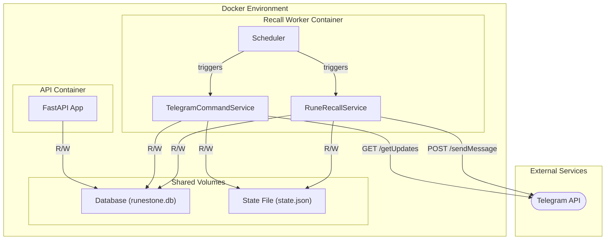

# Design Plan: RuneRecall - Pre-configured Multi-User Telegram Bot

## 1. Executive Summary & Goals
This document outlines an updated plan to implement **RuneRecall** as a standalone, interactive Telegram bot. This revision moves from a single-user model to a **pre-configured, multi-user system**. The bot will run in a dedicated container, managing separate learning cycles for a defined list of authorized users. Each user will be linked to a specific `user_id` in the vocabulary database, ensuring their learning progress is isolated and persistent.

**Key Goals:**
1.  **Isolated Multi-User Experience:** The bot will manage independent sessions for a pre-configured list of Telegram users, preventing interference between them.
2.  **User-Specific Word Selection:** Vocabulary words will be fetched from the database based on the specific `user_id` associated with the Telegram user.
3.  **Decoupled & Resilient Architecture:** The bot will operate as a standalone worker container, separate from the main web API, communicating via a shared database and a structured state file.

## 2. Current Situation Analysis
The system architecture consists of a FastAPI web application and a planned standalone worker for background tasks. The database schema includes a `user_id` field in the `vocabulary` table, which was previously ignored but will now be central to this multi-user design. The primary change is evolving the application's state management from a single global state to a per-user state.

## 3. Proposed Solution / Refactoring Strategy
### 3.1. High-Level Design / Architectural Overview
The system will use two Docker containers: the existing `runestone-api` and a new `runestone-recall` worker. They will share access to the database. The worker's state will be managed in a `state.json` file, which will now be structured as a dictionary of pre-configured users, keyed by their Telegram username. This file will act as an allow-list and store the state for each user's learning cycle.

**Flow Description:**
1.  **Pre-configuration:** An administrator pre-populates `state.json` with the Telegram usernames of authorized users and their corresponding `db_user_id`.
2.  **Command Polling (Worker):** A scheduled job polls the Telegram API. When a message arrives, the `TelegramCommandService` extracts the `username`.
3.  **Authorization & Activation:**
    -   If the `username` exists in `state.json`, the service processes the command. `/start` sets `is_active: true` and stores the user's `chat_id`. `/stop` sets `is_active: false`.
    -   If the `username` is not in `state.json`, the bot sends a polite "not authorized" message and takes no further action.
4.  **Word Sending (Worker):** A separate job triggers the `RuneRecallService`. This service now iterates through all users in the state file where `is_active: true`. For each active user, it performs the daily word portion logic (checking date, selecting new words if needed) using that user's specific state and `db_user_id`.

### 3.2. Key Components / Modules
1.  **State Manager (`src/runestone/services/state_manager.py`):**
    -   **Responsibility:** Manage the multi-user `state.json` file. It will provide methods to get/update state for a specific user and to retrieve a list of all active users.
2.  **Vocabulary Repository (`db/repository.py`):**
    -   **Responsibility:** The `select_new_daily_word_ids` method will be modified to accept a `user_id` to fetch words only for that specific user.
3.  **Telegram Command Service (`src/runestone/services/telegram_command_service.py`):**
    -   **Responsibility:** Poll for commands, authorize users against the state file, and update their individual state (`is_active`, `chat_id`).
4.  **RuneRecall Service (`src/runestone/services/rune_recall_service.py`):**
    -   **Responsibility:** The core sending logic is now wrapped in a loop that processes each active user independently.

### 3.3. Detailed Action Plan / Phases
#### Phase 1: Configuration & Data Layer
-   **Objective(s):** Adapt the data access layer and state management for a multi-user model.
-   **Priority:** High

-   **Task 1.1:** Define and create a template for the multi-user `state.json`.
    -   **Rationale/Goal:** Establish the new, critical state structure and provide a clear template for administrators to pre-configure users.
    -   **Estimated Effort:** S
    -   **Deliverable/Criteria for Completion:** A `state.example.json` file is created with the structure: `{ "update_offset": 0, "users": { "telegram_username": { "db_user_id": 1, "chat_id": null, "is_active": false, "daily_selection": {} } } }`.

-   **Task 1.2:** Update `select_new_daily_word_ids` in `VocabularyRepository` to filter by `user_id`.
    -   **Rationale/Goal:** Ensure the word selection logic is correctly scoped to the individual user.
    -   **Estimated Effort:** S
    -   **Deliverable/Criteria for Completion:** The method now requires a `user_id` parameter and includes `filter(Vocabulary.user_id == user_id)` in its query.

#### Phase 2: Core Services & State Management
-   **Objective(s):** Overhaul the services to handle per-user state and logic.
-   **Priority:** High

-   **Task 2.1:** Re-implement `StateManager` for multi-user state.
    -   **Rationale/Goal:** Create a robust interface for managing the new state file structure.
    -   **Estimated Effort:** L
    -   **Deliverable/Criteria for Completion:** The `StateManager` class has methods like `get_user(username)`, `update_user(username, data)`, `get_active_users()`, `get_update_offset()`, and `set_update_offset()`. All file write operations must use file locking.

-   **Task 2.2:** Update `TelegramCommandService` for user authorization.
    -   **Rationale/Goal:** Implement the command processing logic based on the pre-configured user list.
    -   **Estimated Effort:** M
    -   **Deliverable/Criteria for Completion:** The `process_updates` method now:
        1.  Extracts `username` from incoming messages.
        2.  Uses `StateManager.get_user(username)` to check if the user is in the allow-list.
        3.  If authorized, updates the user's state (`chat_id`, `is_active`).
        4.  If unauthorized, sends a rejection message.

-   **Task 2.3:** Update `RuneRecallService` to loop through active users.
    -   **Rationale/Goal:** Adapt the word-sending logic to handle multiple concurrent user sessions.
    -   **Estimated Effort:** M
    -   **Deliverable/Criteria for Completion:** The main method of the service now calls `StateManager.get_active_users()`. It then iterates through this list, performing the entire daily portion and sending logic for each user independently.

#### Phase 3: Worker Application and Deployment
-   **Objective(s):** Create the standalone worker application and define its deployment.
-   **Priority:** High
-   **Tasks:** The tasks for this phase (creating `recall_main.py`, `Dockerfile.recall`, and updating `docker-compose.yml` with shared volumes for the database and state file) remain the same as in the previous plan.

## 4. Key Considerations & Risk Mitigation
-   **Risk:** Manual state file management is error-prone.
    -   **Mitigation:** Provide a clear `state.example.json` and document the configuration process. For a future iteration, a CLI command or API endpoint could be built to manage users in the state file.
-   **Risk:** Scalability of the JSON state file.
    -   **Mitigation:** This approach is explicitly designed for a small, known set of users. It is not intended to scale to hundreds or thousands of users. If such scale is needed in the future, the `StateManager` would be replaced with a database-backed solution, but the service logic would remain largely the same.
-   **Security:** A user could change their Telegram username, breaking the link.
    -   **Mitigation:** The current design relies on the username as a stable identifier. A more robust future implementation could use the immutable Telegram User ID, but this would require a more complex initial registration flow. For the current scope, using the username is acceptable.

## 5. Success Metrics / Validation Criteria
-   An unauthorized user sending `/start` receives a rejection message and their state is not stored.
-   An authorized user sending `/start` is activated and starts receiving words specific to their `db_user_id`.
-   Two different authorized users can be active simultaneously, receiving different daily word portions from their respective user data pools.
-   Stopping and restarting the worker container preserves the active state and learning progress for all users.

## 6. Assumptions Made
1.  **Pre-configured Users:** The list of authorized users is small and can be managed by an administrator editing the `state.json` file.
2.  **Stable Usernames:** Telegram usernames of pre-configured users are assumed to be stable.
3.  **Dockerized Environment:** The deployment environment supports running multiple containers with shared volumes.