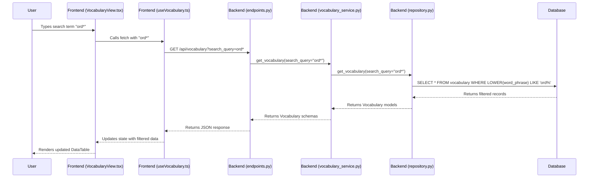

# Refactoring/Design Plan: Implement Vocabulary Search

## 1. Executive Summary & Goals
This plan details the addition of a search functionality to the "Vocabulary" tab. The search will be performed against the `word_phrase` field, supporting case-insensitive and wildcard (`*`) pattern matching.

- **Goal 1:** Implement a backend API endpoint that accepts a search query and returns filtered vocabulary items.
- **Goal 2:** Add a search input field to the frontend Vocabulary view that consumes the new API functionality.
- **Goal 3:** Ensure the search is performant and secure.

## 2. Current Situation Analysis
The current Vocabulary tab, implemented in `frontend/src/components/VocabularyView.tsx`, fetches a static list of the 20 most recent vocabulary items via the `useRecentVocabulary` hook. The backend endpoint `/api/vocabulary` accepts only a `limit` parameter and does not support any filtering or searching capabilities. This limits the user's ability to find specific words they have saved.

## 3. Proposed Solution / Refactoring Strategy
### 3.1. High-Level Design / Architectural Overview
The solution involves a full-stack change, modifying the frontend to send a search query and the backend to process it.

### 3.2. Key Components / Modules
- **`runestone.db.repository.VocabularyRepository`**: To be modified to include a `WHERE ... LIKE` clause in the vocabulary retrieval query.
- **`runestone.services.vocabulary_service.VocabularyService`**: To be updated to pass the search query from the endpoint to the repository.
- **`runestone.api.endpoints.get_vocabulary`**: To be updated to accept an optional `search_query` parameter.
- **`frontend/src/hooks/useVocabulary.ts`**: The `useRecentVocabulary` hook will be modified to accept a search term, manage the fetching state, and construct the API request URL with the search query.
- **`frontend/src/components/VocabularyView.tsx`**: To be updated with a search input UI element and state management to trigger the search.

### 3.3. Detailed Action Plan / Phases
#### Phase 1: Backend Implementation
- **Objective(s):** Create an API endpoint that filters vocabulary by a search term.
- **Priority:** High

- **Task 1.1:** Modify `VocabularyRepository.get_vocabulary`
    - **Rationale/Goal:** Update the database query to filter results based on a search term using a case-insensitive `LIKE` operator.
    - **Estimated Effort (Optional):** S
    - **Deliverable/Criteria for Completion:** The method signature is updated to `get_vocabulary(self, limit: int, search_query: str | None, user_id: int = 1)`, and the SQLAlchemy query correctly filters by `word_phrase`.

- **Task 1.2:** Update `VocabularyService.get_vocabulary`
    - **Rationale/Goal:** Propagate the `search_query` parameter from the service layer to the repository layer.
    - **Estimated Effort (Optional):** S
    - **Deliverable/Criteria for Completion:** The method signature is updated to `get_vocabulary(self, limit: int, search_query: str | None, user_id: int = 1)` and it passes the `search_query` to the repository method.

- **Task 1.3:** Update `/api/vocabulary` endpoint in `endpoints.py`
    - **Rationale/Goal:** Expose the search functionality via the API by accepting a new query parameter.
    - **Estimated Effort (Optional):** S
    - **Deliverable/Criteria for Completion:** The `get_vocabulary` endpoint function accepts an optional `search_query: str | None = None` parameter and passes it to the service layer. The `limit` parameter should be adjusted or removed when a search query is present to return all results.

#### Phase 2: Frontend Implementation
- **Objective(s):** Implement the user interface for searching and display the filtered results.
- **Priority:** High (Dependent on Phase 1)

- **Task 2.1:** Modify `useRecentVocabulary` hook in `useVocabulary.ts`
    - **Rationale/Goal:** Enable the hook to fetch data based on a dynamic search term.
    - **Estimated Effort (Optional):** M
    - **Deliverable/Criteria for Completion:** The hook is refactored to accept a search term, constructs the correct API URL (`/api/vocabulary?search_query=...`), and refetches data when the term changes.

- **Task 2.2:** Add search input to `VocabularyView.tsx`
    - **Rationale/Goal:** Provide a user interface for entering search queries.
    - **Estimated Effort (Optional):** S
    - **Deliverable/Criteria for Completion:** A Material-UI `TextField` or similar input component is added to the `VocabularyView` component above the `DataTable`.

- **Task 2.3:** Implement search state management and debouncing
    - **Rationale/Goal:** Create a responsive user experience by managing the search input's state and preventing excessive API calls while the user is typing.
    - **Estimated Effort (Optional):** M
    - **Deliverable/Criteria for Completion:** The `VocabularyView` component manages the search term in its state. A debouncing mechanism (e.g., using `setTimeout` in a `useEffect` hook) is implemented to trigger the fetch from `useRecentVocabulary` only after the user stops typing for a short period (e.g., 300-500ms).

### 3.4. Data Model Changes
No changes are required for the database schema or data models.

### 3.5. API Design / Interface Changes
- **Endpoint:** `GET /api/vocabulary`
- **Current Parameters:** `limit: int = 20`
- **Proposed Parameters:**
    - `limit: int = 100` (Increase default limit for searches)
    - `search_query: str | None = None` (The search term provided by the user)
- **Behavior:**
    - If `search_query` is provided, the endpoint returns all matching vocabulary items, up to the `limit`.
    - If `search_query` is `None` or empty, the endpoint returns the most recent vocabulary items, as it does currently.

## 4. Key Considerations & Risk Mitigation
### 4.1. Technical Risks & Challenges
- **SQL Injection:** User-provided search strings pose a risk.
    - **Mitigation:** Use SQLAlchemy's parameter binding features, which automatically sanitize inputs. Do not use raw SQL strings.
- **Performance:** A `LIKE` query with a leading wildcard (`%term`) can be slow on large tables as it prevents index usage.
    - **Mitigation:**
        1. Ensure the `word_phrase` column in the `vocabulary` table is indexed.
        2. For now, the dataset is expected to be small. If performance degrades, consider more advanced search solutions like PostgreSQL's trigram indexes or a dedicated search engine (e.g., Elasticsearch) for future scalability.

### 4.2. Dependencies
- The frontend implementation (Phase 2) is dependent on the completion of the backend API changes (Phase 1).

### 4.3. Non-Functional Requirements (NFRs) Addressed
- **Usability:** The search input will be debounced on the frontend to provide a smooth user experience and prevent API spamming.
- **Performance:** The backend query will be designed for efficiency on the current scale. An index on the `word_phrase` column is recommended.
- **Security:** The backend will use parameterized queries to prevent SQL injection vulnerabilities.

## 5. Success Metrics / Validation Criteria
- **Functional:** A user can type a search term (e.g., "hej*") into the search box on the Vocabulary tab.
- **Correctness:** The `DataTable` updates to show only vocabulary items where `word_phrase` starts with "hej" (case-insensitive).
- **Performance:** The search results appear within a reasonable time (<1 second) for a typical user's vocabulary size.
- **Qualitative:** The search feature feels responsive and intuitive to use.

## 6. Assumptions Made
- The underlying database is SQLite, which requires using `LOWER()` for case-insensitive `LIKE` searches. If PostgreSQL is used, `ILIKE` would be a more direct alternative.
- The `user_id` is currently hardcoded to `1` in the backend repository. This plan will maintain that assumption.
- The number of vocabulary items per user will not be large enough in the short term to require a full-text search engine.

## 7. Open Questions / Areas for Further Investigation
- Should the search query also match against the `translation` or `example_phrase` fields? (Current scope is only `word_phrase`).
- What is the desired behavior when the search input is cleared? (Assumption: it should revert to showing the most recent items).