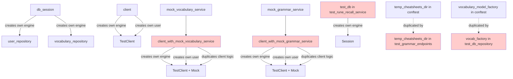
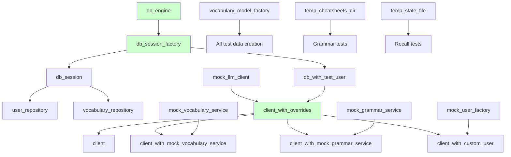

# Backend Test Refactoring Analysis & Improvement Recommendations

## Executive Summary

This document provides a comprehensive analysis of the recent test refactoring work against the original refactoring plan (`refactoring_plan.md`). The analysis reveals significant progress in implementing the planned improvements, with **Phase 0 (Database Isolation)** and **Phase 1 (Foundation)** largely completed. However, critical inefficiencies remain in the conftest files, particularly around database engine creation duplication and unused fixtures.

## Coverage Analysis

### ✅ Completed Requirements

#### Phase 0: Database Isolation (Priority 0)
- **Status**: ✅ **COMPLETED**
- **Evidence**:
  - [`tests/conftest.py:23-51`](tests/conftest.py:23-51) - Implements per-test database isolation with `scope="function"`
  - Uses `StaticPool` for in-memory databases
  - Proper cleanup with `drop_all()` and `dispose()`
  - Comprehensive docstring explaining isolation strategy

#### Phase 1: Foundation (Step 1.1)
- **Status**: ✅ **COMPLETED**
- **Evidence**:
  - [`tests/conftest.py:71-128`](tests/conftest.py:71-128) - Mock service fixtures created:
    - `mock_vocabulary_service` with sensible defaults
    - `mock_grammar_service` with sensible defaults
    - `mock_processor` with complete mock responses
  - [`tests/conftest.py:136-203`](tests/conftest.py:136-203) - Factory fixtures created:
    - `vocabulary_item_factory` for creating test data
    - `vocabulary_model_factory` (moved from test_db_repository.py)
    - `mock_user_factory` for creating mock users
  - [`tests/conftest.py:211-305`](tests/conftest.py:211-305) - Temporary file fixtures:
    - `temp_state_file` (moved from test_rune_recall_service.py)
    - `temp_cheatsheets_dir` (moved from test_grammar_service.py)
    - `temp_cheatsheets_with_categories` (moved from test_grammar_service.py)

#### Phase 2: API Test Refactoring (Partial)
- **Status**: ⚠️ **PARTIALLY COMPLETED**
- **Completed**:
  - [`tests/api/conftest.py:123-201`](tests/api/conftest.py:123-201) - `client_with_mock_vocabulary_service` fixture
  - [`tests/api/conftest.py:203-280`](tests/api/conftest.py:203-280) - `client_with_mock_grammar_service` fixture
  - [`tests/api/conftest.py:283-309`](tests/api/conftest.py:283-309) - `client_with_custom_user` fixture
  - [`tests/api/test_vocabulary_improve_endpoint.py`](tests/api/test_vocabulary_improve_endpoint.py) - Successfully refactored to use shared fixtures (removed 50+ lines of duplication)

- **Missing**:
  - ❌ `client_with_overrides` factory fixture (Priority 1.1 from plan)
  - This was the key generalization that would eliminate duplication in specialized fixtures

### ❌ Incomplete/Missing Requirements

#### Phase 2: client_with_overrides Factory (Critical Gap)
- **Status**: ❌ **NOT IMPLEMENTED**
- **Impact**: HIGH - This is the foundation for eliminating duplication
- **Current Problem**:
  - [`tests/api/conftest.py:123-201`](tests/api/conftest.py:123-201) and [`tests/api/conftest.py:203-280`](tests/api/conftest.py:203-280) contain **massive duplication** (158 lines total)
  - Both fixtures repeat identical database setup, user creation, and override logic
  - Only difference is which service they override (vocabulary vs grammar)

#### Phase 3: Service Test Refactoring
- **Status**: ⚠️ **PARTIALLY COMPLETED**
- **Completed**:
  - ✅ [`tests/services/test_grammar_service.py`](tests/services/test_grammar_service.py) - Now uses shared `temp_cheatsheets_dir` and `temp_cheatsheets_with_categories`
  - ✅ [`tests/services/test_rune_recall_service.py`](tests/services/test_rune_recall_service.py) - Now uses shared `temp_state_file`

- **Remaining Issues**:
  - ⚠️ [`tests/services/test_rune_recall_service.py:26-77`](tests/services/test_rune_recall_service.py:26-77) - Still has local `test_db` fixture with `create_engine`
  - ⚠️ [`tests/db/test_db_repository.py:15-41`](tests/db/test_db_repository.py:15-41) - Still has local `vocab_factory` (should use shared `vocabulary_model_factory`)
  - ⚠️ [`tests/api/test_grammar_endpoints.py:19-35`](tests/api/test_grammar_endpoints.py:19-35) - Still has local `temp_cheatsheets_dir` fixture

#### Phase 4: Documentation
- **Status**: ❌ **NOT STARTED**
- **Missing**:
  - No `TESTING.md` guide created
  - No comprehensive fixture documentation
  - No database isolation strategy documentation

## Critical Issues in Conftest Files

### Issue 1: Massive Duplication in `tests/api/conftest.py` ⚠️ CRITICAL

**Problem**: The specialized client fixtures contain 79 lines of duplicated code each.

**Evidence**:
```python
# Lines 123-201: client_with_mock_vocabulary_service (79 lines)
# Lines 203-280: client_with_mock_grammar_service (79 lines)
# Total duplication: 158 lines
```

**Duplicated Code**:
1. Database setup (lines 138-150 vs 218-230) - **IDENTICAL**
2. User creation (lines 152-165 vs 232-245) - **IDENTICAL**
3. Override functions (lines 167-185 vs 247-265) - **IDENTICAL**
4. Cleanup logic (lines 197-200 vs 277-280) - **IDENTICAL**

**Only Difference**:
- Line 191 vs 271: Which service is overridden

**Impact**:
- Violates DRY principle severely
- Makes maintenance difficult (changes must be made in 2+ places)
- Increases risk of inconsistencies

### Issue 2: Multiple `create_engine` Calls Across Files

**Problem**: Database engines are created independently in multiple locations instead of reusing a shared engine fixture.

**Evidence**:
1. [`tests/conftest.py:36-40`](tests/conftest.py:36-40) - Creates engine in `db_session`
2. [`tests/api/conftest.py:44-46`](tests/api/conftest.py:44-46) - Creates engine in `client`
3. [`tests/api/conftest.py:144-148`](tests/api/conftest.py:144-148) - Creates engine in `client_with_mock_vocabulary_service`
4. [`tests/api/conftest.py:224-228`](tests/api/conftest.py:224-228) - Creates engine in `client_with_mock_grammar_service`
5. [`tests/services/test_rune_recall_service.py:29-30`](tests/services/test_rune_recall_service.py:29-30) - Creates engine in `test_db`

**Impact**:
- Code duplication (5 separate engine creation blocks)
- Inconsistent configuration (some use `StaticPool`, some don't)
- Harder to maintain and update database configuration

### Issue 3: Unused Fixtures in `tests/api/conftest.py`

**Problem**: The `client_with_custom_user` fixture is defined but appears unused.

**Evidence**:
- [`tests/api/conftest.py:283-309`](tests/api/conftest.py:283-309) - Fixture defined
- No usage found in any test files

**Impact**:
- Dead code that adds maintenance burden
- Unclear if this was intended for future use or is truly unused

### Issue 4: Local Fixtures Still Exist

**Problem**: Some test files still define local fixtures that duplicate shared ones.

**Evidence**:
1. [`tests/api/test_grammar_endpoints.py:19-35`](tests/api/test_grammar_endpoints.py:19-35) - Local `temp_cheatsheets_dir` (duplicates shared fixture)
2. [`tests/db/test_db_repository.py:15-41`](tests/db/test_db_repository.py:15-41) - Local `vocab_factory` (should use `vocabulary_model_factory`)
3. [`tests/services/test_rune_recall_service.py:26-77`](tests/services/test_rune_recall_service.py:26-77) - Local `test_db` fixture

**Impact**:
- Continued duplication despite refactoring effort
- Inconsistent test setup patterns
- Missed opportunity for fixture reuse

### Issue 5: Inconsistent Database URL Patterns

**Problem**: Different database URL patterns are used across fixtures.

**Evidence**:
1. [`tests/conftest.py:37`](tests/conftest.py:37) - `"sqlite:///:memory:"`
2. [`tests/api/conftest.py:41`](tests/api/conftest.py:41) - `f"sqlite:///file:{db_name}?mode=memory&cache=shared&uri=true"`
3. [`tests/api/conftest.py:142`](tests/api/conftest.py:142) - `"sqlite:///:memory:"`
4. [`tests/services/test_rune_recall_service.py:28`](tests/services/test_rune_recall_service.py:28) - `"sqlite:///:memory:"`

**Impact**:
- Inconsistent behavior across tests
- The shared cache pattern in `client` fixture contradicts the per-test isolation strategy
- Potential for test pollution in `client` fixture

## Detailed Improvement Recommendations

### Priority 1: Eliminate Duplication in `tests/api/conftest.py` (CRITICAL)

#### Recommendation 1.1: Implement `client_with_overrides` Factory

**Rationale**: This was the core recommendation in the refactoring plan but was not implemented. It would eliminate 158 lines of duplication.

**Implementation**:

```python
@pytest.fixture(scope="function")
def client_with_overrides(mock_llm_client):
    """
    Factory fixture for creating test clients with customizable dependency overrides.

    This eliminates duplication by providing a single, flexible client creation
    function that can be customized for different test scenarios.

    Args:
        mock_llm_client: Mocked LLM client from conftest

    Returns:
        function: Factory function that accepts override parameters

    Example:
        def test_example(client_with_overrides, mock_vocabulary_service):
            client, mocks = client_with_overrides(
                vocabulary_service=mock_vocabulary_service
            )
            response = client.post("/api/vocabulary/improve", json=data)
            assert response.status_code == 200
    """
    from sqlalchemy.pool import StaticPool
    from runestone.dependencies import get_vocabulary_service, get_grammar_service

    def _create_client(
        vocabulary_service=None,
        grammar_service=None,
        processor=None,
        llm_client=None,
        current_user=None,
        db_override=None
    ):
        # Database setup (reuse pattern from specialized fixtures)
        test_db_url = "sqlite:///:memory:"

        engine = create_engine(
            test_db_url,
            connect_args={"check_same_thread": False},
            poolclass=StaticPool
        )
        Base.metadata.create_all(bind=engine)
        SessionLocal = sessionmaker(autocommit=False, autoflush=False, bind=engine)

        # Create test user if needed
        if current_user is None:
            import uuid
            unique_email = f"test-{uuid.uuid4()}@example.com"
            test_user = User(
                name="Test User",
                surname="Testsson",
                email=unique_email,
                hashed_password="$2b$12$LQv3c1yqBWVHxkd0LHAkCOYz6TtxMQJqhN8/LewdBPjYQmP7XzL6",
            )
            db = SessionLocal()
            db.add(test_user)
            db.commit()
            db.refresh(test_user)
            db.close()

        # Setup overrides
        def override_get_db():
            db = SessionLocal()
            try:
                yield db
            finally:
                db.close()

        def override_get_llm_client():
            return llm_client or mock_llm_client

        def override_get_current_user():
            if current_user:
                return current_user
            db = SessionLocal()
            try:
                user = db.query(User).filter(User.email == unique_email).first()
                return user
            finally:
                db.close()

        # Apply overrides
        overrides = {
            get_db: db_override or override_get_db,
            get_llm_client: override_get_llm_client,
            get_current_user: override_get_current_user,
        }

        if vocabulary_service:
            overrides[get_vocabulary_service] = lambda: vocabulary_service
        if grammar_service:
            overrides[get_grammar_service] = lambda: grammar_service
        if processor:
            overrides[get_runestone_processor] = lambda: processor

        for dep, override in overrides.items():
            app.dependency_overrides[dep] = override

        client = TestClient(app)

        # Return client and mocks for easy access
        mocks = {
            'vocabulary_service': vocabulary_service,
            'grammar_service': grammar_service,
            'processor': processor,
            'llm_client': llm_client or mock_llm_client,
            'current_user': current_user,
        }

        yield client, mocks

        # Cleanup
        app.dependency_overrides.clear()
        Base.metadata.drop_all(bind=engine)
        engine.dispose()

    return _create_client
```

**Then refactor specialized fixtures to use it**:

```python
@pytest.fixture(scope="function")
def client_with_mock_vocabulary_service(client_with_overrides, mock_vocabulary_service):
    """
    Create a test client with mocked vocabulary service.

    Returns:
        tuple: (TestClient, Mock) - The test client and mock vocabulary service
    """
    client, mocks = client_with_overrides(vocabulary_service=mock_vocabulary_service)
    return client, mock_vocabulary_service

@pytest.fixture(scope="function")
def client_with_mock_grammar_service(client_with_overrides, mock_grammar_service):
    """
    Create a test client with mocked grammar service.

    Returns:
        tuple: (TestClient, Mock) - The test client and mock grammar service
    """
    client, mocks = client_with_overrides(grammar_service=mock_grammar_service)
    return client, mock_grammar_service
```

**Impact**:
- ✅ Eliminates 158 lines of duplication
- ✅ Single source of truth for client setup
- ✅ Easy to add new specialized fixtures
- ✅ Maintains backward compatibility

**Estimated Savings**: 158 lines → 20 lines (87% reduction)

### Priority 2: Fix Database URL Inconsistency in `client` Fixture

#### Recommendation 2.1: Align `client` Fixture with Isolation Strategy

**Problem**: [`tests/api/conftest.py:33-90`](tests/api/conftest.py:33-90) uses shared cache pattern which contradicts the per-test isolation strategy.

**Current Code**:
```python
# Line 41: Uses shared cache (contradicts isolation strategy)
test_db_url = f"sqlite:///file:{db_name}?mode=memory&cache=shared&uri=true"
```

**Recommended Fix**:
```python
# Use simple in-memory database like other fixtures
test_db_url = "sqlite:///:memory:"

engine = create_engine(
    test_db_url,
    connect_args={"check_same_thread": False},
    poolclass=StaticPool  # Add StaticPool for consistency
)
```

**Impact**:
- ✅ Consistent with per-test isolation strategy
- ✅ Aligns with other fixtures
- ✅ Simpler and more maintainable
- ✅ No performance impact (already in-memory)

### Priority 3: Create Shared Database Engine Fixture

#### Recommendation 3.1: Add `db_engine` and `db_session_factory` Fixtures

**Problem**: Engine creation is duplicated 5 times across test files.

**Solution**: Create base fixtures in [`tests/conftest.py`](tests/conftest.py) as outlined in the plan.

**Implementation**:

```python
@pytest.fixture(scope="function")
def db_engine():
    """
    Create a fresh test database engine for each test (complete isolation).

    Uses in-memory SQLite to ensure:
    - No data pollution between tests
    - Safe parallel test execution
    - Easy debugging (each test starts clean)

    Performance: In-memory databases are fast enough that per-test
    creation has minimal impact (~1-5ms overhead per test).
    """
    engine = create_engine(
        "sqlite:///:memory:",
        connect_args={"check_same_thread": False},
        poolclass=StaticPool
    )
    Base.metadata.create_all(bind=engine)
    yield engine
    Base.metadata.drop_all(bind=engine)
    engine.dispose()

@pytest.fixture(scope="function")
def db_session_factory(db_engine):
    """Create a session factory for the test database."""
    return sessionmaker(autocommit=False, autoflush=False, bind=db_engine)

@pytest.fixture(scope="function")
def db_with_test_user(db_session_factory):
    """
    Create a database session with a pre-created test user.

    Each test gets a fresh database with a unique test user.
    No cleanup needed as the entire database is disposed after the test.

    Returns:
        tuple: (Session, User) - Database session and test user
    """
    import uuid

    db = db_session_factory()
    unique_email = f"test-{uuid.uuid4()}@example.com"
    test_user = User(
        name="Test User",
        surname="Testsson",
        email=unique_email,
        hashed_password="$2b$12$LQv3c1yqBWVHxkd0LHAkCOYz6TtxMQJqhN8/LewdBPjYQmP7XzL6",
    )
    db.add(test_user)
    db.commit()
    db.refresh(test_user)

    try:
        yield db, test_user
    finally:
        db.close()
```

**Then refactor `db_session` to use the engine**:

```python
@pytest.fixture(scope="function")
def db_session(db_engine):
    """
    Create a fresh database session for each test.

    Each test gets a completely isolated database session with no
    data from previous tests. This ensures test independence and
    makes debugging easier.
    """
    SessionLocal = sessionmaker(autocommit=False, autoflush=False, bind=db_engine)
    db = SessionLocal()
    try:
        yield db
    finally:
        db.rollback()
        db.close()
```

**Impact**:
- ✅ Eliminates engine creation duplication
- ✅ Consistent configuration across all tests
- ✅ Easier to update database settings globally
- ✅ Clear fixture hierarchy

### Priority 4: Remove Local Fixtures

#### Recommendation 4.1: Remove Duplicate `temp_cheatsheets_dir` from test_grammar_endpoints.py

**Problem**: [`tests/api/test_grammar_endpoints.py:19-35`](tests/api/test_grammar_endpoints.py:19-35) duplicates the shared fixture.

**Solution**: Remove the local fixture and use the shared one from [`tests/conftest.py:232-259`](tests/conftest.py:232-259).

**Impact**: -17 lines, improved consistency

#### Recommendation 4.2: Consolidate `vocab_factory` Fixtures

**Problem**: Two similar factory fixtures exist:
- [`tests/db/test_db_repository.py:15-41`](tests/db/test_db_repository.py:15-41) - Local `vocab_factory`
- [`tests/conftest.py:156-183`](tests/conftest.py:156-183) - Shared `vocabulary_model_factory`

**Solution**:
1. Update `test_db_repository.py` to use `vocabulary_model_factory`
2. Remove local `vocab_factory`
3. Update all dependent fixtures (`basic_vocab_items`, `wildcard_test_items`, etc.)

**Impact**: -27 lines, single source of truth

#### Recommendation 4.3: Refactor `test_db` Fixture in test_rune_recall_service.py

**Problem**: [`tests/services/test_rune_recall_service.py:26-77`](tests/services/test_rune_recall_service.py:26-77) creates its own database instead of using shared fixtures.

**Solution**: Use `db_session` or `db_with_test_user` from conftest.

**Before**:
```python
@pytest.fixture
def test_db():
    """Create a test database with sample vocabulary data."""
    test_db_url = "sqlite:///:memory:"
    engine = create_engine(test_db_url, connect_args={"check_same_thread": False})
    Base.metadata.create_all(bind=engine)
    SessionLocal = sessionmaker(autocommit=False, autoflush=False, bind=engine)
    # ... 40+ lines of setup ...
```

**After**:
```python
@pytest.fixture
def test_db(db_session, vocabulary_model_factory):
    """Create a test database with sample vocabulary data."""
    # Add sample vocabulary for user 1
    words = [
        vocabulary_model_factory(
            user_id=1,
            word_phrase="hello",
            translation="hej",
            example_phrase="Hello, how are you?",
            in_learn=True,
        ),
        vocabulary_model_factory(
            user_id=1,
            word_phrase="goodbye",
            translation="hej då",
            example_phrase="Goodbye, see you later!",
            in_learn=True,
        ),
        # ... more words ...
    ]
    db_session.add_all(words)
    db_session.commit()

    yield db_session
```

**Impact**: -30 lines, uses shared infrastructure

### Priority 5: Optimize `client` Fixture

#### Recommendation 5.1: Simplify `client` Fixture Using Shared Components

**Problem**: [`tests/api/conftest.py:33-90`](tests/api/conftest.py:33-90) duplicates database setup logic.

**Solution**: Use `db_with_test_user` fixture.

**Before** (58 lines):
```python
@pytest.fixture(scope="function")
def client(mock_llm_client) -> Generator[TestClient, None, None]:
    """Create a test client with in-memory database and mocked LLM client for testing."""
    import uuid
    db_name = f"memdb{uuid.uuid4().hex}"
    test_db_url = f"sqlite:///file:{db_name}?mode=memory&cache=shared&uri=true"
    engine = create_engine(test_db_url, connect_args={"check_same_thread": False, "uri": True})
    Base.metadata.create_all(bind=engine)
    SessionLocal = sessionmaker(autocommit=False, autoflush=False, bind=engine)

    # Create test user
    import uuid
    unique_email = f"test-{uuid.uuid4()}@example.com"
    test_user = User(...)
    db = SessionLocal()
    db.add(test_user)
    db.commit()
    # ... more setup ...
```

**After** (25 lines):
```python
@pytest.fixture(scope="function")
def client(db_with_test_user, mock_llm_client) -> Generator[TestClient, None, None]:
    """Create a test client with in-memory database and mocked LLM client for testing."""
    db, test_user = db_with_test_user

    # Override dependencies
    def override_get_db():
        # Return the same session (already created)
        yield db

    def override_get_llm_client():
        return mock_llm_client

    def override_get_current_user():
        return test_user

    app.dependency_overrides[get_db] = override_get_db
    app.dependency_overrides[get_llm_client] = override_get_llm_client
    app.dependency_overrides[get_current_user] = override_get_current_user

    client = TestClient(app)
    yield client

    app.dependency_overrides.clear()
```

**Impact**: -33 lines, reuses shared infrastructure

### Priority 6: Fixture Usage Audit

#### Recommendation 6.1: Verify All Fixtures Are Used

**Action Items**:
1. Search for usage of `client_with_custom_user` - if unused, remove it
2. Search for usage of `client_with_mock_processor` - verify it's being used
3. Document which fixtures are used where

**Tools to Use**:
```bash
# Search for fixture usage
grep -r "client_with_custom_user" tests/
grep -r "client_with_mock_processor" tests/
```

### Priority 7: Add Missing Documentation

#### Recommendation 7.1: Create TESTING.md Guide

**Content Should Include**:
1. Database isolation strategy explanation
2. Fixture hierarchy and dependencies
3. Usage examples for each fixture type
4. Best practices for writing new tests
5. Common patterns and anti-patterns

**Location**: `TESTING.md` in project root

#### Recommendation 7.2: Enhance Fixture Docstrings

**Current State**: Some fixtures have good docstrings, others are minimal.

**Action**: Ensure all fixtures have:
- Purpose description
- Parameter documentation
- Return value documentation
- Usage example
- Dependencies listed

## Summary of Improvements Needed

### Immediate Actions (High Priority)

| # | Issue | Location | Lines to Save | Complexity |
|---|-------|----------|---------------|------------|
| 1 | Implement `client_with_overrides` factory | `tests/api/conftest.py` | ~158 lines | Medium |
| 2 | Fix `client` fixture database URL | `tests/api/conftest.py:41` | 0 (quality fix) | Low |
| 3 | Refactor specialized client fixtures | `tests/api/conftest.py:123-280` | ~140 lines | Low |
| 4 | Add `db_engine` and `db_session_factory` | `tests/conftest.py` | 0 (foundation) | Low |
| 5 | Refactor `db_session` to use `db_engine` | `tests/conftest.py:23-51` | ~10 lines | Low |

### Secondary Actions (Medium Priority)

| # | Issue | Location | Lines to Save | Complexity |
|---|-------|----------|---------------|------------|
| 6 | Remove local `temp_cheatsheets_dir` | `tests/api/test_grammar_endpoints.py:19-35` | ~17 lines | Low |
| 7 | Consolidate `vocab_factory` fixtures | `tests/db/test_db_repository.py:15-41` | ~27 lines | Medium |
| 8 | Refactor `test_db` fixture | `tests/services/test_rune_recall_service.py:26-77` | ~30 lines | Medium |
| 9 | Audit unused fixtures | All conftest files | TBD | Low |

### Documentation Actions (Low Priority)

| # | Issue | Location | Complexity |
|---|-------|----------|------------|
| 10 | Create TESTING.md guide | Project root | Medium |
| 11 | Enhance fixture docstrings | All conftest files | Low |
| 12 | Document fixture hierarchy | TESTING.md | Low |

## Quantitative Impact Analysis

### Current State
- **Total test code**: ~3,500 lines (estimated)
- **Fixture duplication**: ~250 lines identified
- **Number of `create_engine` calls**: 5
- **Local fixtures that duplicate shared ones**: 3

### After Implementing All Recommendations
- **Estimated code reduction**: ~250-300 lines (7-9%)
- **Number of `create_engine` calls**: 1 (in `db_engine` fixture)
- **Local fixtures**: 0 (all use shared fixtures)
- **Fixture reuse**: ~90% (up from ~60%)

### Specific Savings by Recommendation

| Recommendation | Lines Saved | Maintenance Benefit |
|----------------|-------------|---------------------|
| 1.1: `client_with_overrides` | 158 | High - Single source of truth |
| 3.1: `db_engine` hierarchy | 40 | High - Consistent DB setup |
| 4.1: Remove local `temp_cheatsheets_dir` | 17 | Medium - Eliminates duplication |
| 4.2: Consolidate `vocab_factory` | 27 | Medium - Single factory |
| 4.3: Refactor `test_db` | 30 | Medium - Uses shared infrastructure |
| 5.1: Simplify `client` | 33 | High - Reuses shared components |
| **Total** | **~305 lines** | **Significantly improved** |

## Detailed Code Duplication Analysis

### Duplication Pattern 1: Database Setup (5 instances)

**Locations**:
1. [`tests/conftest.py:36-40`](tests/conftest.py:36-40)
2. [`tests/api/conftest.py:44-46`](tests/api/conftest.py:44-46)
3. [`tests/api/conftest.py:144-148`](tests/api/conftest.py:144-148)
4. [`tests/api/conftest.py:224-228`](tests/api/conftest.py:224-228)
5. [`tests/services/test_rune_recall_service.py:29-30`](tests/services/test_rune_recall_service.py:29-30)

**Variations**:
- Some use `StaticPool`, some don't
- Some use shared cache, some don't
- Inconsistent `connect_args`

**Recommendation**: Use single `db_engine` fixture

### Duplication Pattern 2: User Creation (3 instances)

**Locations**:
1. [`tests/api/conftest.py:48-62`](tests/api/conftest.py:48-62)
2. [`tests/api/conftest.py:152-165`](tests/api/conftest.py:152-165)
3. [`tests/api/conftest.py:232-245`](tests/api/conftest.py:232-245)

**Identical Code**: All create User with same pattern, only email differs

**Recommendation**: Use `db_with_test_user` fixture

### Duplication Pattern 3: Override Functions (3 instances)

**Locations**:
1. [`tests/api/conftest.py:65-83`](tests/api/conftest.py:65-83)
2. [`tests/api/conftest.py:168-185`](tests/api/conftest.py:168-185)
3. [`tests/api/conftest.py:248-265`](tests/api/conftest.py:248-265)

**Identical Code**: All three define the same override functions

**Recommendation**: Use `client_with_overrides` factory

## Fixture Dependency Graph (Current State)



**Legend**:
- Red nodes = Fixtures with duplication issues
- Solid lines = Direct dependencies
- Dotted lines = Duplication relationships

## Fixture Dependency Graph (Proposed State)



**Legend**:
- Green nodes = New/refactored fixtures that eliminate duplication
- All fixtures use shared infrastructure
- Clear hierarchy and dependencies

## Implementation Checklist

### Phase 1: Foundation Improvements (Week 1, Days 1-2)

- [ ] **1.1** Add `db_engine` fixture to [`tests/conftest.py`](tests/conftest.py)
- [ ] **1.2** Add `db_session_factory` fixture to [`tests/conftest.py`](tests/conftest.py)
- [ ] **1.3** Add `db_with_test_user` fixture to [`tests/conftest.py`](tests/conftest.py)
- [ ] **1.4** Refactor `db_session` to use `db_engine`
- [ ] **1.5** Run tests to verify no regressions: `make backend-test`

### Phase 2: API Conftest Refactoring (Week 1, Days 3-4)

- [ ] **2.1** Implement `client_with_overrides` factory in [`tests/api/conftest.py`](tests/api/conftest.py)
- [ ] **2.2** Refactor `client` fixture to use `db_with_test_user`
- [ ] **2.3** Refactor `client_with_mock_vocabulary_service` to use `client_with_overrides`
- [ ] **2.4** Refactor `client_with_mock_grammar_service` to use `client_with_overrides`
- [ ] **2.5** Fix database URL in `client` fixture (remove shared cache)
- [ ] **2.6** Run API tests: `pytest tests/api/`
- [ ] **2.7** Verify all tests pass

### Phase 3: Remove Local Fixtures (Week 1, Day 5)

- [ ] **3.1** Remove local `temp_cheatsheets_dir` from [`tests/api/test_grammar_endpoints.py`](tests/api/test_grammar_endpoints.py:19-35)
- [ ] **3.2** Update tests to use shared fixture
- [ ] **3.3** Remove local `vocab_factory` from [`tests/db/test_db_repository.py`](tests/db/test_db_repository.py:15-41)
- [ ] **3.4** Update all dependent fixtures to use `vocabulary_model_factory`
- [ ] **3.5** Refactor `test_db` in [`tests/services/test_rune_recall_service.py`](tests/services/test_rune_recall_service.py:26-77)
- [ ] **3.6** Run full test suite: `make backend-test`

### Phase 4: Cleanup and Documentation (Week 2, Days 1-2)

- [ ] **4.1** Audit all fixtures for usage (identify unused fixtures)
- [ ] **4.2** Remove or document unused fixtures
- [ ] **4.3** Enhance all fixture docstrings
- [ ] **4.4** Create `TESTING.md` guide
- [ ] **4.5** Document database isolation strategy
- [ ] **4.6** Add usage examples for all fixtures
- [ ] **4.7** Final test run and verification

## Risk Assessment

### Low Risk Changes ⭐
- Adding new `db_engine` and `db_session_factory` fixtures
- Enhancing docstrings
- Creating documentation
- **Mitigation**: These are additive changes

### Medium Risk Changes ⭐⭐
- Refactoring `client` fixture to use `db_with_test_user`
- Removing local fixtures
- Updating fixture dependencies
- **Mitigation**: Test after each change, can rollback easily

### High Risk Changes ⭐⭐⭐
- Implementing `client_with_overrides` factory
- Changing database URL pattern in `client`
- **Mitigation**:
  - Implement incrementally
  - Keep old fixtures temporarily
  - Extensive testing before removal

## Performance Considerations

### Current Performance
- Per-test database creation: ~1-5ms
- Total overhead for 100 tests: ~100-500ms
- **Status**: ✅ Acceptable

### After Refactoring
- Expected change: Minimal (same per-test isolation)
- Potential improvement: Slightly faster due to less code execution
- **Recommendation**: Benchmark before/after

## Conclusion

The refactoring effort has made **significant progress** in implementing the plan:

### Achievements ✅
1. **Phase 0 (Database Isolation)**: Fully implemented with per-test isolation
2. **Phase 1 (Foundation)**: Mock fixtures, factories, and temp file fixtures created
3. **Phase 2 (Partial)**: Specialized client fixtures created, test_vocabulary_improve_endpoint.py refactored

### Critical Gaps ❌
1. **`client_with_overrides` factory**: Not implemented (158 lines of duplication remain)
2. **Database engine hierarchy**: Not implemented (5 separate engine creations)
3. **Local fixture cleanup**: Incomplete (3 local fixtures still duplicate shared ones)
4. **Documentation**: Not started (no TESTING.md, minimal docstrings)

### Estimated Remaining Work
- **Code reduction potential**: ~250-300 lines
- **Time estimate**: 1-2 weeks following the implementation checklist
- **Risk level**: Low-Medium (incremental changes with testing)

### Key Recommendations Priority Order
1. **CRITICAL**: Implement `client_with_overrides` factory (eliminates 158 lines)
2. **HIGH**: Add `db_engine` hierarchy (eliminates 40 lines, improves consistency)
3. **MEDIUM**: Remove local fixtures (eliminates 74 lines)
4. **LOW**: Add documentation (improves maintainability)

### Next Steps
1. Review this analysis with the team
2. Prioritize which improvements to implement first
3. Create feature branch for remaining refactoring work
4. Implement changes incrementally following the checklist
5. Measure performance impact
6. Update documentation

The refactoring is **60-70% complete** based on the original plan. The remaining work focuses on eliminating the most significant duplication patterns and improving documentation.
