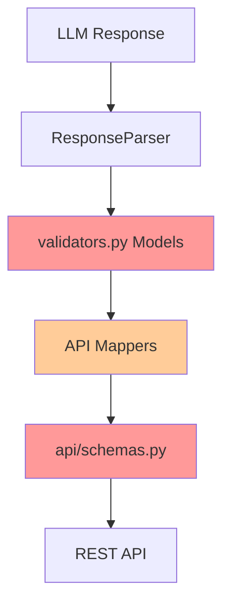

# Validators Module Refactoring Analysis

## Executive Summary

The `src/runestone/core/prompt_builder/validators.py` module has critical naming and architectural issues that impact maintainability. This document provides a comprehensive analysis and three refactoring options.

## Current State Problems

### 1. Misleading Module Name
**File**: `validators.py`
**Actual Purpose**: Pydantic models for LLM response parsing
**Problem**: Name suggests validation logic, but contains only data models

### 2. Massive Schema Duplication

| Internal Model (validators.py) | API Schema (schemas.py) | Similarity |
|-------------------------------|------------------------|------------|
| `OCRResponse` | `OCRResult` | 90% |
| `AnalysisResponse` | `ContentAnalysis` | 95% |
| `GrammarFocusResponse` | `GrammarFocus` | 100% |
| `VocabularyItemResponse` | `VocabularyItem` | 100% |
| `SearchNeededResponse` | `SearchNeeded` | 100% |
| `VocabularyResponse` | `VocabularyImproveResponse` | 100% |

**Impact**: Dual maintenance, manual mapping overhead, increased test surface

### 3. Inconsistent Naming
```python
class RecognitionStatistics(BaseModel)      # No suffix
class OCRResponse(BaseModel)                # "Response" suffix
class GrammarFocusResponse(BaseModel)       # "Response" suffix
```

### 4. Wrong Location
Module is in `prompt_builder/` but handles **response parsing**, not prompt building.

### 5. Unnecessary Abstraction
The `mappers.py` exists solely to copy fields between identical structures:
```python
def convert_analysis_response(response: AnalysisResponse) -> ContentAnalysis:
    return ContentAnalysis(
        grammar_focus=GrammarFocus(
            topic=response.grammar_focus.topic,  # Manual copying
            explanation=response.grammar_focus.explanation,
            # ... more boilerplate
        )
    )
```

## Architecture Diagram



**Red boxes** = Duplication problem
**Orange box** = Unnecessary layer

## Three Refactoring Options

### Option 1: Minimal Refactoring ⭐⭐

**Goal**: Fix naming only

**Changes**:
- Rename `validators.py` → `response_models.py`
- Rename classes: `OCRResponse` → `OCRData`, etc.
- Update imports

**Pros**:
- ✅ Low risk (1-2 days)
- ✅ Clearer naming
- ✅ Minimal code changes

**Cons**:
- ❌ Still have duplication
- ❌ Still need mappers
- ❌ Doesn't fix architecture

---

### Option 2: Unified Schema Layer ⭐⭐⭐⭐⭐ (RECOMMENDED)

**Goal**: Eliminate duplication with single schema layer

**New Structure**:
```
src/runestone/
├── schemas/                    # NEW unified location
│   ├── __init__.py
│   ├── ocr.py                 # OCR models
│   ├── analysis.py            # Analysis models
│   └── vocabulary.py          # Vocabulary models
├── core/
│   └── prompt_builder/
│       ├── parsers.py         # Uses schemas.*
│       ├── builder.py
│       └── templates.py
└── api/
    ├── endpoints.py           # Uses schemas.* directly
    └── (DELETE mappers.py)    # Eliminated!
```

**Example**:
```python
# src/runestone/schemas/ocr.py
from pydantic import BaseModel, Field

class RecognitionStatistics(BaseModel):
    total_elements: int = Field(ge=0, default=0)
    successfully_transcribed: int = Field(ge=0, default=0)
    unclear_uncertain: int = Field(ge=0, default=0)
    unable_to_recognize: int = Field(ge=0, default=0)

class OCRResult(BaseModel):
    """Used by both parser and API - single source of truth."""
    transcribed_text: str
    recognition_statistics: RecognitionStatistics

    @property
    def character_count(self) -> int:
        """Computed property for API responses."""
        return len(self.transcribed_text)
```

**Pros**:
- ✅ Eliminates ALL duplication
- ✅ Single source of truth
- ✅ No mapping overhead
- ✅ Easier maintenance
- ✅ Better organized by domain
- ✅ Can be done in 3-5 days

**Cons**:
- ⚠️ Medium refactoring effort
- ⚠️ Need to update many imports
- ⚠️ Requires thorough testing

---

### Option 3: Domain-Driven Design ⭐⭐⭐⭐⭐

**Goal**: Complete architectural redesign

**New Structure**:
```
src/runestone/
├── domain/                     # NEW domain layer
│   ├── ocr/
│   │   ├── models.py          # Domain models (dataclasses)
│   │   ├── services.py        # Business logic
│   │   └── validators.py      # ACTUAL validation logic!
│   ├── analysis/
│   └── vocabulary/
├── core/
│   └── llm/                    # Renamed from prompt_builder
│       ├── parsers.py         # LLM → domain conversion
│       ├── prompts.py
│       └── templates.py
└── api/
    ├── schemas/               # API Pydantic models
    └── serializers.py         # Domain → API conversion
```

**Example**:
```python
# src/runestone/domain/ocr/models.py
from dataclasses import dataclass

@dataclass(frozen=True)
class OCRResult:
    """Immutable domain entity."""
    transcribed_text: str
    statistics: RecognitionStatistics

    @property
    def success_rate(self) -> float:
        if self.statistics.total_elements == 0:
            return 1.0
        return self.statistics.successfully_transcribed / self.statistics.total_elements

    def is_acceptable_quality(self, threshold: float = 0.9) -> bool:
        """Business logic in domain layer."""
        return self.success_rate >= threshold

# src/runestone/domain/ocr/validators.py
def validate_ocr_quality(result: OCRResult, min_threshold: float = 0.9) -> None:
    """ACTUAL validation logic - properly named!"""
    if not result.is_acceptable_quality(min_threshold):
        raise OCRQualityError(f"Quality {result.success_rate:.1%} below {min_threshold:.1%}")
```

**Pros**:
- ✅ Proper separation of concerns
- ✅ Domain logic in domain layer
- ✅ ACTUAL validation in validators
- ✅ Immutable domain models
- ✅ Highly maintainable
- ✅ Follows DDD principles

**Cons**:
- ❌ Significant effort (2-3 weeks)
- ❌ High risk
- ❌ Requires team buy-in
- ❌ Learning curve

## Comparison Matrix

| Criteria | Option 1 | Option 2 | Option 3 |
|----------|----------|----------|----------|
| **Naming Clarity** | Good | Excellent | Perfect |
| **Eliminates Duplication** | ❌ No | ✅ Yes | ✅ Yes |
| **Maintainability** | Fair | Very Good | Excellent |
| **Risk Level** | 🟢 Low | 🟡 Medium | 🔴 High |
| **Effort** | 1-2 days | 3-5 days | 2-3 weeks |
| **Long-term Value** | Low | High | Very High |

## Recommendation: Option 2

**Why Option 2 is the sweet spot:**

1. **Solves the main problem** - Eliminates duplication
2. **Reasonable effort** - Can be done in one sprint
3. **Low risk** - Pydantic models work everywhere
4. **Immediate benefits** - Cleaner code, easier maintenance
5. **Future-proof** - Can evolve to Option 3 later if needed

## Implementation Plan for Option 2

### Phase 1: Create Structure (Day 1)
```bash
# Create new schema directory
src/runestone/schemas/
├── __init__.py
├── ocr.py
├── analysis.py
└── vocabulary.py
```

### Phase 2: Migrate Models (Days 2-3)
1. Move models from `validators.py` to schema files
2. Rename classes (remove redundant suffixes)
3. Add computed properties for API fields
4. Update exports in `__init__.py`

### Phase 3: Update Imports (Days 3-4)
1. Update `parsers.py` imports
2. Update `api/endpoints.py` to use schemas directly
3. Delete `api/mappers.py`
4. Update all test files

### Phase 4: Cleanup & Test (Day 5)
1. Delete old `validators.py`
2. Run full test suite
3. Update documentation
4. Code review

## Migration Example

### Before (Current)
```python
# validators.py
class OCRResponse(BaseModel):
    transcribed_text: str
    recognition_statistics: RecognitionStatistics

# schemas.py
class OCRResult(BaseModel):
    text: str
    character_count: int

# mappers.py
def convert_ocr_response(response: OCRResponse) -> OCRResult:
    return OCRResult(text=response.transcribed_text, character_count=len(response.transcribed_text))
```

### After (Option 2)
```python
# schemas/ocr.py
class OCRResult(BaseModel):
    """Single model for both parser and API."""
    transcribed_text: str
    recognition_statistics: RecognitionStatistics

    @property
    def character_count(self) -> int:
        return len(self.transcribed_text)

# No mappers needed!
# Parser uses: OCRResult(**data)
# API uses: result.model_dump() or result.character_count
```

## Risk Mitigation

1. **Feature flag** - Implement behind flag initially
2. **Parallel run** - Keep old code temporarily
3. **Gradual rollout** - One domain at a time
4. **Rollback plan** - Keep old files until tested

## Success Metrics

After Option 2:
- ✅ Zero schema duplication
- ✅ No mapper functions
- ✅ 30% less schema code
- ✅ Faster development
- ✅ All tests passing

## Next Steps

1. Review this analysis
2. Approve Option 2 (or choose alternative)
3. Create implementation branch
4. Begin Phase 1

---

**Version**: 1.0
**Date**: 2025-11-02
**Prepared by**: Kilo Code (Architect Mode)
